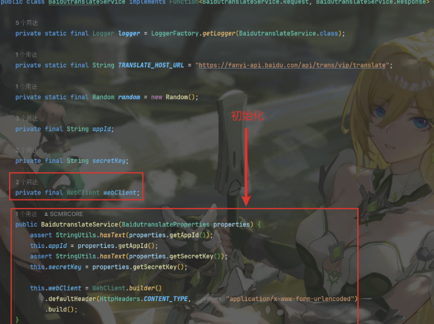
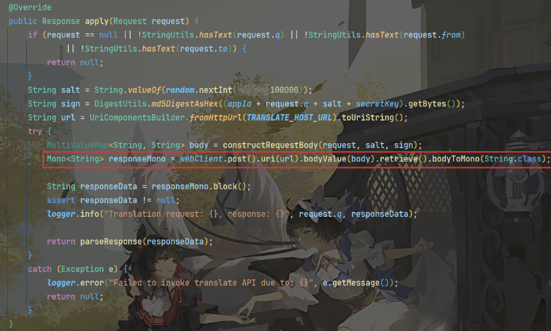

## HttpClient

### 具体介绍

**1.介绍**

HttpClient 是Apache Jakarta Common 下的子项目，可以用来提供高效的、最新的、功能丰富的支持 **HTTP 协议的客户端编程工具包**，并且它支持 HTTP 协议最新的版本和建议。

**2.功能**

- 实现了所有 HTTP 的方法（GET、POST、PUT、HEAD、DELETE、HEAD、OPTIONS 等）
- 响应数据

**3.使用场景**

**需要调用其他系统接口时**，尤其是基于HTTP协议的接口

例如：微信支付、查看地图、获取短信验证码、获取天气

**4.核心api**

- HttpClient：Http客户端对象，使用该类型对象可发起Http请求。（接口）

- HttpClients：构建器，用于获得HttpClient对象。

- CloseableHttpClient：具体实现类，实现了HttpClient接口。

- HttpGet：Get方式请求类型。

- HttpPost：Post方式请求类型。

**5.请求发送步骤**

- 创建HttpClient对象
- 创建Http请求对象（比如我们要发送一个get请求，我们就需要构造HttpGet对象）
- 调用HttpClient的execute对象方法发送请求


### 使用步骤

**1.引入依赖**

```xml
<dependency>
    <groupId>org.apache.httpcomponents</groupId>
    <artifactId>httpclient</artifactId>
    <version>4.5.13</version>
</dependency>
```

**2.原始请求方法**（不推荐）

Get请求：

```java
//通过httpclient发送GET方式的请求
@Test
public void testGET() throws IOException {
    //创建httpclient对象
    CloseableHttpClient httpClients = HttpClients.createDefault();
    
    //创建请求对象
    HttpGet httpGet = new HttpGet("http://localhost:8080/user/shop/status");
 
    //发送请求对象,并接受响应结果
    CloseableHttpResponse response = httpClients.execute(httpGet);
 
    //获取服务端返回回来的状态码
    int statusCode = response.getStatusLine().getStatusCode();
 
    System.out.println("服务端返回的状态码: " +statusCode);
 
    //获取服务端返回回来的响应体，然后通过一个工具类来解析这个响应体
    HttpEntity entity = response.getEntity();
    String body = EntityUtils.toString(entity);
 
    System.out.println("服务端返回的数据是: " +body);
    
    response.close();
    httpClients.close();
}
```

Post请求：

```java
    @Test
    //通过httpclient发送POST方式的请求
    public void testPOST() throws IOException {
        
        //创建httpclient对象
        CloseableHttpClient httpClient = HttpClients.createDefault();
 
        //创建请求对象
        HttpPost httpPost = new HttpPost("http://localhost:8080/admin/employee/login");
 
        JSONObject jsonObject = new JSONObject();
        jsonObject.put("username","admin");
        jsonObject.put("password","123456");
        StringEntity entity = new StringEntity(jsonObject.toString());
        //指定编码方式
        entity.setContentEncoding("utf-8");
        //数据格式
        entity.setContentType("application/json");
//        post请求设置请求参数（JSON格式）
        httpPost.setEntity(entity);
        //发送请求
        CloseableHttpResponse response = httpClient.execute(httpPost);
        //解析返回结果
        //获取服务端返回回来的状态码
        int statusCode = response.getStatusLine().getStatusCode();
 
        System.out.println("服务端返回的状态码: " +statusCode);
 
        //获取服务端返回回来的响应体，然后通过一个工具类来解析这个响应体
        HttpEntity entity1 = response.getEntity();
        String body = EntityUtils.toString(entity1);
 
        System.out.println("服务端返回的数据是: " +body);
 
        //关闭资源
        response.close();
        httpClient.close();
    }
```

**3.工具类**（推荐）

例子：

	

源码：

```java
/**
 * Http工具类
 */
public class HttpClientUtil {
 
    static final  int TIMEOUT_MSEC = 5 * 1000;
 
    /**
     * 发送GET方式请求
     * @param url
     * @param paramMap
     * @return
     */
    public static String doGet(String url,Map<String,String> paramMap){
        // 创建Httpclient对象
        CloseableHttpClient httpClient = HttpClients.createDefault();
 
        String result = "";
        CloseableHttpResponse response = null;
 
        try{
            URIBuilder builder = new URIBuilder(url);
            if(paramMap != null){
                for (String key : paramMap.keySet()) {
                    builder.addParameter(key,paramMap.get(key));
                }
            }
            URI uri = builder.build();
 
            //创建GET请求
            HttpGet httpGet = new HttpGet(uri);
 
            //发送请求
            response = httpClient.execute(httpGet);
 
            //判断响应状态
            if(response.getStatusLine().getStatusCode() == 200){
                result = EntityUtils.toString(response.getEntity(),"UTF-8");
            }
        }catch (Exception e){
            e.printStackTrace();
        }finally {
            try {
                response.close();
                httpClient.close();
            } catch (IOException e) {
                e.printStackTrace();
            }
        }
 
        return result;
    }
 
    /**
     * 发送POST方式请求
     * @param url
     * @param paramMap
     * @return
     * @throws IOException
     */
    public static String doPost(String url, Map<String, String> paramMap) throws IOException {
        // 创建Httpclient对象
        CloseableHttpClient httpClient = HttpClients.createDefault();
        CloseableHttpResponse response = null;
        String resultString = "";
 
        try {
            // 创建Http Post请求
            HttpPost httpPost = new HttpPost(url);
 
            // 创建参数列表
            if (paramMap != null) {
                List<NameValuePair> paramList = new ArrayList();
                for (Map.Entry<String, String> param : paramMap.entrySet()) {
                    paramList.add(new BasicNameValuePair(param.getKey(), param.getValue()));
                }
                // 模拟表单
                UrlEncodedFormEntity entity = new UrlEncodedFormEntity(paramList);
                httpPost.setEntity(entity);
            }
 
            httpPost.setConfig(builderRequestConfig());
 
            // 执行http请求
            response = httpClient.execute(httpPost);
 
            resultString = EntityUtils.toString(response.getEntity(), "UTF-8");
        } catch (Exception e) {
            throw e;
        } finally {
            try {
                response.close();
            } catch (IOException e) {
                e.printStackTrace();
            }
        }
 
        return resultString;
    }
    
    private static RequestConfig builderRequestConfig() {
        return RequestConfig.custom()
                .setConnectTimeout(TIMEOUT_MSEC)
                .setConnectionRequestTimeout(TIMEOUT_MSEC)
                .setSocketTimeout(TIMEOUT_MSEC).build();
    }
 
}
```


## WebClient

也是用于发送api请求的工具

路径：

```java
import org.springframework.web.reactive.function.client.WebClient;
```

用法示例：

注入与初始化

	

发送请求

	


