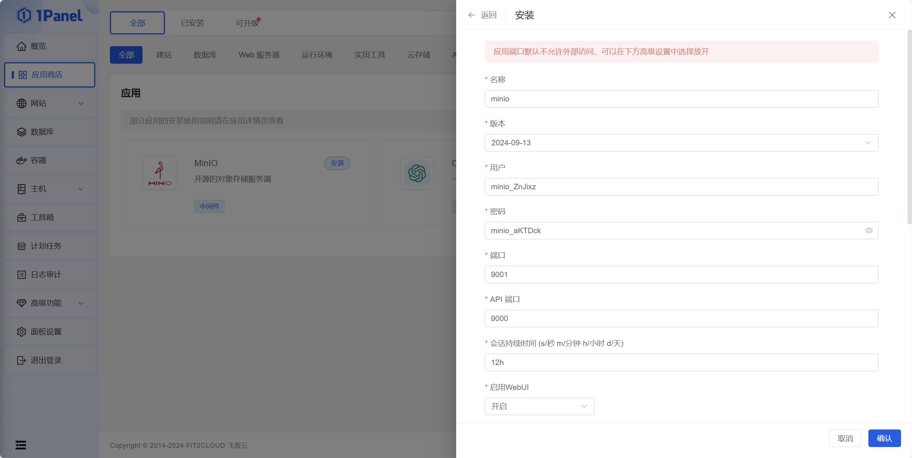
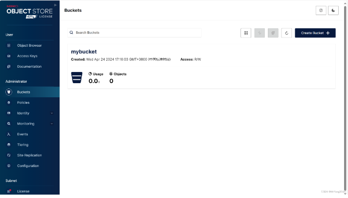
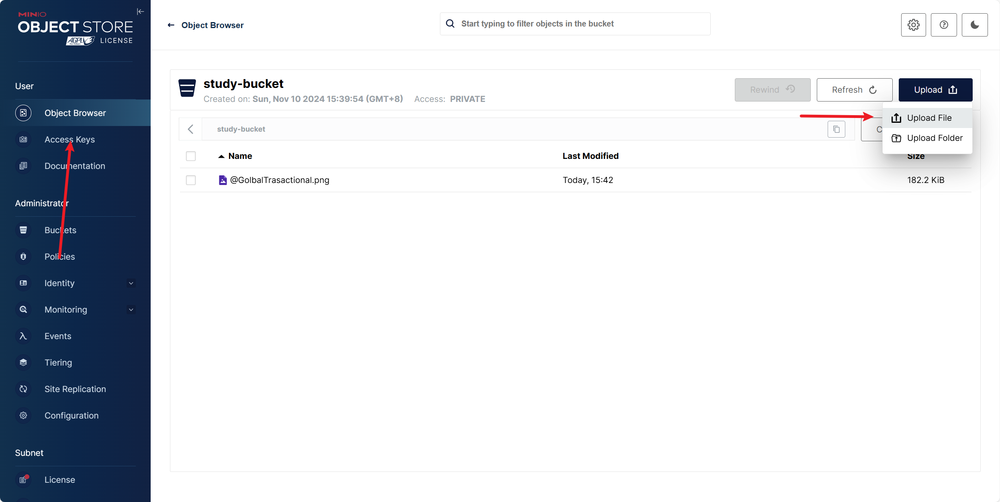
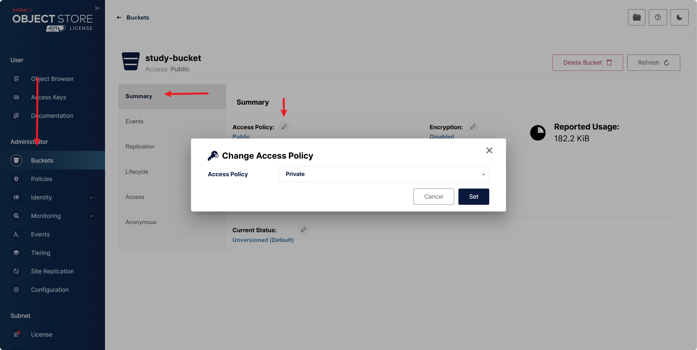
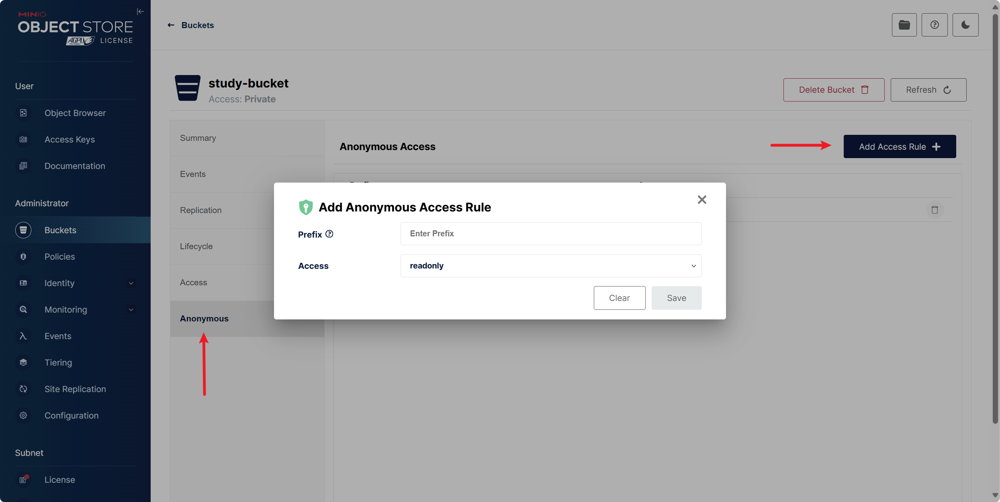
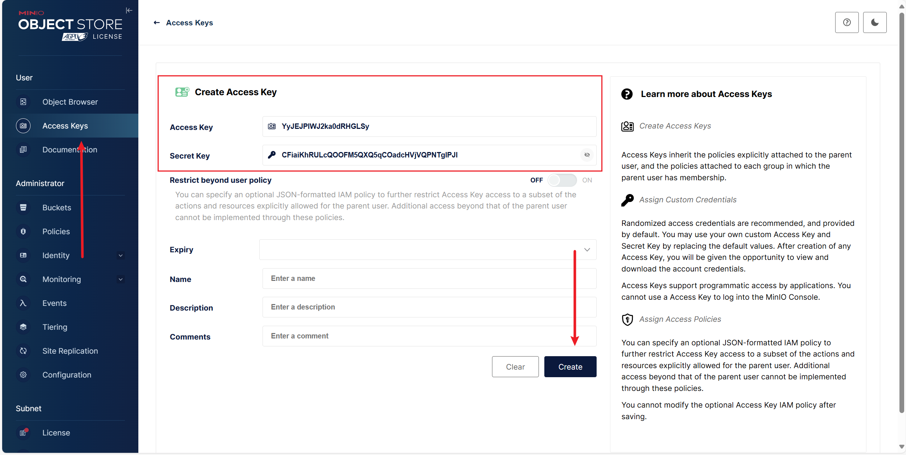

## MiniIO：服务器OSS

官网连接：[适用于 Linux 的 MinIO 对象存储 — 适用于 Linux 的 MinIO 对象存储](https://min.io/docs/minio/linux/index.html)


### 服务器部署&操作

#### 部署在Linux

这里使用1Panel在docker上部署



进入miniIO面板：http://yourip:9001 （账号密码如图）


linux在docker手动安装：

```powershell
docker run \
   -p 9000:9000 \
   -p 9001:9001 \
   --name minio1 \
   -v D:\minio\data:/data \
   -e "MINIO_ROOT_USER=你的用户" \
   -e "MINIO_ROOT_PASSWORD=你的密码" \
   quay.io/minio/minio server /data --console-address ":9001"
```


#### 配置MiniIO

流程：创建一个资源桶(bucket) ->创建AK SK密钥来交给用户登录，然后再上传下载资源桶中的数据

**1.创建数据桶**



可以在linux 系统中使用

mc  alias  set  <桶名字> MINIIO访问界面:API端口 SK AK 进行创建桶

例如：

```powershell
mc alias set mymini2 http://yourip:9001 rlhR84uCH07RQoqECQEL c6gr6VPqWsOEo8e9d9v8wDuJ5OG7wTySr5DAP0Js
```

```powershell
mc mb myminio/mybucket2                     #创建一个名字为mybacket2桶
```


**2.在界面上传和下载文件**




**3.设置文件公开访问**

默认创建的桶都是私有桶，无法公开访问



也可以设置数据读写权限




### JAVA开发端操作

#### 导入配置

**1.引入依赖：**

```xml
<dependency>
    <groupId>io.minio</groupId>
    <artifactId>minio</artifactId>
    <version>8.5.13</version>
</dependency>
```


**2.获取Access Key：**



这个和阿里oss一样，只能查看一次。丢失只好重建bucket


**3.配置文件引入：**

```java
server:
    port: 8080
spring:
    servlet:
        multipart:
            max-file-size: 10MB
            max-request-size: 10MB
    #minio配置
    minio:
        access-key: 
        secret-key: 
        url: #访问地址
        bucket-name: study-bucket
```


#### 工具类

##### **config类***

不多说，用来映射参数的

```java
@Data
@Configuration
@ConfigurationProperties(prefix = "spring.minio")
public class MinioConfig {

    private String accessKey;
    private String secretKey;
    private String url;
    private String bucketName;

    @Bean
    public MinioClient minioClient(){
        return MinioClient.builder()
                .endpoint(url)
                .credentials(accessKey,secretKey)
                .build();
    }
}
```


##### **util类***

```java
/**
 * @Description Minio工具类
 */

@Component
public class MinioUtils {

    @Autowired
    private MinioClient minioClient;

    @Autowired
    private MinioConfig configuration;

    /**
     * @param name 名字
     * @Description description: 判断bucket是否存在，不存在则创建
     */
    public boolean existBucket(String name) {
        boolean exists;
        try {
            exists = minioClient.bucketExists(BucketExistsArgs.builder().bucket(name).build());
            if (!exists) {
                minioClient.makeBucket(MakeBucketArgs.builder().bucket(name).build());
                exists = true;
            }
        } catch (Exception e) {
            e.printStackTrace();
            exists = false;
        }
        return exists;
    }

    /**
     * @param bucketName 存储bucket名称
     * @Description 创建存储bucket
     */
    public Boolean makeBucket(String bucketName) {
        try {
            minioClient.makeBucket(MakeBucketArgs.builder()
                    .bucket(bucketName)
                    .build());
        } catch (Exception e) {
            e.printStackTrace();
            return false;
        }
        return true;
    }

    /**
     * @param bucketName 存储bucket名称
     * @Description 删除存储bucket
     */
    public Boolean removeBucket(String bucketName) {
        try {
            minioClient.removeBucket(RemoveBucketArgs.builder()
                    .bucket(bucketName)
                    .build());
        } catch (Exception e) {
            e.printStackTrace();
            return false;
        }
        return true;
    }

    /**
     * @param fileName 文件名称
     * @param time     时间
     * @Description 获取上传临时签名
     */
    @SneakyThrows
    public Map getPolicy(String fileName, ZonedDateTime time) {
        PostPolicy postPolicy = new PostPolicy(configuration.getBucketName(), time);
        postPolicy.addEqualsCondition("key", fileName);
        try {
            Map<String, String> map = minioClient.getPresignedPostFormData(postPolicy);
            HashMap<String, String> map1 = new HashMap<>();
            map.forEach((k, v) -> {
                map1.put(k.replaceAll("-", ""), v);
            });
            map1.put("host", configuration.getUrl() + "/" + configuration.getBucketName());
            return map1;
        } catch (ErrorResponseException e) {
            e.printStackTrace();
        } catch (InsufficientDataException e) {
            e.printStackTrace();
        } catch (InternalException e) {
            e.printStackTrace();
        } catch (InvalidKeyException e) {
            e.printStackTrace();
        } catch (InvalidResponseException e) {
            e.printStackTrace();
        } catch (IOException e) {
            e.printStackTrace();
        } catch (NoSuchAlgorithmException e) {
            e.printStackTrace();
        } catch (ServerException e) {
            e.printStackTrace();
        } catch (XmlParserException e) {
            e.printStackTrace();
        }
        return null;
    }

    /**
     * @param objectName 对象名称
     * @param method     方法
     * @param time       时间
     * @param timeUnit   时间单位
     * @Description 获取上传文件的url
     */
    public String getPolicyUrl(String objectName, Method method, int time, TimeUnit timeUnit) {
        try {
            return minioClient.getPresignedObjectUrl(GetPresignedObjectUrlArgs.builder()
                    .method(method)
                    .bucket(configuration.getBucketName())
                    .object(objectName)
                    .expiry(time, timeUnit).build());
        } catch (ErrorResponseException e) {
            e.printStackTrace();
        } catch (InsufficientDataException e) {
            e.printStackTrace();
        } catch (InternalException e) {
            e.printStackTrace();
        } catch (InvalidKeyException e) {
            e.printStackTrace();
        } catch (InvalidResponseException e) {
            e.printStackTrace();
        } catch (IOException e) {
            e.printStackTrace();
        } catch (NoSuchAlgorithmException e) {
            e.printStackTrace();
        } catch (XmlParserException e) {
            e.printStackTrace();
        } catch (ServerException e) {
            e.printStackTrace();
        }
        return null;
    }


    /**
     * @param file     文件
     * @param fileName 文件名称
     * @Description 上传文件
     */
    public void upload(MultipartFile file, String fileName) {
        // 使用putObject上传一个文件到存储桶中。
        try {
            InputStream inputStream = file.getInputStream();
            minioClient.putObject(PutObjectArgs.builder()
                    .bucket(configuration.getBucketName())
                    .object(fileName)
                    .stream(inputStream, file.getSize(), -1)
                    .contentType(file.getContentType())
                    .build());
            inputStream.close();
        } catch (ErrorResponseException e) {
            e.printStackTrace();
        } catch (InsufficientDataException e) {
            e.printStackTrace();
        } catch (InternalException e) {
            e.printStackTrace();
        } catch (InvalidKeyException e) {
            e.printStackTrace();
        } catch (InvalidResponseException e) {
            e.printStackTrace();
        } catch (IOException e) {
            e.printStackTrace();
        } catch (NoSuchAlgorithmException e) {
            e.printStackTrace();
        } catch (ServerException e) {
            e.printStackTrace();
        } catch (XmlParserException e) {
            e.printStackTrace();
        }
    }

    /**
     * @param objectName 对象名称
     * @param time       时间
     * @param timeUnit   时间单位
     * @Description 根据filename获取文件访问地址
     */
    public String getUrl(String objectName, int time, TimeUnit timeUnit) {
        String url = null;
        try {
            url = minioClient.getPresignedObjectUrl(GetPresignedObjectUrlArgs.builder()
                    .method(Method.GET)
                    .bucket(configuration.getBucketName())
                    .object(objectName)
                    .expiry(time, timeUnit).build());
        } catch (ErrorResponseException e) {
            e.printStackTrace();
        } catch (InsufficientDataException e) {
            e.printStackTrace();
        } catch (InternalException e) {
            e.printStackTrace();
        } catch (InvalidKeyException e) {
            e.printStackTrace();
        } catch (InvalidResponseException e) {
            e.printStackTrace();
        } catch (IOException e) {
            e.printStackTrace();
        } catch (NoSuchAlgorithmException e) {
            e.printStackTrace();
        } catch (XmlParserException e) {
            e.printStackTrace();
        } catch (ServerException e) {
            e.printStackTrace();
        }
        return url;
    }

    /**
     * @Description description: 下载文件
     */
    public ResponseEntity<byte[]> download(String fileName) {
        ResponseEntity<byte[]> responseEntity = null;
        InputStream in = null;
        ByteArrayOutputStream out = null;
        try {
            in = minioClient.getObject(GetObjectArgs.builder().bucket(configuration.getBucketName()).object(fileName).build());
            out = new ByteArrayOutputStream();
            IOUtils.copy(in, out);
            //封装返回值
            byte[] bytes = out.toByteArray();
            HttpHeaders headers = new HttpHeaders();
            try {
                headers.add("Content-Disposition", "attachment;filename=" + URLEncoder.encode(fileName, "UTF-8"));
            } catch (UnsupportedEncodingException e) {
                e.printStackTrace();
            }
            headers.setContentLength(bytes.length);
            headers.setContentType(MediaType.APPLICATION_OCTET_STREAM);
            headers.setAccessControlExposeHeaders(Arrays.asList("*"));
            responseEntity = new ResponseEntity<byte[]>(bytes, headers, HttpStatus.SUCCESS);
        } catch (Exception e) {
            e.printStackTrace();
        } finally {
            try {
                if (in != null) {
                    try {
                        in.close();
                    } catch (IOException e) {
                        e.printStackTrace();
                    }
                }
                if (out != null) {
                    out.close();
                }
            } catch (IOException e) {
                e.printStackTrace();
            }
        }
        return responseEntity;
    }

    /**
     * @param objectFile 对象文件
     */
    public String getFileUrl(String objectFile) {
        try {
//            限时7天的签名算法
//            return minioClient.getPresignedObjectUrl(GetPresignedObjectUrlArgs.builder()
//                    .method(Method.GET)
//                    .bucket(configuration.getBucketName())
//                    .object(objectFile)
//                    .build()
//            );
//          直接访问，有风险，但是相当于不限时，SystemConstant.OSS_IP是服务器IP，自己去补充枚举类
            return "http://" + SystemConstant.OSS_IP + "/" + configuration.getBucketName() + "/" + objectFile;
        } catch (Exception e) {
            e.printStackTrace();
        }

        return null;
    }
}
```


##### controller

可以参考下

```java
/**
 * @Description minio文件上传控制器
 */
@CrossOrigin
@RestController
@RequestMapping("/api")
public class MinioFileUploadController {
    @Autowired
    private MinioUtils minioUtils;

    /**
     * @param file     文件
     * @param fileName 文件名称
     * @Description 上传文件
     */
    @GetMapping("/upload")
    public AjaxResult uploadFile(@RequestParam("file") MultipartFile file, String fileName) {

        minioUtils.upload(file, fileName);
        return AjaxResult.success("上传成功");
    }

    /**
     * @param fileName 文件名称
     * @Description dowload文件
     */
    @GetMapping("/dowload")
    public ResponseEntity dowloadFile(@RequestParam("fileName") String fileName) {
        return minioUtils.download(fileName);
    }

    /**
     * @param fileName 文件名称
     * @Description 得到文件url
     */
    @GetMapping("/getUrl")
    public AjaxResult getFileUrl(@RequestParam("fileName") String fileName){
        HashMap map=new HashMap();
        map.put("FileUrl",minioUtils.getFileUrl(fileName));
        return AjaxResult.success(map);
    }
}
```


##### HttpStatus(可选)

```java
/**
 * @Description http请求状态
 */
public class HttpStatus
{
    /**
     * 操作成功
     */
    public static final int SUCCESS = 200;

    /**
     * 对象创建成功
     */
    public static final int CREATED = 201;

    /**
     * 请求已经被接受
     */
    public static final int ACCEPTED = 202;

    /**
     * 操作已经执行成功，但是没有返回数据
     */
    public static final int NO_CONTENT = 204;

    /**
     * 资源已被移除
     */
    public static final int MOVED_PERM = 301;

    /**
     * 重定向
     */
    public static final int SEE_OTHER = 303;

    /**
     * 资源没有被修改
     */
    public static final int NOT_MODIFIED = 304;

    /**
     * 参数列表错误（缺少，格式不匹配）
     */
    public static final int BAD_REQUEST = 400;

    /**
     * 未授权
     */
    public static final int UNAUTHORIZED = 401;

    /**
     * 访问受限，授权过期
     */
    public static final int FORBIDDEN = 403;

    /**
     * 资源，服务未找到
     */
    public static final int NOT_FOUND = 404;

    /**
     * 不允许的http方法
     */
    public static final int BAD_METHOD = 405;

    /**
     * 资源冲突，或者资源被锁
     */
    public static final int CONFLICT = 409;

    /**
     * 不支持的数据，媒体类型
     */
    public static final int UNSUPPORTED_TYPE = 415;

    /**
     * 系统内部错误
     */
    public static final int ERROR = 500;

    /**
     * 接口未实现
     */
    public static final int NOT_IMPLEMENTED = 501;

    /**
     * 系统警告消息
     */
    public static final int WARN = 601;
}
```


##### 常用常量(可选)

```java
import io.jsonwebtoken.Claims;

/**
 * @Description 通用常量信息
 */
public class Constants
{
    /**
     * UTF-8 字符集
     */
    public static final String UTF8 = "UTF-8";

    /**
     * GBK 字符集
     */
    public static final String GBK = "GBK";

    /**
     * www主域
     */
    public static final String WWW = "www.";

    /**
     * http请求
     */
    public static final String HTTP = "http://";

    /**
     * https请求
     */
    public static final String HTTPS = "https://";

    /**
     * 通用成功标识
     */
    public static final String SUCCESS = "0";

    /**
     * 通用失败标识
     */
    public static final String FAIL = "1";

    /**
     * 登录成功
     */
    public static final String LOGIN_SUCCESS = "Success";

    /**
     * 注销
     */
    public static final String LOGOUT = "Logout";

    /**
     * 注册
     */
    public static final String REGISTER = "Register";

    /**
     * 登录失败
     */
    public static final String LOGIN_FAIL = "Error";
 
    /**
     * 验证码有效期（分钟）
     */
    public static final Integer CAPTCHA_EXPIRATION = 2;

    /**
     * 令牌
     */
    public static final String TOKEN = "token";

    /**
     * 令牌前缀
     */
    public static final String TOKEN_PREFIX = "Bearer ";

    /**
     * 令牌前缀
     */
    public static final String LOGIN_USER_KEY = "login_user_key";

    /**
     * 用户ID
     */
    public static final String JWT_USERID = "userid";

    /**
     * 用户名称
     */
    public static final String JWT_USERNAME = Claims.SUBJECT;

    /**
     * 用户头像
     */
    public static final String JWT_AVATAR = "avatar";

    /**
     * 创建时间
     */
    public static final String JWT_CREATED = "created";

    /**
     * 用户权限
     */
    public static final String JWT_AUTHORITIES = "authorities";

    /**
     * 资源映射路径 前缀
     */
    public static final String RESOURCE_PREFIX = "/profile";

    /**
     * RMI 远程方法调用
     */
    public static final String LOOKUP_RMI = "rmi:";

    /**
     * LDAP 远程方法调用
     */
    public static final String LOOKUP_LDAP = "ldap:";

    /**
     * LDAPS 远程方法调用
     */
    public static final String LOOKUP_LDAPS = "ldaps:";

    /**
     * 定时任务白名单配置（仅允许访问的包名，如其他需要可以自行添加）
     */
    public static final String[] JOB_WHITELIST_STR = { "com.ruoyi" };

    /**
     * 定时任务违规的字符
     */
    public static final String[] JOB_ERROR_STR = { "java.net.URL", "javax.naming.InitialContext", "org.yaml.snakeyaml",
            "org.springframework", "org.apache", "com.ruoyi.common.utils.file", "com.ruoyi.common.config" };
}
```

##### Ajax请求工具类(可选)

```java
/**
 * @Description ajax结果
 */
public class AjaxResult extends HashMap<String, Object>
{
    private static final long serialVersionUID = 1L;

    /** 状态码 */
    public static final String CODE_TAG = "code";

    /** 返回内容 */
    public static final String MSG_TAG = "msg";

    /** 数据对象 */
    public static final String DATA_TAG = "data";

    /**
     * 初始化一个新创建的 AjaxResult 对象，使其表示一个空消息。
     */
    public AjaxResult()
    {
    }

    /**
     * 初始化一个新创建的 AjaxResult 对象
     *
     * @param code 状态码
     * @param msg 返回内容
     */
    public AjaxResult(int code, String msg)
    {
        super.put(CODE_TAG, code);
        super.put(MSG_TAG, msg);
    }

    /**
     * 初始化一个新创建的 AjaxResult 对象
     *
     * @param code 状态码
     * @param msg 返回内容
     * @param data 数据对象
     */
    public AjaxResult(int code, String msg, Object data)
    {
        super.put(CODE_TAG, code);
        super.put(MSG_TAG, msg);
        if (data!=null)
        {
            super.put(DATA_TAG, data);
        }
    }

    /**
     * 返回成功消息
     *
     * @return 成功消息
     */
    public static AjaxResult success()
    {
        return AjaxResult.success("操作成功");
    }

    /**
     * 返回成功数据
     *
     * @return 成功消息
     */
    public static AjaxResult success(Object data)
    {
        return AjaxResult.success("操作成功", data);
    }

    /**
     * 返回成功消息
     *
     * @param msg 返回内容
     * @return 成功消息
     */
    public static AjaxResult success(String msg)
    {
        return AjaxResult.success(msg, null);
    }

    /**
     * 返回成功消息
     *
     * @param msg 返回内容
     * @param data 数据对象
     * @return 成功消息
     */
    public static AjaxResult success(String msg, Object data)
    {
        return new AjaxResult(HttpStatus.SUCCESS, msg, data);
    }

    /**
     * 返回警告消息
     *
     * @param msg 返回内容
     * @return 警告消息
     */
    public static AjaxResult warn(String msg)
    {
        return AjaxResult.warn(msg, null);
    }

    /**
     * 返回警告消息
     *
     * @param msg 返回内容
     * @param data 数据对象
     * @return 警告消息
     */
    public static AjaxResult warn(String msg, Object data)
    {
        return new AjaxResult(HttpStatus.WARN, msg, data);
    }

    /**
     * 返回错误消息
     *
     * @return 错误消息
     */
    public static AjaxResult error()
    {
        return AjaxResult.error("操作失败");
    }

    /**
     * 返回错误消息
     *
     * @param msg 返回内容
     * @return 错误消息
     */
    public static AjaxResult error(String msg)
    {
        return AjaxResult.error(msg, null);
    }

    /**
     * 返回错误消息
     *
     * @param msg 返回内容
     * @param data 数据对象
     * @return 错误消息
     */
    public static AjaxResult error(String msg, Object data)
    {
        return new AjaxResult(HttpStatus.ERROR, msg, data);
    }

    /**
     * 返回错误消息
     *
     * @param code 状态码
     * @param msg 返回内容
     * @return 错误消息
     */
    public static AjaxResult error(int code, String msg)
    {
        return new AjaxResult(code, msg, null);
    }

    /**
     * 方便链式调用
     *
     * @param key 键
     * @param value 值
     * @return 数据对象
     */
    @Override
    public AjaxResult put(String key, Object value)
    {
        super.put(key, value);
        return this;
    }
}
```

