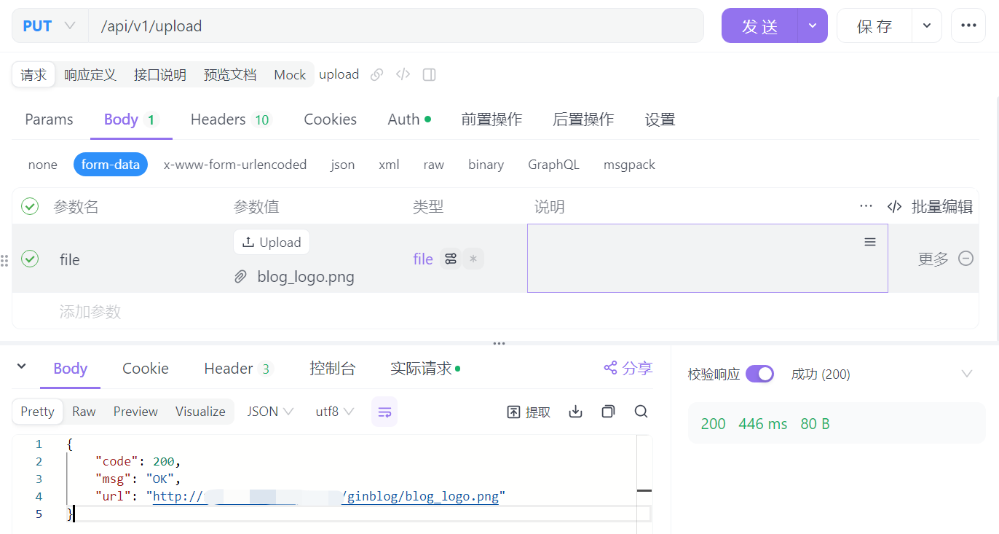

# Simple-MinIO-Tools

官方SDK:[Software Development Kits (SDK) — MinIO Object Storage for Linux](https://min.io/docs/minio/linux/developers/minio-drivers.html)

```powershell
go get github.com/minio/minio-go/v7
```

官方文档:[Go Quickstart Guide — MinIO Object Storage for Linux](https://min.io/docs/minio/linux/developers/go/minio-go.html)

**前言**：查询了一圈官方文档发现，没有熟悉的form-data的file(multipart.File )类型的文件上传接口，于是自己结合文档手搓了下

## 基础配置

**配置文件**

```ini
[minio]
AccessKey = your-access-key
SecretKey = your-secret-key
Bucket = your-bucket-name
Url = 服务器ip+端口(不需要http前缀不然会报错)
```

**setting.go**

加载配置

```go
var (
	...
    
    AccessKey  string
    SecretKey  string
    Bucket     string
    url        string
)

func init() {
    file, err := ini.Load("config/config.ini")
    if err != nil {
       fmt.Println("配置文件读取错误，请检查文件路径是否正确")
    }
	...
    LoadMinio(file) //加载
}

func LoadServer(file *ini.File) {...}

func LoadData(file *ini.File) {...}

func LoadMinio(file *ini.File) {
    AccessKey = file.Section("minio").Key("AccessKey").MustString("")
    SecretKey = file.Section("minio").Key("SecretKey").MustString("")
    Bucket = file.Section("minio").Key("Bucket").MustString("")
    url = file.Section("minio").Key("url").MustString("")
}
```

**errmsg.go**

错误code和信息

```go
const (
	...
	//MinIo模块的错误
	ERROR_MINIO_CLIENT_FAILED_CREATE   = 4001
	ERROR_MINIO_PARSING_MULTIPART_FORM = 4002
	ERROR_MINIO_FILE_LOAD              = 4003
	ERROR_MINIO_FILE_UPLOAD            = 4004
)

var CodeMsg = map[int]string{
	...

	ERROR_MINIO_CLIENT_FAILED_CREATE:   "MinIO客户端创建失败",
	ERROR_MINIO_PARSING_MULTIPART_FORM: "解析multipart表单失败",
	ERROR_MINIO_FILE_LOAD:              "文件加载失败",
	ERROR_MINIO_FILE_UPLOAD:            "文件上传失败",
}

func GetMsg(code int) string {
	return CodeMsg[code]
}
```

## 具体服务

**midware或utils**

```go
var AccessKey = utils.AccessKey
var SecretKey = utils.SecretKey
var Bucket = utils.Bucket
var url = utils.Url

// 初始化Minio客户端
func InitMinio() (*minio.Client, error) {
	minioClient, err := minio.New(url, &minio.Options{
		Creds: credentials.NewStaticV4(AccessKey, SecretKey, ""),
	})
	if err != nil {
		log.Fatalf("Minio Client creation failed, %v", err)
		return nil, err
	}
	return minioClient, nil
}

// 上传图片
func Upload(file multipart.File, header *multipart.FileHeader) (minio.UploadInfo, int) {
	//初始化客户端
	minioClient, err := InitMinio()
	if err != nil {
		code = errmsg.ERROR_MINIO_CLIENT_FAILED_CREATE
		return minio.UploadInfo{}, code
	}
	//上传
	objeceName := header.Filename
	info, err := minioClient.PutObject(
		context.Background(),
		Bucket,
		objeceName,
		file,
		header.Size,
		minio.PutObjectOptions{ContentType: header.Header.Get("Content-Type")},
	)
	if err != nil {
		code = errmsg.ERROR_MINIO_FILE_UPLOAD
		return minio.UploadInfo{}, code
	}
	return info, errmsg.SUCCESS
}

// 获取上传图片的url，用于访问
func GetUrl(objectName string) string {
	ImgaeUrl := "http://" + url + "/" + Bucket + "/" + objectName
	return ImgaeUrl
}
```

**api或controller**

```go
func UploadFile(c *gin.Context) {
	//检查是否是multipart file
	if err := c.Request.ParseMultipartForm(32 << 20); err != nil {
		code = errmsg.ERROR_MINIO_PARSING_MULTIPART_FORM
		c.JSON(http.StatusOK, gin.H{
			"code": code,
			"msg":  errmsg.GetMsg(code),
		})
		return
	}
	//获取文件file
	file, header, err := c.Request.FormFile("file")
	if err != nil {
		code = errmsg.ERROR_MINIO_FILE_LOAD
		c.JSON(http.StatusOK, gin.H{
			"code": code,
			"msg":  errmsg.GetMsg(code),
		})
		return
	}
	defer file.Close()

	//调用上传逻辑
	url, code := model.UploadAndGet(file, header)
	c.JSON(http.StatusOK, gin.H{
		"code": code,
		"url":  url,
		"msg":  errmsg.GetMsg(code),
	})
}
```

**service**

```go
func UploadAndGet(file multipart.File, header *multipart.FileHeader) (string, int) {
    //上传
    _, code := midware.Upload(file, header)
    if code != errmsg.SUCCESS {
       return "", code
    }
    //获取url
    url := midware.GetUrl(header.Filename)
    return url, errmsg.SUCCESS
}
```

**router**

```go
//upload
auth.PUT("upload", v1.UploadFile)
```

## 测试上传

