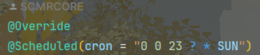

# 定时任务

这里只讲最简单的注解法

分为两步：

**1.开启定时任务**

在启动类添加@EnableScheduling

```java
@EnableScheduling
@SpringBootApplication
@EnableFeignClients(basePackages = "com.example.lecapi.clients", defaultConfiguration = DefaultFeignConfig.class)
public class ClockApplication {

    public static void main(String[] args) {
        SpringApplication.run(ClockApplication.class, args);
    }

}
```


**2.给定时方法加注解**

定时任务的添加只需要使用 @Scheduled 注解标注即可，如果有多个定时任务可以创建多个 @Scheduled 注解标注的方法

```java
@Slf4j
public class CleanData {
    @Autowired
    ClockMapper clockMapper;
    @Autowired
    ClockHistoryMapper clockHistoryMapper;
    @Resource
    RedisTemplate redisTemplate;

    //定时任务：每周清理打卡
    @Scheduled(cron = "0 0 23 ? * SUN")
    public void clean() {
        //获取所有打卡记录id
        List<Clock> records = clockMapper.getAllRecords();

        //保存打卡历史
        log.info("保存打卡历史");
        for(Clock record : records) {
            clockHistoryMapper.saveAll(record);
        }
        
        //清空时长
        log.info("清空时长");
        clockMapper.cleanAllTime(records);
    }
}
```

- **CronTrigger**（Cron触发器）功能非常强大，是基于日历的作业调度，而SimpleTrigger是精准指定间隔，所以相比SimpleTrigger，CroTrigger更加常用。CroTrigger是基于Cron表达式的
- **Cron** 表达式是一个字符串，以5或6个空格隔开，分为6或7个域，每一个域代表一个含义。Cron的表达式被用来配置CronTrigger实例。


**3.例子：表示每周日23点刷新**

	

解析：从左到右分别为：秒、分、时、日期、月份、星期

因为我们是按照星期而不是日期所以日期用'?'


下面是计算网站

[crontab执行时间计算 - 在线工具](https://tool.lu/crontab/)
