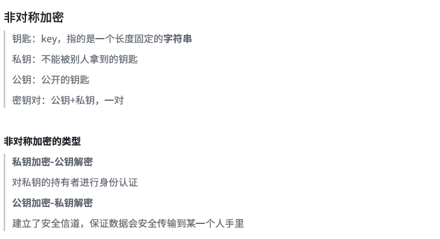

# Git&GitHub介绍

## 开源/实习经验

### 迈出开源第一步

[firstcontributions/first-contributions: 🚀✨ Help beginners to contribute to open source projects](https://github.com/firstcontributions/first-contributions)

这个项目手把手教了如何进行开源贡献，包括fork，clone，pr等等，非常建议自己做一遍。

	

(中文版)

误区：不是说我随便创建个代码放到github就是开源了，开源社区都有社区规范之类的，可以自己多去看看。

> 个人经验

- **阅读README**：进入每一个开源项目首先就要去看README(类似于项目介绍)
- **查看issues**：通常issue会写一些项目目前的问题，以及待开发的东西
- **查看/提交pr**：如何提交pr上面项目有讲，通常出现在pull request里的就是代表还没合并的pr。
- **英文English**：github社区英文是很重要了，我知道大家第一次看会很痛苦，但是用多了就习惯了，作为程序员英语算是一个基本功了。


### **变基与合并**

**Q1**：什么是变基/合并？

- 变基是将**一个分支的更改应用到另一个分支的最新提交之上**，从而使得目标分支看起来就像**直接基于最新的源分支开发**的一样。
- 合并是将**两个分支的更改整合**在一起，**创建一个新的合并**提交来表示这次集成。


开源/实习中：

1. 一般是在本地main或者dev来时刻保持最新，有事没事git pull
2. 要开发新功能feat时，从main/dev最新分支，switch -c出去
3. 如果main或者dev更新了，此时在feat这里建议rebase main/dev保持更新
   （TIP: 如果已经提交pr，不要rebase，不然会把别人代码拉到你的分支历史；可以直接在github的fork仓库那里点更新当前分支然后再拉下来，如果要求你discord，说明此时有冲突了需要解决下）

merge其实我已经用的少了


### 关于暂存和放弃

当你checkout时会遇到**不让你checkout出去**，因为有未提交的文件，此时你不想提交(因为是测试的)，要么在最开始就用ignore屏蔽，要么就暂存stash。

```powershell
# 暂存当前修改
git stash

# 切换分支或做其他操作...

#查看stash列表
git stash list

#恢复某个特定的 stash，一定要加""
git stash apply "stash@{1}"
#或者，我pop用的多
git stash pop "stash@{1}"
```


### 关于gitignore

gitignore的文件可以忽略你不想进行版本管理的文件

注意！：gitignore必须提前写好，如果已经进行的add或者commit的则无法ignore

常见格式：

```powershell
# 忽略所有 .class 文件
*.class

# 忽略所有 .jar 文件
*.jar

# 忽略所有 .jar.original 文件
*.jar.original

# 忽略所有 .gitignore 文件
*.gitignore

# 忽略所有 .yml 文件
*.yml

# 忽略所有 .yaml 文件
*.yaml

# 忽略所有 .factories 文件
*.factories

# 忽略所有 target 目录
backend/user-service/target
backend/lec-gateway/target
backend/clock-service/target
```


### 提取远程commit到自己仓库

情景：我在别人的合作fork仓库开发，并且commit了。但是我想挑自己的commit到自己的fork仓库，然后提交pr，这样该怎么做呢？

- **本地仓库可以remote多个仓库**，我们先在自己fork的仓库的本地，remote另一个仓库
- 然后切换到另一个仓库，获取commit的ID，IDEA可以直接看

```bash
//然后输入：
git cherry-pick abcdef1
```

TIP：不一定会有要求add然后commit，因为已经commit过了。直接推上自己的仓库去即可


### pr中撤回错误commit

如果自己或者别人在我这个pr上commit导致了一些错误

比如CLA出错，那么就可以撤回这个commit（^得加）

```bash
//先撤回
git reset --hard commitID^
//然后强制提交
git push --force origin main
```

然后就能在github的pr的commit历史上看到reset了


## 大致工作流程图


### Linux部分命令

>**一些Linux的基本命令**

```powershell
ls/ll 		  		(查看当前(隐藏)目录)
cat 文件名 		  (查看文件内容)
touch 文件名 	      (创建文件)
vi 文件名 		      (进入vi编辑器记事本之类的可以替代)
mv 原本名字 新的名字   (修改名字)
rm [-rf] 文件名 	  (删除[强制]文件)

cd	文件名			  (前进)
cd ..				(退回上一级目录)
cd ~				(退回用户根目录)
cd d				(切换到d盘根目录)
mkdir 文件夹名		 (创建文件夹)
```

vi编辑器Linux常用：最底部是状态栏。进去时是处于插入状态，我们填写好修改内容后，先按esc编辑状体栏输入

`:wq`是保存并退出 `:q`是退出 `:q!`是强制退出


>  **为常用之类配置别名**

1.打开用户目录，创建.bashrc文件

```powershell
touch ~/.bashrc //~是当前用户的根目录
```

2.打开文件(直接鼠标打开)，按照下面格式来设置别名

```powershell
#用于输出git提交日志
alias git-log='git log --pretty=oneline --all --graph --abbrev-commit'
#用于输出当前目录所有文件及基本信息
alias ll='ls -al'
```


> **解决GitBash乱码问题**

1.打开GitBash执行下面命令

```powershell
git config --global core.quotepath false
```

2.${git_home}/etc/bash.bashrc文件最后加入下面两行(git_home就是git安装的根目录)

```
export LANG="zh_CN.UTF-8"
export LC_ALL="zh_CN.UTF-8"
```


## git部分

### git初始化本地仓库

要使用Git对我们的代码进行版本控制，首先需要获得本地仓库

1. 在电脑的任意位置创建一个空目录(例如test)作为我们的本地Git仓库
2. 进入这个目录中，点击右键打开Git bash窗囗
3. 执行命令git init 
4. 如果创建成功后可在文件夹下看到隐藏的.git日录。(我的电脑创建在`D:\git&github\LocalDatabase`)


### git常用指令

Git工作目录(仓库下的目录)下对于文件的**修改**会存在几个状态，这些**修改**的状态会随着我们执行Git命令而发生变化


> 工作区基本命令

```powershell
1.git add (工作区 -> 暂存区)
//ps：git add . (将所有当前目录下的修改进行add)

2.git commit -m "内容是手动标记/日志" (暂存区 -> 本地仓库)

3.git stauts (获取当前工作目录的状态)

4.git log [options] (查看提交日志)
	options:  (可以一起用)
		--all 显示所有分值
		--pretty=oneline 将提交信息显示为一行
		--abbrev-commit 使得输出的commitld更简短
		--graph 以图的形式显示
由于我们已经提前把这些起别名了，所以直接 git-log就行
```

> **版本回退**

我们想退回到某个版本

```powershell
git reset --hard commitId (回退到某个版本) 
//commitId就是git log中显示的每项操作的版本Id
//ps:在GitBash中直接选中便是复制，然后按滚轮就是粘贴

git reflog (查看每次操作ID)
//比如我们从版本2回退到1，但是我们又想回退到2了，但是我们把屏幕clear了找不到2的commitId了，这时候reflog便记录了2对应的commitId
```

> **添加忽略文件**

我们有很多文件，但是有一两个不需要add，但是一个个输入id又很麻烦，所以可以添加忽略文件

```powershell
touch .gitignore 创建忽略文件
vi .gitignore vi编辑器进入忽略文件
```

然后填入需要忽略文件的id或者后缀(*.txt)，保存退出，进行git add . 即可


### git分支常用指令

使用分支就是把代码从主线上分离下来进行开发，以免影响主线开发

我个人理解就是：我们在创建分支时，相当于把master复制了一份，然后我们对这个副本进行开发，这个副本便是分支

**ps：创建分支时，新分支只会复制已经commit的文件**

> 查看/创建

```powershell
git branch 				(查看分支)
git branch 分支名		  (创建分支)
```

git-log也可以查看分支提交内容，并且规定当前工作区只能为一个分支服务

> 切换
>

```powershell
git checkout 分支名      (切换分支)
git checkout -b         (创建并切换)
```

HEAD指向当前分支，切换分支后工作目录内容也会发生变化

	

> 合并
>

```powershell
git merge 分支名         (合并分支)
```

一般都是把分支合并到master，所以先切换到master分支再合并，会进入vi界面，直接vi保存退出

	

可以看左边的图：`*`代表一个分支，merge后两个`*`连在一起合成一个新的`*`

> 删除

```powershell
git branch -d 分支名		(删除分支)
git branch -D 分支名		(强制删除分支)
```

不能删除当前分支，只能删除其他分支

有时候会遇到就是某个分支没有合并到master的时候，-d会提醒你是否误操作，如果不是误操作就直接-D


### git解决冲突

当两个分支修改了同一个文件的同一行，这时候就需要手动解决冲突：

1.处理文件中冲突的地方

2.直接add+commit

	

可以鼠标点进去改，也可以用vi编辑器改

因此，为了避免冲突，应该在每次coding前pull更新内容到本地


### git版本回退

**对于尚未添加到暂存区(add)**

```powershell
//放弃所有在工作目录中的修改：
git checkout -- .
//放弃特定文件修改
git checkout -- [文件路径]
```

**已经将更改添加到暂存区(尚未commit)**

先取消暂存状态

```powershell
git reset HEAD --
```

然后再用上面两条指令


##  github部分

### 仓库托管&配备公钥

我们本地想与远程github建立连接，首先就需要密钥配对，一般来说一个电脑只用配一次，服务器同理。

	

生成密钥对并完成身份验证

```
ssh-keygen -t rsa
```

在路径` ~/.ssh`  下找到⽂件 `id_rsa.pub`  ，其中的内容(cat获取) 就是公钥，把它交给`github`即可。

```
cat ~/.ssh/id_rsa.pub
```

	

检验是否成功

```
ssh -T git@github.com
```


### 远程仓库添加&查看&推送

> **新建仓库后，拿到ssh进行远程关联**

origin是给url起的名字

```
git remote add origin 你仓库的ssh
```

> **查看**

```powershell
git remote     (查看有哪些仓库)
git remote -v  (查看本地仓库关联的远程仓库)
git branch -vv (查看本地分支以及关联关系)
```

	

master有绑定关系，branch1没有绑定关系

> **推送**

-f是强制覆盖

```powershell
git push [-f] [--set-upstream] [远端名称 [本地分支名]:[远端分支名]]

//如果远程分支名和本地分支名相同，则可以只写本地分支名
	git push origin master
//选项--set-upstream推送到远端的同时建立起和远端分支的关联关系
	git push --set-upstream origin master
//当前分支已经和远端分支关联，则可以省略分支名
	git push	(比如当前在master，之前已经和master建立联系，那么之间push)
```


### 从远程仓库克隆

直接在想克隆到的文件夹中打开`GitBash`

```powershell
git clone ssh地址 文件夹名字
```

远端仓库ssh位置

			


### 抓取&拉取

> 抓取命令
>

```powershell
git fetch [remote name] [branch name]
```

抓取命令是将**仓库里的更新**都**抓取到本地**，**不会进行合并**

不指定远端名称和分支名，则抓取所有分支

> 拉取命令
>

```
git pull [remote name] [branch name]
```

拉取命令是将**仓库里的更新**都**抓取到本地并进行合并**,等同于fetch+merge

不指定远端名称和分支名，则抓取所有分支

PS：远程分支和本地分支都是分支，他俩也可以进行merge操作，只是需要把远端仓库里的更新都下载到本地，在进行操作


### 远程解决冲突

A 用户在本地代码修改完后先推送到远程仓库，此时B也在本地修改完代码了，但是晚于A，所以要先拉区远程仓库的提交，经过合并后才能推送到远端分支

冲突就在于：B拉取代码时，A和B同一段时间修改了同一个文件的相同位置代码，产生了冲突。**远程分支也是分支，合并时冲突的解决方式也和解决本地分支冲突相同**

因此，一般来说建议在coding前pull更新内容到本地


