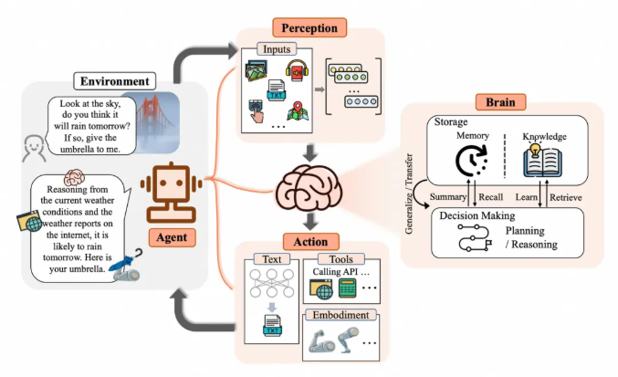
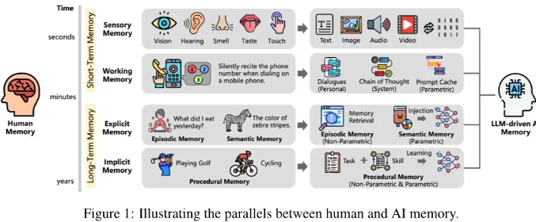

# Agentic AI 时代的记忆系统演进之路

原文链接：[万字解码 Agentic AI 时代的记忆系统演进之路](https://mp.weixin.qq.com/s/LYx4pV1L9aVjd5u5iiI2zg)

## Agent与Memory

当下阶段 AI 应用正在从 Generative AI 向 Agentic AI 阶段迈进，2025 年被视为 Agent 市场元年，Agent 架构相关的技术讨论非常火热，技术演进也非常的快速。

从目前的技术发展趋势看，**各类开发框架逐渐从底层专注于与 LLM 的集成演进到上层关注于对 Agent 内部各类组件的抽象和集成**，也有了像 MCP 和 A2A 这类定义了 Agent 如何调用工具以及如何与其他 Agent 交互的标准协议的建立，Agent 架构的各个部件逐渐被定义清晰并且形成标准。

上图（来自 The Rise and Potential of Large Language Model Based Agents: A Survey）定义了 Agent 架构，其中包含几个重要部分：

- **感知能力**：让 Agent 能接受多模态的信息输入。
- **决策能力**：让 Agent 能自主决策和规划能力，能够执行更复杂的任务。 
- **记忆能力**：让 Agent 具备记忆能力，记忆内部存储Agent的知识和技能。
- **行动能力**：让 Agent 具备与外界交互的能力，通过行动与感知让 Agent能自主完成更多复杂任务。

本文要探讨的便是记忆部分，对Agent至关重要：

1. *让 Agent 具备持续学习能力*：Agent 所拥有的知识主要蕴含在 LLM 的参数内，这部分是静态的，记忆让 Agent 具备了知识与经验积累和优化的能力。有研究表明配置了记忆的 Agent 能显著增强性能，Agent 能够从过去经历中总结经验以及从错误中学习，加强任务表现。

2. *让 Agent 能够保持对话的连贯性和行动的一致性*：拥有记忆能够让 Agent **具备更远距离的上下文管理能力**，在长对话中能够保持一致的上下文从而保持连贯性。也能避免建立与之前相矛盾的事实，保持行动的一致性。

3. *让 Agent 能够提供个性化的服务和用户体验*：拥有记忆能够让 Agent **通过历史对话推断用户偏好**，构建与用户互动的心理模型，从而提供更符合用户偏好的个性化服务和体验。

## 如何定义Memory

### 人脑记忆结构

记忆有不同维度的分类：

**1.按存储时间分类**：

- **感知记忆**存储人脑从环境捕获的信息(声音、视觉...)
- **短期记忆**存储人脑在思考过程中所需处理的信息，也称**工作记忆**
- **长期记忆**用于长期保存人类记忆(知识与技能)

感知记忆是人脑的信息输入区，短期记忆（或工作记忆区）是人脑工作时的信息**暂存**区（或信息加工区），而长期记忆就是人脑的长期**信息储存**区

**2.按内容性质分类**：

- 可声明式记忆，也称**显式**记忆
- 不可声明式记忆，也称**隐式**记忆

这两类的主要区别:

a.是否可以用语言描述：可声明式记忆可以用语言来描述，例如所掌握的某个知识内容。不可声明式记忆不可被语言描述，例如所掌握的某个技能如骑车。

b.是否需要有意识参与：显式记忆需要有意识主动回忆，而隐式记忆无意识参与，所以也被称为肌肉记忆。

**3.按存储内容分类**：

经历、知识、技能

- 情境记忆（Episodic Memory）：代表经历，存储了过去发生的事件。
- 语义记忆（Semantic Memory）：代表知识，存储了所了解的知识。
- 流程记忆（Procedure Memory）：代表技能，存储了所掌握的技能。

记忆就是人脑对信息进行编码、存储和检索的过程，核心操作：

1. **编码**（Encode）：获取和处理信息，将其转化为可以存储的形式。

2. **存储**（Storage）：在短期记忆或长期记忆中保留编码信息的过程。

3. **提取**（Retrival）：也可称为回忆，即在需要时访问并使存储的信息重新进入意识的过程。

记忆还包含其他的一些操作：

1. 巩固（Consolidation）：通过巩固将**短期记忆转变成长期记忆**，存储在大脑中，降低被遗忘的可能性。

2. 再巩固（Reconsolidation）：**先前存储的记忆被重新激活**，进入不稳定状态并需要再巩固以维持其存储的过程。

3. 反思（Reflection）：反思是指**主动回顾、评估和检查自己的记忆内容的过程**，以增强自我意识，调整学习策略或优化决策的过程。

4. 遗忘（Forgetting）：遗忘是一个自然的过程。

### 智能体记忆

结合上面概念可以描述为：『存储在哪个记忆区』的『以什么形式存在』的『什么类型的』记忆。

**记忆存储的差别**：

1. 上下文：智能体的短期/工作记忆区，上下文窗口有限，且过长时容易被遗忘。
2. LLM：智能体的长期记忆区，蕴含了智能体的大部分知识，包含了不同类型的记忆。
3. 外挂记忆存储：也是属于长期记忆区。

**存储形式的差别**：

可以简单分为 **参数形式** 和 **非参数形式**

KV-Cache(字面上的map的kv对存储的缓存)可以认为是短期记忆区的参数形式记忆，LLM是长期记忆区的参数形式记忆，外挂记忆是长期记忆区非参数形式的记忆。

**智能体记忆分类**：

这里挑几个熟悉的：

- 提示词工程（prompt enginerr）属于对短期记忆区的显示记忆优化
- 知识库（RAG）属于对长期记忆区的显示记忆优化
- 模型微调（Fine-Tunning）属于对长期记忆区的隐式记忆优化。

**智能体记忆操作**：

智能体提供的记忆操作与人脑记忆是比较类似的，也包括编码、存储和提取。

记忆编码包含了对记忆的获取和处理，通过对工作记忆区内容的处理发现新的记忆，编码成可存储的结构。

记忆存储为参数或非参数的形式，**非参数的形式通常以 Plaintext、Graph 或 Structure-Table 的结构存储。**

记忆提取通常通过检索来实现，具体技术实现包括全文检索、向量检索、图检索或者是混合检索，具体检索方式取决于存储的内容和结构。

## Agent Memory产品

MemoryBank、LETTA、ZEP、A-MEM、Mem0、MemOS、Mirix

从上述产品的演变趋势来看，Memory正在覆盖越来越多的场景，同时也在覆盖越来越多记忆类型。

**早期主要聚焦在对话记忆，现在已经扩展到任务执行、决策支持、个性服务等**。

一些被验证的能提升效率的手段：

1. 精细化的记忆管理：记忆在场景、分类和形式上有明确的区分，『**分而治之**』的思路被证明是有效的优化手段，这个和 Multi-Agent 的优化思路是类似的。

2. 组合多种记忆存储结构：
   记忆底层存储结构可以大致分为结构化信息（Metadata 或 Tag 等）、纯文本（Text-Chunk、Summary、情境记录等）和知识图谱，会分别构建标签索引、全文索引、向量索引和图索引等提升检索效果。
   也有基于这些原子索引能力构建场景化的索引，如分层摘要、社区图等。不同的存储结构对应不同的场景，**记忆框架由集成单一结构演进到组合多种架构**，带来了一定的效果提升。

3. **记忆检索优化**：检索方式也在逐步演进，由**单一检索演进到混合检索**，也有针对 Embedding 和 Reranker 进行调优优化。

