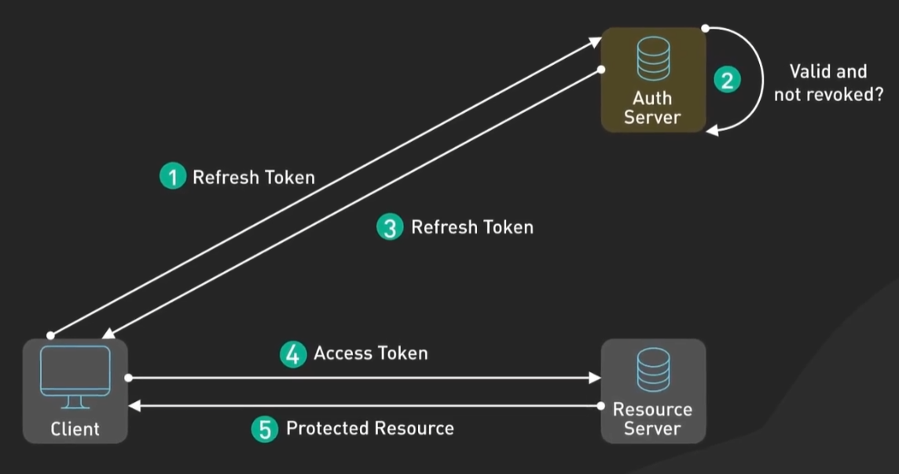

## 平衡JWT令牌时效性与安全性

**双token**:

当一个第三方服务获得了访问令牌后，它可以使用该令牌来调用API，直到令牌过期。由于访问令牌的有效期很短，如果令牌被泄露，攻击者只能在短暂的时间内滥用它。一旦访问令牌过期，攻击者将无法继续使用它，除非他们也能获得刷新令牌。

**如果第三方服务需要继续访问API，它可以通过提供刷新令牌来请求新的访问令牌。**这样做的好处是，即使访问令牌被泄露，由于它的有效期短，风险相对较小。而且，如果怀疑有安全问题，你可以仅撤销刷新令牌，这将阻止任何进一步的访问令牌被发放，从而立即终止所有后续访问。

**为什么Web或App模式下可能不需要双token：**

在Web或移动应用程序中，用户通常直接与应用程序交互，而不是通过第三方服务。因此，在这些环境中，应用可以直接管理用户的会话，包括如何安全地存储和处理令牌。此外，浏览器环境下的单页面应用(SPA)可能会使用更复杂的机制（如基于浏览器的OAuth 2.0隐式流或授权码流加PKCE），并且可能依赖于HTTPS、同源策略等其他安全措施来保护令牌。

- 访问令牌：每次请求时用于身份验证的实际JWT，时效期常为15min。
- 刷新令牌：顾名思义，时效期常为天/周。

运作原理：

当访问令牌过期时，客户端可以将刷新令牌发送到服务器上的一个特殊令牌端点，而不是要求用户重新登录。

服务器检查刷新令牌是否有效且未被撤销。如果正常则服务器发放一个新的访问令牌。

PS：刷新令牌只在访问令牌过期时发送，而不是每次请求都发送。

