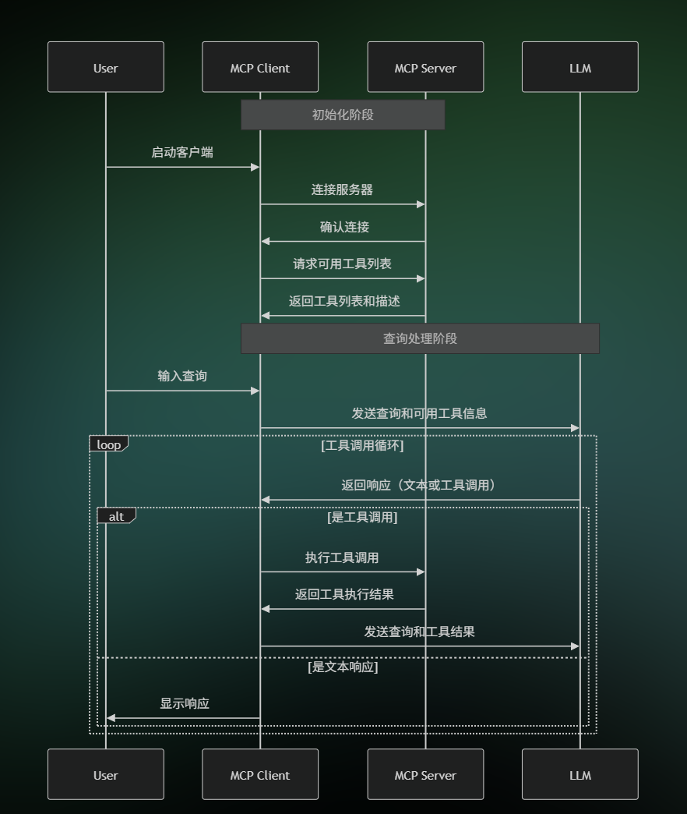
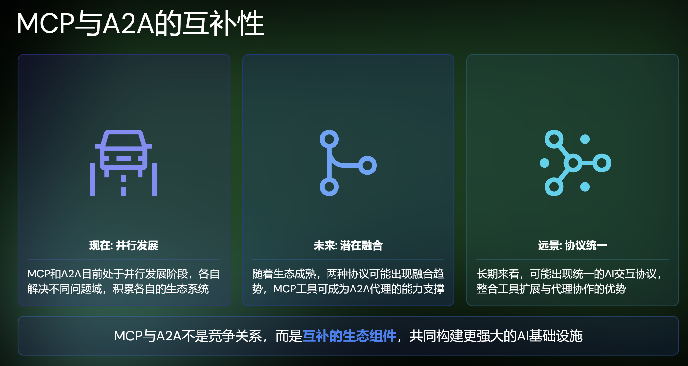

文章概览：

- MCP本身
- MCP与FunctionCall
- MCP与A2A

参考文章：

[MCP 是什么？机遇以及可能的未来 - Slidev](https://talks.ayaka.io/nekoayaka/2025-04-13-what-is-mcp-and-how-it-helps/#/8?clicks=3)

## MCP是什么

Model Context Protocol模型上下文协议

Anthropic公司2024年初推出的开放协议

- 提供标准化接口，实现LLM与外部数据源及工具的无缝集成
- 已获得多个AI编辑器支持：Cursor，Windsurf，Cline等
- 正逐渐成为连接LLM与外部世界的事实标准

> **MCP实现方式**

**Server实现：**

- 通常是一段运行在本地的py/js代码
- 可执行本地操作 (浏览文件系统)
- 可通过网络访问API (包括第三方API或远程数据库)
- 可提供预定义的功能工具集

**Client实现：**

->已实现MCP的应用：

Claude (Anthropic公司自己的)，Cursor，Windsuf (类似Cursor)，Cline (Claude插件)

->客户端负责：

- 连接MCP服务器
- 在用户和LLM之间中转信息
- 按LLM指示调用工具

> **MCP基本工作流程**	

1. 客户端启动，读取MCP配置

2. 连接MCP Server

3. 获取工具列表

4. 发送用户input，同时提供可用工具列表

5. LLM判断是否需要调用工具

6. 客户端按照LLM指示调用Server上的工具

7. 将调用结果返回给LLM，组织最终答案

   ​	

> **MCP当前的局限性**

- **客户端生态不足**：支持MCP的应用数量有限，主流Chat应用和Web应用尚未大规模集成
- **部署与管理复杂**：需要一定的技术知识，部署和维护门槛高
- **安全审核机制不完善**：缺乏标准化的安全审核流程，用户难以判断工具安全性
- **产品化程度不高**：当前更偏向开发者工具，对终端用户的产品体验有待提升

## MCP与FunctionCalling

**FunctionCalling**

- 由API提供商 (OpenAI，DashScope) 定义接口标准
- 函数预先定义，每种能力需单独集成
- 通常再模型的服务端执行，数据隐私风险
- 每个模型API有自己的调用方式

**MCP**

- 开放协议标准，任何人可实现和拓展
- 本地运行，数据不离开用户设备
- 工具生态可互操作，一次构建多处使用
- 标准USB接口，支持“即插即用”拓展

> **Q: 为什么MCP比直接实现FunctionCalling更好**？

就像Web标准让所有浏览器都能访问同一个网站，MCP让所有支持该协议的AI模型都能使用同一套工具生态，而不必为每个模型单独开发接口。开发者一次构建，随处可用。

> **Q: MCP解决了什么问题?**

- 连接外部服务：使LLM能获取实时信息：股价天气新闻。
- 执行拓展操作：允许LLM调用外部工具进行精确计算和执行具体任务。

虽然FuncitonCalling也能通过API完成部分功能，但是MCP本身的开放标准，本地运行和生态互操作性带来了更加便捷和标准的开发模式。

## Google的A2A协议概览

agent2agent，使不同AI代理能互相通信协作。

A2A核心概念：

- **代理发现**：通过Agent Cards发现能力
- **任务生命周期**：标准化任务状态管理
- **内容交换**：文本文件结构化数据

A2A技术实现：

- 基于JSON-RPC 2.0，通过HTTP(S)通信
- 支持标准请求/响应和服务器发送事件 (SSE)
- 基于角色的消息结构 (用户/代理)

> **A2A与MCP对比的核心区别**

- A2A专注于：agent间的协作与通信，创建任务委派网络
- MCP专注于：Tool集成与环境访问，拓展单一模型能力

> **直接能力对比**

MCP：LLM的工具箱

- 功能拓展：赋予LLM新的能力，通过工具和资源访问拓展大模型能力
- 本地优先：设计用于在本地环境运行，保证数据安全和隐私
- 单用户视角：侧重单个用户与增强LLM之间的交互

A2A：AI代理协作网络，让专业代理互相配合

- 代理协作：AI代理间能互相发现，通信，协作完成任务
- 分布式设计：适用于跨网络，跨服务的代理协作场景
- 多代理生态：构建能力各异的代理网络，形成协作生态系统

