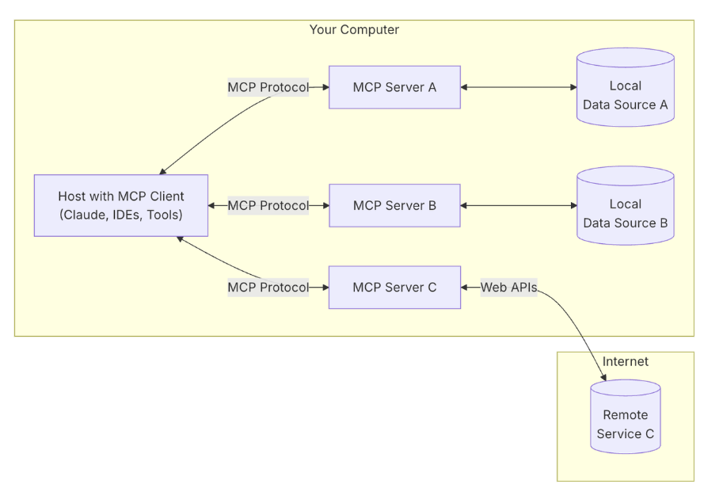
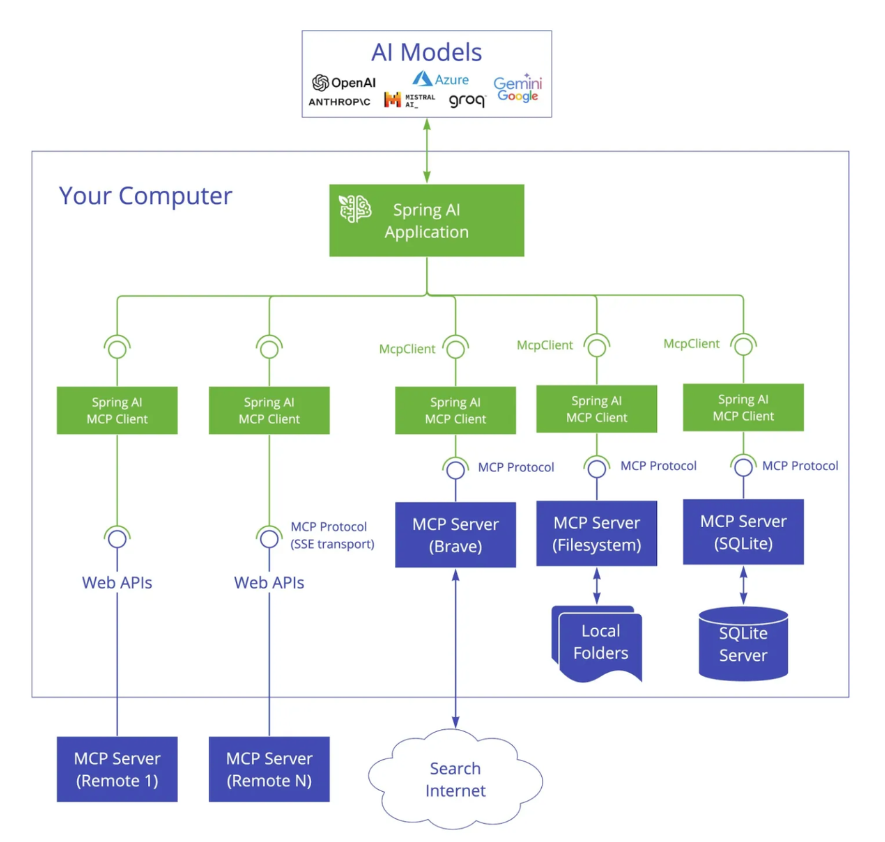
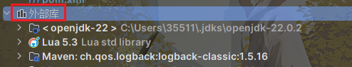
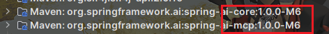
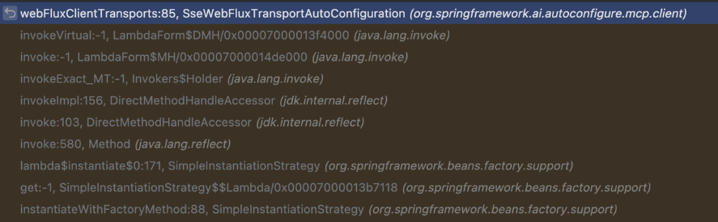
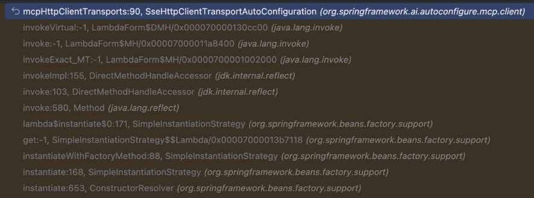
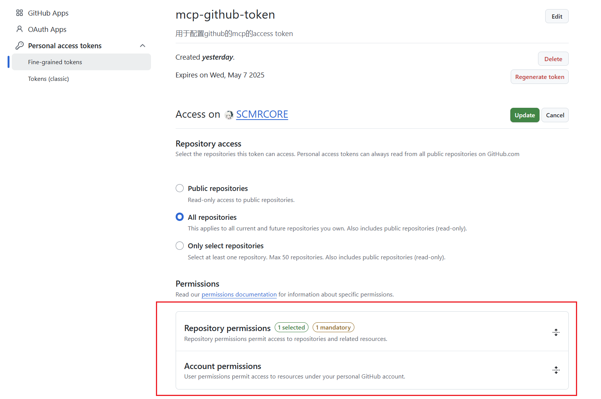

## MCP (JAVA开发)

### 认识Model Context Protocol

#### MCP基本概念

> **个人理解：**通过McpClient和McpServer可以实现跨语言mcp服务调用
>
> 也就是说python开发的服务编写McpServer；Java开发的服务McpClient，编写配置文件，向McpServer发起请求

Anthropic 公司开发，给AI和各类工具数据间搭建标准化桥梁。

**大模型应用可以使用别人分析的MCP完成各种工作内容。**

获取途径：

- awesome-mcp-servers
- mcp.so

MCP协议场景场景：

- 使用百度/高德地图分析旅线计算时间
- 接 Puppeteer 自动操作网页
- 使用 Github/Gitlab 让大模型接管代码仓库
- 使用数据库组件完成对 Mysql、ES、Redis 等数据库的操作
- 使用搜索组件扩展大模型的数据搜索能力


#### 在Claude Desktop中体验MCP

[Java开发基于Spring AI Alibaba玩转MCP：从发布、调用到 Claude 集成_博客-阿里云Spring AI Alibaba官网官网](https://java2ai.com/blog/spring-ai-alibaba-mcp/?spm=0.29160081.0.0.46c8793ednsupD&source=blog/)


#### MCP的架构

MCP主要分为MCP服务端和MCP客户端（这里要和常规的加以区分）

- **客户端：一般指大模型应用**，比如Claude、通过Spring AI Alibaba和Langchain等开发的AI应用
- **服务端：链接各数据源的服务和工具**



工作流程：

AI应用集成MCP客户端 ——> 通过MCP协议向MCP服务端发起请求。

MCP服务端可以连接本地/远程的数据源，或者通过API访问其他服务 ——> 从而完成数据的获取 ——> 返回给AI应用去使用。


### 在SpringAI中使用MCP Server

#### Spring AI MCP介绍

既然MCP是协议，Sprig AI MCP便是为模型上下文提供了JAVA和Spring框架的集成。

使得通过标准化接口与不同数据源工具进行交互，支持同步和异步。



Spring AI MCP 采用模块化架构，包括以下组件：

- Spring AI 应用程序：使用 Spring AI 框架构建想要通过 MCP 访问数据的生成式 AI 应用程序
- **Spring MCP 客户端：MCP 协议的 Spring AI 实现，与服务器保持 1:1 连接**

通过 Spring AI MCP，可以快速搭建 MCP 客户端和服务端程序。


#### 依赖和仓库镜像问题

由于依赖还没上传到Maven公共仓库，所以可以选择手动指定；这个在spring ai官网也有所提及

```xml
	<repositories>
        <repository>
            <name>Central Portal Snapshots</name>
            <id>central-portal-snapshots</id>
            <url>https://central.sonatype.com/repository/maven-snapshots/</url>
            <releases>
                <enabled>false</enabled>
            </releases>
            <snapshots>
                <enabled>true</enabled>
            </snapshots>
        </repository>
<!--        <repository>-->
<!--            <id>spring-milestones</id>-->
<!--            <name>Spring Milestones</name>-->
<!--            <url>https://repo.spring.io/milestone</url>-->
<!--            <snapshots>-->
<!--                <enabled>false</enabled>-->
<!--            </snapshots>-->
<!--        </repository>-->

        <repository>
            <id>spring-milestones</id>
            <name>Spring Milestones</name>
            <url>https://repo.spring.io/libs-milestone-local</url>
            <snapshots>
                <enabled>false</enabled>
            </snapshots>
        </repository>

        <repository>
            <id>spring-snapshots</id>
            <name>Spring Snapshots</name>
            <url>https://repo.spring.io/snapshot</url>
            <releases>
                <enabled>false</enabled>
            </releases>
        </repository>
    </repositories>
```

有时候spring-ai更新了，但是spring-ai-core还是老版本，可能遇到不兼容问题(1.0.0-M4无法使用MCP )

手动更新到最新版本：

```xml
<!--spring-ai-->
<dependency>
    <groupId>org.springframework.ai</groupId>
    <artifactId>spring-ai-core</artifactId>
    <version>1.0.0-M6</version>
</dependency>
```

检查方式：查看外部库

	

	


#### MCP常用的开发模式

Spring AI 提供了两种机制快速搭建 MCP Server，通过这两种方式开发者可以快速向 AI 应用开放自身的能力，这两种机制如下：

- 基于 stdio 的进程间通信传输，以独立的进程运行在 AI 应用本地，适用于比较轻量级的工具。
- 基于 SSE（Server-Sent Events） 进行远程服务访问，需要将服务单独部署，客户端通过服务端的 URL 进行远程访问，适用于比较重量级的工具。

然后关于实际开发其实主要两种：

- 本地client调用本地server
- 本地client调用远程server

个人感觉第二种用的更多，下面我们会都进行讲解


#### MCP客户端与本地MCP服务

##### **基于stdio的MCP服务端Server实现**

这里选用开源天气查询OpenMeteo

```xml
<!-- 添加Spring AI MCP starter依赖 -->
<dependency>
    <groupId>org.springframework.ai</groupId>
    <artifactId>spring-ai-mcp-server-spring-boot-starter</artifactId>
    <version>1.0.0-M6</version>
</dependency>
```

`<version>`版本记得时刻注意官网

```yaml
server:
    port: 8081

spring:
    application:
        name: lec-ai

	#重点，必须禁用
    main:
        web-application-type: none # 必须禁用web应用类型
        banner-mode: off # 禁用banner

    ai:
        mcp:
            server:
                stdio: true
                name: my-weather-server
                version: 0.0.1
```

具体的server服务

```java
@Service
public class OpenMeteoService {

    // OpenMeteo免费天气API基础URL
    private static final String BASE_URL = "https://api.open-meteo.com/v1";

    private final RestClient restClient;

    public OpenMeteoService() {
        this.restClient = RestClient.builder()
                .baseUrl(BASE_URL)
                .defaultHeader("Accept", "application/json")
                .defaultHeader("User-Agent", "OpenMeteoClient/1.0")
                .build();
    }

    // OpenMeteo天气数据模型
    @JsonIgnoreProperties(ignoreUnknown = true)
    public record WeatherData(
            @JsonProperty("latitude") Double latitude,
            @JsonProperty("longitude") Double longitude,
            @JsonProperty("timezone") String timezone,
            @JsonProperty("current") CurrentWeather current,
            @JsonProperty("daily") DailyForecast daily,
            @JsonProperty("current_units") CurrentUnits currentUnits) {

        @JsonIgnoreProperties(ignoreUnknown = true)
        public record CurrentWeather(
                @JsonProperty("time") String time,
                @JsonProperty("temperature_2m") Double temperature,
                @JsonProperty("apparent_temperature") Double feelsLike,
                @JsonProperty("relative_humidity_2m") Integer humidity,
                @JsonProperty("precipitation") Double precipitation,
                @JsonProperty("weather_code") Integer weatherCode,
                @JsonProperty("wind_speed_10m") Double windSpeed,
                @JsonProperty("wind_direction_10m") Integer windDirection) {
        }

        @JsonIgnoreProperties(ignoreUnknown = true)
        public record CurrentUnits(
                @JsonProperty("time") String timeUnit,
                @JsonProperty("temperature_2m") String temperatureUnit,
                @JsonProperty("relative_humidity_2m") String humidityUnit,
                @JsonProperty("wind_speed_10m") String windSpeedUnit) {
        }

        @JsonIgnoreProperties(ignoreUnknown = true)
        public record DailyForecast(
                @JsonProperty("time") List<String> time,
                @JsonProperty("temperature_2m_max") List<Double> tempMax,
                @JsonProperty("temperature_2m_min") List<Double> tempMin,
                @JsonProperty("precipitation_sum") List<Double> precipitationSum,
                @JsonProperty("weather_code") List<Integer> weatherCode,
                @JsonProperty("wind_speed_10m_max") List<Double> windSpeedMax,
                @JsonProperty("wind_direction_10m_dominant") List<Integer> windDirection) {
        }
    }

    /**
     * 获取天气代码对应的描述
     */
    private String getWeatherDescription(int code) {
        return switch (code) {
            case 0 -> "晴朗";
            case 1, 2, 3 -> "多云";
            case 45, 48 -> "雾";
            case 51, 53, 55 -> "毛毛雨";
            case 56, 57 -> "冻雨";
            case 61, 63, 65 -> "雨";
            case 66, 67 -> "冻雨";
            case 71, 73, 75 -> "雪";
            case 77 -> "雪粒";
            case 80, 81, 82 -> "阵雨";
            case 85, 86 -> "阵雪";
            case 95 -> "雷暴";
            case 96, 99 -> "雷暴伴有冰雹";
            default -> "未知天气";
        };
    }

    /**
     * 获取风向描述
     */
    private String getWindDirection(int degrees) {
        if (degrees >= 337.5 || degrees < 22.5)
            return "北风";
        if (degrees >= 22.5 && degrees < 67.5)
            return "东北风";
        if (degrees >= 67.5 && degrees < 112.5)
            return "东风";
        if (degrees >= 112.5 && degrees < 157.5)
            return "东南风";
        if (degrees >= 157.5 && degrees < 202.5)
            return "南风";
        if (degrees >= 202.5 && degrees < 247.5)
            return "西南风";
        if (degrees >= 247.5 && degrees < 292.5)
            return "西风";
        return "西北风";
    }

    /**
     * 获取指定经纬度的天气预报
     *
     * @param latitude  纬度
     * @param longitude 经度
     * @return 指定位置的天气预报
     * @throws RestClientException 如果请求失败
     */
    @Tool(description = "获取指定经纬度的天气预报")
    public String getWeatherForecastByLocation(double latitude, double longitude) {
        // 获取天气数据（当前和未来7天）
        var weatherData = restClient.get()
                .uri("/forecast?latitude={latitude}&longitude={longitude}&current=temperature_2m,apparent_temperature,relative_humidity_2m,precipitation,weather_code,wind_speed_10m,wind_direction_10m&daily=temperature_2m_max,temperature_2m_min,precipitation_sum,weather_code,wind_speed_10m_max,wind_direction_10m_dominant&timezone=auto&forecast_days=7",
                        latitude, longitude)
                .retrieve()
                .body(WeatherData.class);

        // 拼接天气信息
        StringBuilder weatherInfo = new StringBuilder();

        // 添加当前天气信息
        WeatherData.CurrentWeather current = weatherData.current();
        String temperatureUnit = weatherData.currentUnits() != null ? weatherData.currentUnits().temperatureUnit()
                : "°C";
        String windSpeedUnit = weatherData.currentUnits() != null ? weatherData.currentUnits().windSpeedUnit() : "km/h";
        String humidityUnit = weatherData.currentUnits() != null ? weatherData.currentUnits().humidityUnit() : "%";

        weatherInfo.append(String.format("""
                当前天气:
                温度: %.1f%s (体感温度: %.1f%s)
                天气: %s
                风向: %s (%.1f %s)
                湿度: %d%s
                降水量: %.1f 毫米

                """,
                current.temperature(),
                temperatureUnit,
                current.feelsLike(),
                temperatureUnit,
                getWeatherDescription(current.weatherCode()),
                getWindDirection(current.windDirection()),
                current.windSpeed(),
                windSpeedUnit,
                current.humidity(),
                humidityUnit,
                current.precipitation()));

        // 添加未来天气预报
        weatherInfo.append("未来天气预报:\n");
        WeatherData.DailyForecast daily = weatherData.daily();

        for (int i = 0; i < daily.time().size(); i++) {
            String date = daily.time().get(i);
            double tempMin = daily.tempMin().get(i);
            double tempMax = daily.tempMax().get(i);
            int weatherCode = daily.weatherCode().get(i);
            double windSpeed = daily.windSpeedMax().get(i);
            int windDir = daily.windDirection().get(i);
            double precip = daily.precipitationSum().get(i);

            // 格式化日期
            LocalDate localDate = LocalDate.parse(date);
            String formattedDate = localDate.format(DateTimeFormatter.ofPattern("yyyy-MM-dd (EEE)"));

            weatherInfo.append(String.format("""
                    %s:
                    温度: %.1f%s ~ %.1f%s
                    天气: %s
                    风向: %s (%.1f %s)
                    降水量: %.1f 毫米

                    """,
                    formattedDate,
                    tempMin, temperatureUnit,
                    tempMax, temperatureUnit,
                    getWeatherDescription(weatherCode),
                    getWindDirection(windDir),
                    windSpeed, windSpeedUnit,
                    precip));
        }

        return weatherInfo.toString();
    }

    /**
     * 获取指定位置的空气质量信息 (使用备用模拟数据)
     * 注意：由于OpenMeteo的空气质量API可能需要额外配置或不可用，这里提供备用数据
     *
     * @param latitude  纬度
     * @param longitude 经度
     * @return 空气质量信息
     */
    @Tool(description = "获取指定位置的空气质量信息（模拟数据）")
    public String getAirQuality(@ToolParam(description = "纬度") double latitude,
                                @ToolParam(description = "经度") double longitude) {

        try {
            // 从天气数据中获取基本信息
            var weatherData = restClient.get()
                    .uri("/forecast?latitude={latitude}&longitude={longitude}&current=temperature_2m&timezone=auto",
                            latitude, longitude)
                    .retrieve()
                    .body(WeatherData.class);

            // 模拟空气质量数据 - 实际情况下应该从真实API获取
            // 根据经纬度生成一些随机但相对合理的数据
            int europeanAqi = (int) (Math.random() * 100) + 1;
            int usAqi = (int) (europeanAqi * 1.5);
            double pm10 = Math.random() * 50 + 5;
            double pm25 = Math.random() * 25 + 2;
            double co = Math.random() * 500 + 100;
            double no2 = Math.random() * 40 + 5;
            double so2 = Math.random() * 20 + 1;
            double o3 = Math.random() * 80 + 20;

            // 根据AQI评估空气质量等级
            String europeanAqiLevel = getAqiLevel(europeanAqi);
            String usAqiLevel = getUsAqiLevel(usAqi);

            return String.format("""
                    空气质量信息（模拟数据）:

                    位置: 纬度 %.4f, 经度 %.4f
                    欧洲空气质量指数: %d (%s)
                    美国空气质量指数: %d (%s)
                    PM10: %.1f μg/m³
                    PM2.5: %.1f μg/m³
                    一氧化碳(CO): %.1f μg/m³
                    二氧化氮(NO2): %.1f μg/m³
                    二氧化硫(SO2): %.1f μg/m³
                    臭氧(O3): %.1f μg/m³

                    数据更新时间: %s

                    注意: 由于OpenMeteo空气质量API限制，此处显示模拟数据，仅供参考。
                    """,
                    latitude, longitude,
                    europeanAqi, europeanAqiLevel,
                    usAqi, usAqiLevel,
                    pm10,
                    pm25,
                    co,
                    no2,
                    so2,
                    o3,
                    weatherData.current().time());
        } catch (Exception e) {
            // 如果获取基本天气数据失败，返回完全模拟的数据
            return String.format("""
                    空气质量信息（完全模拟数据）:

                    位置: 纬度 %.4f, 经度 %.4f
                    欧洲空气质量指数: %d (%s)
                    美国空气质量指数: %d (%s)
                    PM10: %.1f μg/m³
                    PM2.5: %.1f μg/m³
                    一氧化碳(CO): %.1f μg/m³
                    二氧化氮(NO2): %.1f μg/m³
                    二氧化硫(SO2): %.1f μg/m³
                    臭氧(O3): %.1f μg/m³

                    注意: 由于API限制，此处显示完全模拟数据，仅供参考。
                    """,
                    latitude, longitude,
                    50, getAqiLevel(50),
                    75, getUsAqiLevel(75),
                    25.0,
                    15.0,
                    300.0,
                    20.0,
                    5.0,
                    40.0);
        }
    }

    /**
     * 获取欧洲空气质量指数等级
     */
    private String getAqiLevel(Integer aqi) {
        if (aqi == null)
            return "未知";

        if (aqi <= 20)
            return "优";
        else if (aqi <= 40)
            return "良";
        else if (aqi <= 60)
            return "中等";
        else if (aqi <= 80)
            return "较差";
        else if (aqi <= 100)
            return "差";
        else
            return "极差";
    }

    /**
     * 获取美国空气质量指数等级
     */
    private String getUsAqiLevel(Integer aqi) {
        if (aqi == null)
            return "未知";

        if (aqi <= 50)
            return "优";
        else if (aqi <= 100)
            return "中等";
        else if (aqi <= 150)
            return "对敏感人群不健康";
        else if (aqi <= 200)
            return "不健康";
        else if (aqi <= 300)
            return "非常不健康";
        else
            return "危险";
    }

    public static void main(String[] args) {
        OpenMeteoService client = new OpenMeteoService();
        // 北京坐标
        System.out.println(client.getWeatherForecastByLocation(39.9042, 116.4074));
        // 北京空气质量（模拟数据）
        System.out.println(client.getAirQuality(39.9042, 116.4074));
    }
}
```

注册服务：自己new一个@Configuration的配置类然后编写下面这个即可

```java
    @Bean
    public ToolCallbackProvider weatherTools(OpenMeteoService openMeteoService) {
        return MethodToolCallbackProvider.builder().toolObjects(openMeteoService).build();
    }
```

**如何使用**：本地的话只能打包成jar包，然后供本地mcp client调用


##### 基于stdio的MCP客户端client实现

```xml
<!-- 添加Spring AI MCP starter依赖 -->
<dependency>
    <groupId>org.springframework.ai</groupId>
    <artifactId>spring-ai-mcp-client-spring-boot-starter</artifactId>
    <version>1.0.0-M6</version>
</dependency>
```

```yaml
server:
    port: 8083

spring:
    application:
        name: lec-agent
    ai:
        dashscope:
            api-key: ${your-api-key}
        mcp:
            client:
                stdio:
                    # 指定MCP服务器配置文件路径（推荐）
                    servers-configuration: classpath:/mcp-servers-config.json
                    # 直接配置示例，和上边的配制二选一
                    # connections:
                    #   server1:
                    #     command: java
                    #     args:
                    #       - -jar
                    #       - /path/to/your/mcp-server.jar
```

**mcp-servers-config.json**：classpath:/默认就是指src/main/resource

这里填入我们上面Server打包好的jar包位置

```json
{
    "mcpServers": {
        "weather": {
            "command": "java",
            "args": [
                "-Dspring.ai.mcp.server.stdio=true",
                "-Dspring.main.web-application-type=none",
                "-Dlogging.pattern.console=",
                "-jar",
                "这里填入我们上面Server打包好的jar包位置"
            ],
            "env": {}
        }
    }
}
```

编写测试文件，Configuration仅用作演示

```java
@Configuration
public class WeatherProperties {
    @Bean
    public CommandLineRunner predefinedQuestions(
            ChatClient.Builder chatClientBuilder,
            ToolCallbackProvider tools,
            ConfigurableApplicationContext context) {
        return args -> {
            // 构建ChatClient并注入MCP工具
            var chatClient = chatClientBuilder
                    .defaultTools(tools)
                    .build();

            // 定义用户输入
            String userInput = "北京的天气如何？";
            // 打印问题
            System.out.println("\n>>> QUESTION: " + userInput);
            // 调用LLM并打印响应
            System.out.println("\n>>> ASSISTANT: " +
                    chatClient.prompt(userInput).call().content());

            // 关闭应用上下文
            context.close();
        };
    }
}
```

**如何使用**：

先启动server项目，再启动client项目即可

（注意：端口冲突，路径是否正确，依赖是否正确.......）

yaml出现了一下也不影响：

无法解析配置属性 'spring.ai.mcp.client.stdio.servers-configuration' 


##### **基于SSE的MCP服务端Server实现**

基本和stdio相同，主要是依赖

**这里我直接使用官网的例子了**

```xml
<dependency>
   <groupId>org.springframework.ai</groupId>
   <artifactId>spring-ai-mcp-server-webflux-spring-boot-starter</artifactId>
</dependency>
```

```yaml
server:
  port: 8080  # 服务器端口配置

spring:
  ai:
    mcp:
      server:
        name: my-weather-server    # MCP服务器名称
        version: 0.0.1            # 服务器版本号
```

省略：OpenMeteoService

注册Service服务：

```java
@SpringBootApplication
public class McpServerApplication {

    public static void main(String[] args) {
        SpringApplication.run(McpServerApplication.class, args);
    }

    @Bean
    public ToolCallbackProvider weatherTools(OpenMeteoService openMeteoService) {
        return MethodToolCallbackProvider.builder()
                .toolObjects(openMeteoService)
                .build();
    }

    @Bean
    public WebClient.Builder webClientBuilder() {
        return WebClient.builder();
    }
}
```

同样maven打包成jar


##### **基于SSE的MCP服务端Server实现**

> **SSE方式不需要通过.json绑定jar包，直接在yaml中指定url即可**

同上

```xml
<dependency>
   <groupId>org.springframework.ai</groupId>
   <artifactId>spring-ai-mcp-client-webflux-spring-boot-starter</artifactId>
</dependency>
```

在`application.yml`中配置 MCP 服务器，这里**需要指定 SSE 启动的服务地址**，之前我们在 8080 端口上启动了对应的服务：

```yaml
spring:
  ai:
    dashscope:
      api-key: ${DASH_SCOPE_API_KEY}
    mcp:
      client:
        sse:
          connections:
            server1:
              url: http://localhost:8080  #服务地址
```

Client客户端实现

使用方式与基于 stdio 的实现相同，只需注入`ToolCallbackProvider`和`ChatClient.Builder`：

```java
@SpringBootApplication
public class Application {

    public static void main(String[] args) {
        SpringApplication.run(Application.class, args);
    }

    @Bean
    public CommandLineRunner predefinedQuestions(ChatClient.Builder chatClientBuilder,
                                                ToolCallbackProvider tools,
                                                ConfigurableApplicationContext context) {
        return args -> {
            // 构建ChatClient并注入MCP工具
            var chatClient = chatClientBuilder
                    .defaultTools(tools)
                    .build();

            // 使用ChatClient与LLM交互
            String userInput = "北京的天气如何？";
            System.out.println("\n>>> QUESTION: " + userInput);
            System.out.println("\n>>> ASSISTANT: " + chatClient.prompt(userInput).call().content());

            context.close();
        };
    }
}
```

**这里直接启动测试**

启动之后会有报错：

```
Caused by: java.lang.IllegalStateException: Multiple tools with the same name (spring-ai-mcp-client-getWeatherForecastByLocation, spring-ai-mcp-client-getAirQuality)
        at org.springframework.ai.mcp.SyncMcpToolCallbackProvider.validateToolCallbacks(SyncMcpToolCallbackProvider.java:126) ~[spring-ai-mcp-1.0.0-20250325.064812-147.jar:1.0.0-SNAPSHOT]
        at org.springframework.ai.mcp.SyncMcpToolCallbackProvider.getToolCallbacks(SyncMcpToolCallbackProvider.java:110) ~[spring-ai-mcp-1.0.0-20250325.064812-147.jar:1.0.0-SNAPSHOT]
        at org.springframework.ai.autoconfigure.mcp.client.McpClientAutoConfiguration.toolCallbacksDeprecated(McpClientAutoConfiguration.java:196) ~[spring-ai-mcp-client-spring-boot-autoconfigure-1.0.0-M6.jar:1.0.0-M6]
        at java.base/jdk.internal.reflect.DirectMethodHandleAccessor.invoke(DirectMethodHandleAccessor.java:103) ~[na:na]
        at java.base/java.lang.reflect.Method.invoke(Method.java:580) ~[na:na]
        at org.springframework.beans.factory.support.SimpleInstantiationStrategy.lambda$instantiate$0(SimpleInstantiationStrategy.java:171) ~[spring-beans-6.2.0.jar:6.2.0]
        ... 23 common frames omitted
```

从日志上分析，是因为注册了相同的服务名`spring-ai-mcp-client-getWeatherForecastByLocation`和`spring-ai-mcp-client-getAirQuality`，但是从代码上分析，这两个服务我们都只注册了一次，那为什么会报错呢？

**其实这是 Spring AI 目前的一个 BUG**，Spring AI 提供了两个自动配置类去生成客户端工具处理 MCP 服务中 Tool 的获取，分别是`SseHttpClientTransportAutoConfiguration`和`SseWebFluxTransportAutoConfiguration`。这两个自动配置类提供了同步和异步两种方式，本身应该是互斥的，但是 Spring AI 对于互斥的处理上出了问题，导致两个自动配置类都会加载。

`SseWebFluxTransportAutoConfiguration`的加载：

	

`SseHttpClientTransportAutoConfiguration`的加载：

	

两个自动配置类加载之后，就会向提供 SSE 服务的 MCP 服务申请 Tool，这样就**导致同样的 Tool 被申请了两次**，自然就会重复了。解决方案也非常简单，在启动类上排除`SseHttpClientTransportAutoConfiguration`实现就可以了。

**解决方案：手动exclude**

```java
@SpringBootApplication(exclude = {
        org.springframework.ai.autoconfigure.mcp.client.SseHttpClientTransportAutoConfiguration.class
})
public class Application {
...
```


#### MCP客户端与远程MCP服务

##### MCP-GitHub

**前置配置**

```xml
<dependency>
    <groupId>org.springframework.ai</groupId>
    <artifactId>spring-ai-mcp-client-spring-boot-starter</artifactId>
    <version>1.0.0-M6</version>
</dependency>
```

```yaml
server:
    port: 8081

spring:
    application:
        name: lec-ai
    ai:
        dashscope:
            api-key: ${your-api-key}
        mcp:
            client:
                stdio:
                    servers-configuration: classpath:/mcp-servers-config.json
```

```json
{
    "mcpServers": {
        "github": {
            "command": "cmd",
            "args": [
                "/c",
                "npx",
                "-y",
                "@modelcontextprotocol/server-github"
            ],
            "env": {
                "GITHUB_PERSONAL_ACCESS_TOKEN": "your token"
            }
        }
    }
}
```

> **TIP：**win和mac的写法不一样
>
> mac:

```json
{
  "mcpServers": {
    "github": {
      "command": "npx",
      "args": [
        "-y",
        "@modelcontextprotocol/server-github"
      ],
      "env": {
        "GITHUB_PERSONAL_ACCESS_TOKEN": "`"
      }
    }
  }
}
```

**申请token**

[github/github-mcp-server: GitHub's official MCP Server](https://github.com/github/github-mcp-server)



手动勾选赋予权限

**简单调用**

```java
@SpringBootApplication
public class SpringAIAlibabaStudy {
    public static void main(String[] args) {
        SpringApplication.run(SpringAIAlibabaStudy.class, args);
    }

    @Bean
    public CommandLineRunner predefinedQuestions(
            ChatClient.Builder chatClientBuilder,
            ToolCallbackProvider tools,
            ConfigurableApplicationContext context) {
        return args -> {
            // 构建ChatClient并注入MCP工具
            var chatClient = chatClientBuilder
                    .defaultTools(tools)
                    .build();

            // 定义用户输入
            String userInput = "帮我创建一个私有仓库，命名为test-mcp";
            // 打印问题
            System.out.println("\n>>> QUESTION: " + userInput);
            // 调用LLM并打印响应
            System.out.println("\n>>> ASSISTANT: " +
                    chatClient.prompt(userInput).call().content());

            // 关闭应用上下文
            context.close();
        };
    }
}
```

