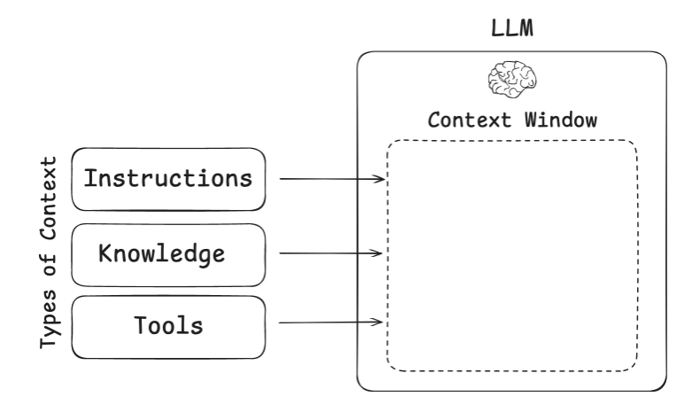

# Context Engineering

## 介绍

LLMs像新式操作系统，上下文窗口是RAM，LLM是CPU。

Context Engineering就是如何填写这个上下文窗口，为下一步做好准备（LLM调用）

**文章给出的三种上下文类型:**

**Instructions** - prompts, memories, few‑shot examples, tool descriptions, etc

个人理解：应用层的原始输入，是构建目标agent所必须的信息

**knowledge** - facts, memories, etc

LLM外部的知识信息，辅助大模型完成任务 (搜索引擎，RAG...)

**Tools** - feedback from tool calls

这个地方我理解与Prompt Engineering的对比：

以前Prompt = Context；现在由于Agent/RAG/Tools等，这里把Prompt的范围限制在了用户的任务提示，缩小了概念范围。

## Agent的上下文工程*

### 问题描述

在长时间任务中，Agent的上下文窗口中会**积累大量反馈信息/工具调用信息**，导致使用大量Token，花费大量成本呢，进而可能引起**上下文长度不够用/无效信息**导致性能下降。

Drew Breunig总结的长上下文可能导致的问题：[How Long Contexts Fail | Drew Breunig](https://www.dbreunig.com/2025/06/22/how-contexts-fail-and-how-to-fix-them.html?ref=blog.langchain.com#context-distraction)

### 上下文中毒（Context Poisoning）

这个问题源于Gemini 2.5 Pro的技术报告：[gemini_v2_5_report.pdf](https://storage.googleapis.com/deepmind-media/gemini/gemini_v2_5_report.pdf)。

**中毒源**：模型在Agent玩《口袋妖怪：红》的实验中**产生幻觉**（如虚构不存在的游戏道具"TEA"），这些错误信息通过目标清单（Scratchpad of Goals）进入上下文：

- 幻觉目标（如"寻找TEA"）被写入清单后**持续污染后续决策**。
- 例如：Gemini坚信需获取《火红/叶绿》版本的"TEA"道具（原版《红/蓝》不存在），导致浪费数小时尝试不可能任务。

**报告中的解决方案**：第二次运行时修改系统提示，强制模型"扮演初次玩家，**忽略预训练知识**"，减少跨游戏幻觉（如不再提及TEA）。

### 上下文分心（Context Distraction）

上下文过长，以至于模型**过度关注上下文，忽略了其训练存在的参数里面的知识**。

同样在Gemini 2.5 Pro玩《口袋妖怪：红》的实验中，当上下文长度超过100k tokens的时候，Agent更趋向于喜欢采取其上下文历史中的重复行动，而不是提出新计划。

### 上下文混淆（Context Confusing）

模型使用上下文过程中的**多余无关内容**生成**低质量的响应**。

伯克利函数调用排行榜（tool使用的基准测试，用于评估模型有效利用tool来回应prompt的能力）

实验结果显示，**当给模型提供的tool超过一个时，每个模型的表现都会变差**。

这种情况在小模型中愈发严重，最近一篇论文评估了小模型的基准测试表现，给Llama3.1 8b模型提供46种tool时，它失败了，尽管上下文没有超过上下文窗口。但当只提供19种模型时，却成功了

随着提供的Tools数量越多（有更多的Tool描述），模型选择正确的工具来调用的能力会变差。

**问题在于：当你把某些东西放入模型的上下文中，模型就必须关注它。**这可能是无关的信息或不必要的工具定义，但模型还是会将其考虑在内。大型模型，尤其是推理模型，在忽略或舍弃多余的上下文方面正变得越来越好，但我们仍不断看到无用的信息让智能体陷入困境。更长的上下文让我们能够塞入更多信息，但这种能力也伴随着弊端。

### 上下文冲突（Context Clash）

指的是更强版本的上下文混淆，上下文直接产生矛盾。

例子：当给出一道数学题，多轮对话提供题干条件相较于一次给出全部题干条件，模型效果会变差。原因是生成的**错误答案被存入上下文中，会干扰模型生成最终答案**。

当做Agent的时候，上下文来源多样（MCP描述、子Agent、RAG等），组装的Context可能会产生冲突导致效果变差。

总结：**上下文工程对于Agent是最重要的！**

## 常见策略

### 保存上下文

##### 暂存器（**Scratchpads**）

即在上下文窗口之外帮Agent保存上下文，可以写到内存中等。

##### 记忆（**Memories**）

这里文章写的不是很清楚，说可以使用一个LLM来维护记忆，输入是旧记忆和新的上下文，输出是新记忆。

个人理解：agent有时需要跨多个会话的内容！因此可以将其存入memory种

### 选择上下文

对应**上下文混淆/冲突**的问题。

##### 暂存器（**Scratchpads**）

可以是工具调用或者是写死的逻辑来选择，比如从OverAllState里面选几个Key。

##### 记忆（**Memories**）

Agent需要能够选择与他们正在执行的任务相关的记忆。

- 情景记忆：之前Agent的行为，可以作为例子被Agent借鉴。

- 程序记忆：Agent的系统提示词，比如Cursor的规则文件，可以引导Agent的行为。

- 语义记忆：用户的一些事实信息，可以作为Agent任务相关的上下文。

##### **工具选择（Tool Loadout）**

在DeepResearch的探索过程中，我们有提到完善tool的desciption。

工具过多模型会过载，所以需要为模型选择工具列表。
可以将RAG应用到工具描述。在论文《RAG MCP》中对此有详细的阐述了。**通过将tool description存储在向量数据库中，能使得大模型根据输入提示选择最相关的工具**

**知识**

RAG是常用的知识库上下文工程方法，但是在Code Agent的实践中，Windsurf的Varun提出：仅仅依靠RAG是不可靠的，还得用grep搜索和基于知识图谱的检索方法综合，以及更先进的重排技术。

### 压缩上下文

对应**长上下文Token/上下文分心**的问题。

##### 上下文摘要

比如Cursor/Claude Code，在上下文过长以后，会自动压缩成摘要。或者是在搜索工具调用之后，进行一波后处理，避免把整个搜索结果全部投入上下文中。
（避免混淆/冲突的结果被摘要进去）

##### 上下文修剪

文章说这里用启发式方法，比如写死的把旧消息删了，或者也可以用上下文修剪器模型。

普罗旺斯：

[[2501.16214\] Provence: efficient and robust context pruning for retrieval-augmented generation](https://arxiv.org/abs/2501.16214?ref=blog.langchain.com)

我们是否可以通过评判模型来简单实现呢？

### 隔离上下文

即拆分上下文来帮助Agent执行任务。

##### Multi-Agent

对于每个Agent，提供**其独立的上下文窗口和独立的工具列表**，来执行垂类任务，效果会更好。

##### 环境隔离上下文

这里举了一个例子，HuggingFace的CodeAgent生成代码以后，其调用沙箱工具执行代码，但是沙箱工具执行代码生成的比如图像/文档等留在沙箱内部，仅仅提供变量名等来告诉LLM有这些资源，待LLM真正需要的时候才提供。

##### State

其实就是OverAllState只拿特定K-V对来隔离。

## 能应用到SAA Graph/LangGraph的部分(罗天)

### 保存上下文

短期记忆：CheckPoint对OverAllState保存。

长期记忆：LangGraph长期记忆允许在多个对话中保存上下文，这个SAA Graph？

### 选择上下文

OverAllState

对长期记忆的RAG检索

BigTool库选择工具

### 压缩上下文

可以在钩子函数处修剪，或是添加节点来汇总上下文/工具调用输出。

### 隔离上下文

OverAllState

工具调用

# Manus的上下文工程实践经验

https://manus.im/blog/Context-Engineering-for-AI-Agents-Lessons-from-Building-Manus

## 利用KV Cache节省成本(LLM内)

KV Cache简而言之，就是前缀相同的Context使得模型推理的时候可以服用之前的计算结果，减少了成本。

文章举例：使用Claude Sonnet时，缓存的输入token成本为0.30美元/百万token，而未缓存的成本为3美元/百万token——相差10倍。

提高命中率的最佳实践：

1. 保持前缀稳定
2. 使上下文尽量向后追加
3. 手动设置缓存断点（可以安全复用的token index）

**这一点其实对于调API无所谓**，简单分享。

## 工具调用遮蔽而非移除(LLM内)

之前提到的，太多工具LLM会过载。经典方法是用RAG类似方法动态加载工具，但是文章说实际上这样不好，原因如下：

1. KV Cache失效，因为tool定义一般在context的前部。
2. 先前的动作如果调用了当前的context中没有的工具，LLM会迷惑，类似于提到过的上下文冲突。

所以应该怎么做呢，文章说：解码过程中掩蔽token的logits。这个其实也是在推理框架内部基于Attention Mask做的，调用API没法优化这点。

## 使用文件系统作为上下文

这个其实类似于前面文章中讲的沙箱法，即告诉LLM有什么，例如：只要保留URL，网页内容就可以从上下文中移除；如果沙盒中仍然保留文档路径，则可以省略文档内容。这使得Manus能够缩短上下文长度，而不会永久丢失信息。

文件系统作为终极Context的好处：**随用随取，天然持久化。**

## *TODO LIST的复述机制

TODO LIST会让LLM**在执行过程中逐步更新**它，勾选已经完成的项目。这块在LLM原理上是有效的，在勾选的过程中，LLM会重新将其目标添加到上下文结尾，即将全局计划重新放到近期注意力范围中，避免了迷失的问题。
(LLM对上下文的开头和结尾敏感)

**个人理解：LLM对长计划/上下文的开头和结尾敏感，因此会将目标添加到末尾，以保持时刻敏感，避免偏题**

## 保留错误的内容

这个很好理解，即记忆犯错的内容，如现在SAA DeepResearch的反思机制，会将其全部的历史记录和评判都提供给他来生成。

## 多样化上下文

少样本提示是Prompt Engineering的一种模式，意思是给定2到10个输入输出样本范例，希望LLM按照这种风格执行。

如果上下文全都是一样的模式，那么LLM会模仿上下文的行为模式，即便这样不是对的，我理解类似于What Color am I的街头采访。

在给出Prompt的时候应该**增加一些噪音，顺序/格式等，会让智能体更强壮**。

# 其他参考链接

[How to Fix Your Context | Drew Breunig](https://www.dbreunig.com/2025/06/26/how-to-fix-your-context.html)

[Prompt Engineer 时代逐渐被 Spec Engineer 时代替代](https://www.bilibili.com/video/BV1YhutzMEw2/?spm_id_from=333.1387.favlist.content.click&vd_source=32c193c94ee6266fa14ba9b7e296e5a2)

