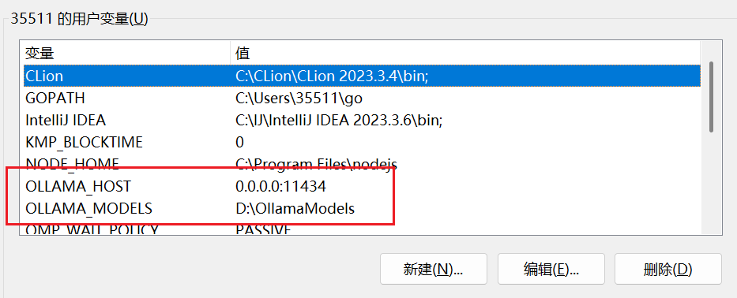
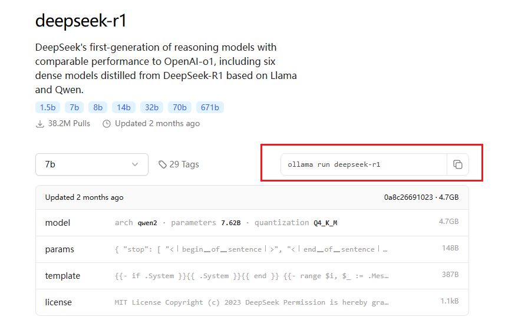
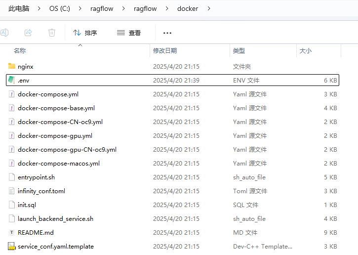
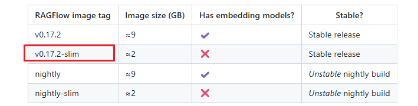
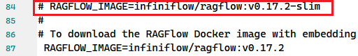
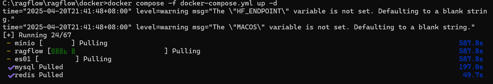
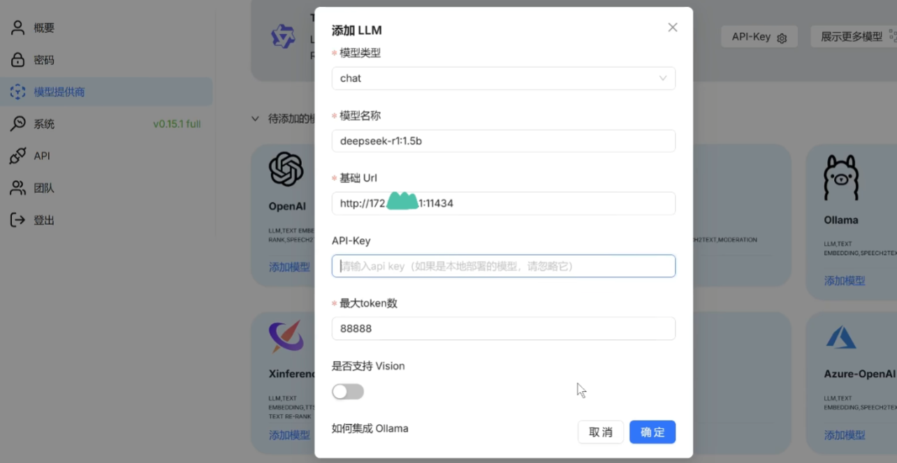
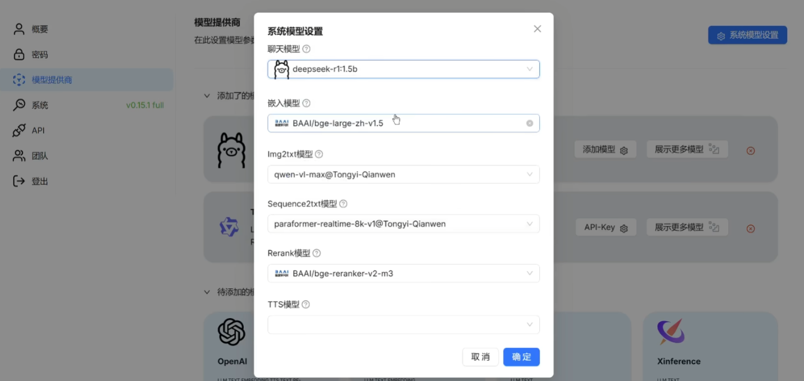
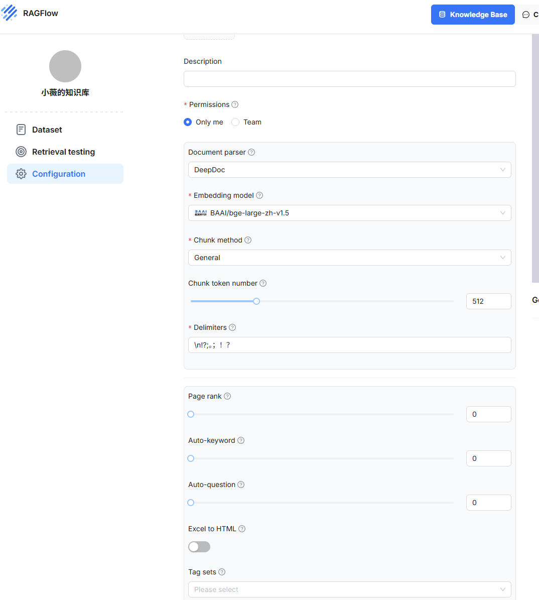
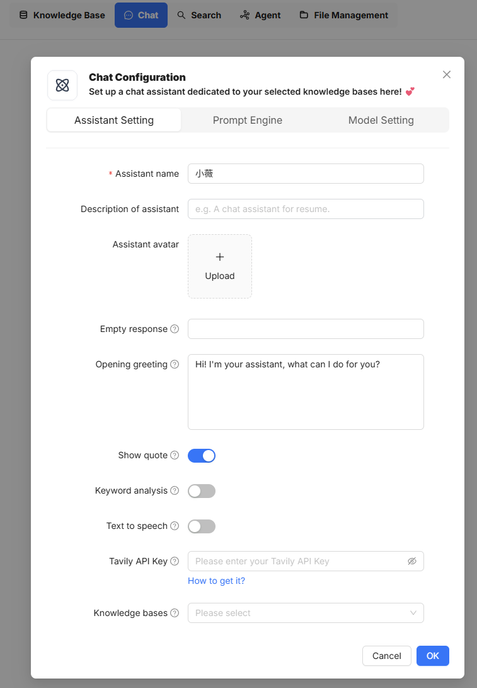

# ollama基础使用

## 环境变量

两个用户变量



- 第一个：让虚拟机RAGFlow能访问到本机Ollama上
- 第二个：默认把模型下载到此


## 下载安装

[Ollama](https://ollama.com/)

直接download对应版本


**模型下载**

[Ollama Search](https://ollama.com/search)

直接在cmd里面执行指令即可



这样最基础的模型就好了


# RagFlow

支持desktop，提供可视化界面和可选的embedding模型，支持大部分chat模型和ollama自己部署的模型，算是一个好用的本地自用可视化界面rag平台

[ragflow/README_zh.md at main · infiniflow/ragflow](https://github.com/infiniflow/ragflow/blob/main/README_zh.md)


## 下载安装

> **PS：win环境可以提前去官网下载docker**

直接clone

```
$ git clone https://github.com/infiniflow/ragflow.git
```

然后到ragflow/docker文件夹



我们就会发现有很多docker-compose文件夹，熟悉docker部署的同学应该不意外

```
$ docker compose -f docker-compose.yml up -d
```

直接运行即可

> **TIP：官方默认是不带embedding模型的，需要修改.env文件**



默认是slim版本



来到84行将slim版本注释掉，87行的完整版取消注释



等待安装ing


## 启动

```powershell
docker compose -f docker-compose.yml up -d
```

1.添加ollama模型：



- 模型名称：cmd里输入`ollama list`然后填入正确的名称
- 然后url就是自己的ip+端口，ip可以在cmd里`ipconfig`找到ipv4，port就是ollama的11434
- token数就无所谓了

2.配置系统模型设置：可选ollama的chat模型和embedding模型



主要选chat和embedding模型就行

3.搭建rag知识库：

参数可自己选，Chunk method就是根据投喂的不同文件来进行针对性解析



4.创建助理，进行chat

