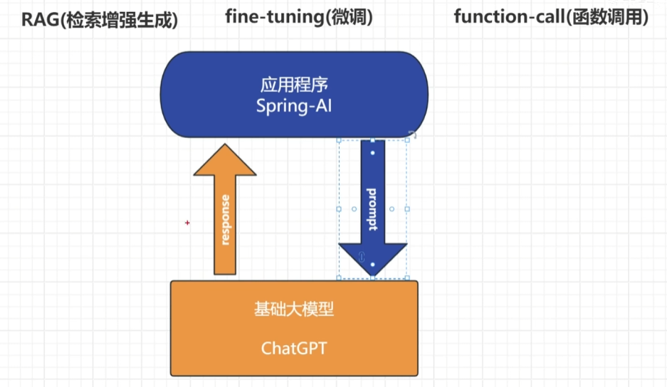
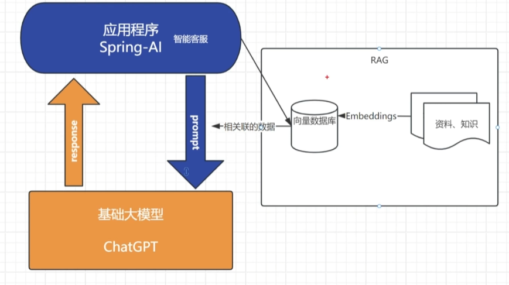
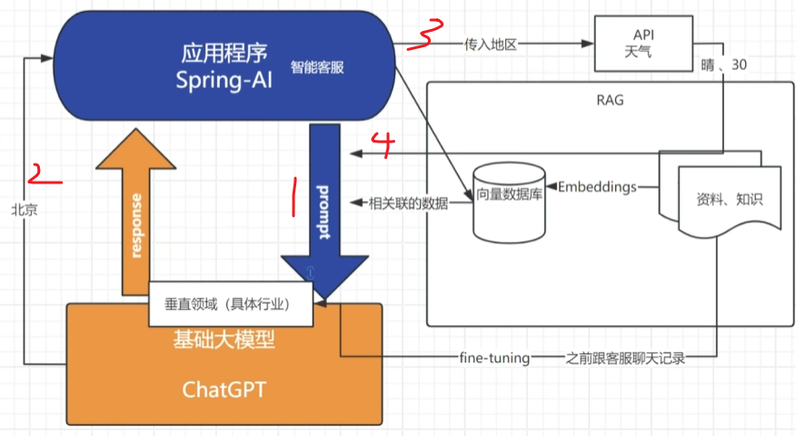
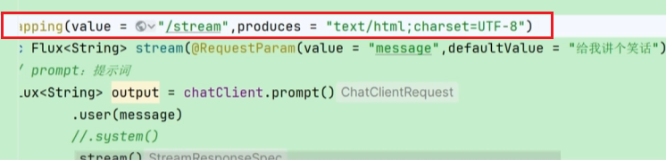
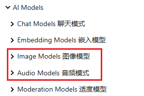

# Spring AI

官网地址：

[Introduction :: Spring AI Reference](https://docs.spring.io/spring-ai/reference/index.html)


## Spring AI请求流程/专有名词




### **RAG：检索增强生成**

大模型本身的数据可能存在一个滞后性，并且缺乏对数据的横向对比。

> **定义**：RAG则是解决这个问题：结合**信息检索技术**和**生成式模型**的混合方法，提升自然语言处理任务（如问答、对话、内容生成等）的准确性和可靠性。

**核心思想**

1. **检索（Retrieval）**：
    当用户提出问题或输入指令时，系统**首先从外部知识库**（如文档、数据库、网页等）中检索与问题相关的**上下文信息**。
    （例如：通过向量相似度搜索、关键词匹配等方式快速定位相关数据。）
2. **生成（Generation）**：
    将检索到的上下文与用户输入**结合，输入到生成模型**（如GPT、LLaMA等）中，生成最终的回答或内容。
    （通过引入真实数据，减少生成模型“幻觉”问题，提升回答的准确性和可信度。）



**向量数据库**

专门设计用于存储、管理和高效检索**高维向量数据**的数据库系统

主要用于处理**非结构化数据（如文本、图像、音频、视频等）的向量化**表示（即嵌入向量），并通过**相似性搜索**快速找到与查询最相关的数据。

相似性搜索的例子：

拉布拉多（特性：狗，大，叫声，性格....）我们针对每个特性进行哈希运算，就得到了拉布拉多的一串哈希值。**哈希值越近的，特性越相同，越相似更容易被检索到**。


### **fine-tuning：微调**

将我们的基础大模型调教成垂直领域的模型。

将一些资料数据组成fine-tuning需要的数据格式即可进行微调

> **核心思想**

1. **预训练模型**：
    使用大规模通用数据（如文本、图像）训练一个基础模型，使其学习通用特征（如语言语法、图像边缘检测）。
2. **任务适配**：
    在预训练模型的基础上，通过少量标注数据调整参数，使其专注于特定任务（如情感分析、医学图像分类）。


### **function-call：函数调用**

一些第三方API的调用，之前spring-ai-alibaba就是这部分




## ChatClient基础使用

[Chat Client API :: Spring AI Reference](https://docs.spring.io/spring-ai/reference/api/chatclient.html)

### 最基础对话

官网提供的基础示例，我们在spring-ai-alibaba也遇见过

**使用默认自动化配置，创建一个ChatClient.Builder的Bean**

```java
@RestController
class MyController {

    private final ChatClient chatClient;

    public MyController(ChatClient.Builder chatClientBuilder) {
        this.chatClient = chatClientBuilder.build();
    }

    @GetMapping("/ai")
    String generation(String userInput) {
        return this.chatClient.prompt()
            .user(userInput)
            .call()
            .content();
    }
}
```

**我们也可以不使用默认的自动化配置**

通过设置 `spring.ai.chat.client.enabled=false` 属性来禁用 `ChatClient.Builder` 的自动配置。 如果同时使用多个聊天模型，这会很有用。 然后，为每个需要的 `ChatModel` 通过编程方式创建一个 `ChatClient.Builder` 实例：

```java
ChatModel myChatModel = ... // usually autowired

ChatClient.Builder builder = ChatClient.builder(this.myChatModel);

// or create a ChatClient with the default builder settings:

ChatClient chatClient = ChatClient.create(this.myChatModel);
```


### 使用默认值(Using Defaults)

在@Configuration里创建一个带有默认文本的一个ChatClinet，能够实现将默认文本和用户输入文本结合。

例如：给他加一些前置：以老师的口吻回答(默认值)+这道题怎么解决(用户文本)

```java
@Configuration
class Config {

    @Bean
    ChatClient chatClient(ChatClient.Builder builder) {
        return builder.defaultSystem("You are a friendly chat bot that answers question in the voice of a Pirate")
                .build();
    }

}
```

这样是一个全局的一个设置，我们也可以不使用这种方法：

通过下方的.system，单独设置系统参数，不仅仅局限于实现上面这种

```java
@RestController
class AIController {
	private final ChatClient chatClient;

	AIController(ChatClient chatClient) {
		this.chatClient = chatClient;
	}

	@GetMapping("/ai")
	Map<String, String> completion(@RequestParam(value = "message", defaultValue = "Tell me a joke") String message, String voice) {
		return Map.of("completion",
				this.chatClient.prompt()
						.system(sp -> sp.param("voice", voice))//这里
						.user(message)
						.call()
						.content());
	}

}
```


### 流式响应(Streaming Response)

不是直接返回结果，而是像平时问AI一样，一个字一个字吐出来。

新的数据结构：`Flux<String>`流式文本格式

```java
Flux<String> output = chatClient.prompt()
    .user("Tell me a joke")
    .stream()
    .content();
```

但是可能会出现一个问题：就是直接返回的`Flux<String>`浏览器可能无法识别格式，回答出现乱码，我们可以手动给他添加：


比如在@GetMapping这里添加一个响应头指明格式


## ChatModel介绍

ChatClient是一个所有模型通用的一个组件。而一单想用一些独有的功能则需要我们的ChatModel

[Chat Model API :: Spring AI Reference](https://docs.spring.io/spring-ai/reference/api/chatmodel.html)

这里面包含了几乎市面上所有的模型的一个ChatModels的使用说明。也可以直接去搜对应的文档。

使用示例：

ChatModel不需要像ChatClient一样还要我们单独配置，一般来说引入了每一家的依赖就会自动装配，所以我们直接@Autowired即可

```java
@Autowired
private ChatModel chatModel;
```

各家有各家的使用方法，按着文档来就行。

```java
ChatResponse response = chatModel.call(
    new Prompt(
        "Generate the names of 5 famous pirates.",
        OpenAiChatOptions.builder()
            .model("deepseek-chat")
            .temperature(0.4)
        .build()
    ));
```

PS：ChatClient底层就是封装ChatModel，并且通过一些语法糖，简化开发。

就比如最基础的ChatClient样例，直接.prompt()就行，ChatModel还得自己new Prompt()

```java
    @GetMapping("/ai")
    String generation(String userInput) {
        return this.chatClient.prompt()
            .user(userInput)
            .call()
            .content();
    }
```


## 其他功能

[Spring AI API :: Spring AI Reference](https://docs.spring.io/spring-ai/reference/api/index.html)

文生图，文生语音，语音翻译....这些直接看文档就行

	


## 多模态

实现当前传入的是文件，语言，或者文本。不需要我们在具体实现。

[Multimodality API :: Spring AI Reference](https://docs.spring.io/spring-ai/reference/api/multimodality.html)


# LangChain


