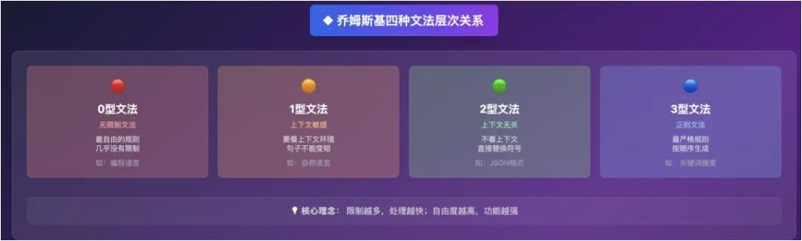
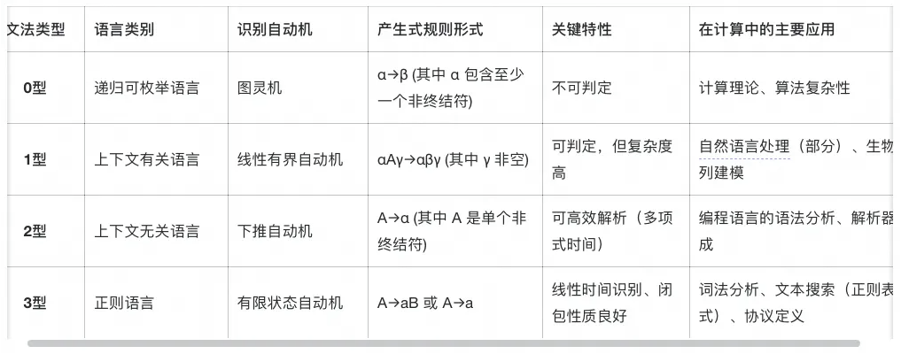
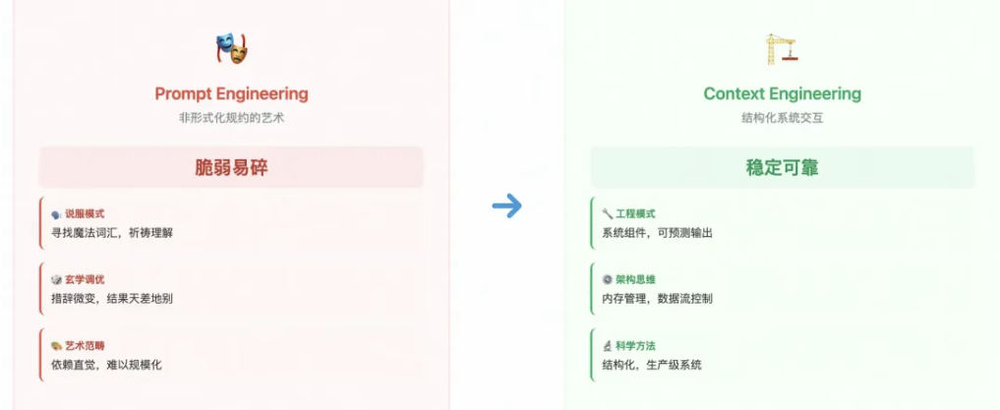

# 为什么Think Tool是形式化的必然？

原文链接: [从Prompt到Context：为什么Think Tool是形式化的必然？](https://mp.weixin.qq.com/s/DNUN5snPJbvSx2l4N1lPqw)

本文从编译原理的视角，为当前AI工程实践（如Prompt Engineering、Context Engineering、Think Tool）提供坚实的理论根基。AI编程的演进并非凭空而来，而是重演了软件工程历史上对形式化、可验证性和可靠性的追求。

## 1.编译原理的语言形式化

### 什么是形式化？精确定义的必要性

语言形式化是以数学的严谨性来定义一种语言的语法（结构）和语义（意义），从而消除歧义的过程。

在生产环境中，我们的最终目标是实现"**更高的可靠性、可读性、可维护性、并降低开发成本**"。

而当前的大语言模型的运作过程类似于"黑箱"，尽管深度思考能让我们感知到大模型的"思考逻辑"，然而大语言模型仍受其原理而更加随机和发散。

> 从编译器的方面来说：形式化的语言定义 为程序员提供了精确的规范，确保编译器之间兼容，并使其属性得以进行严格分析，**如果缺乏形式化，语言的构造将变得错综复杂，对属性的证明也会复杂而微妙**

因此，这种可验证迹线的概念，会结合近期Anthropic提出来的Think Tool来一起说明。

### 乔姆斯基谱系：表达能力与约束的规范化标尺

**了解谱系结构，可以了解到语言表达能力与计算可追踪性之间的矛盾，当规则的约束增强时（从0型走向3型），语言的表达范围收窄，但其分析、解析和验证的难度显著降低。**反之，当约束放宽时，语言变得无所不能，但其行为也变得不可预测。

**这个权衡，到今年2025年，作者发现其实就是AI工程师所面临的困境，从Prompt Engineering到Context Engineering的一个转变**。本质上是一个为了获得结构化系统的可追踪性和可靠性，而有意识地牺牲原始LLM部分无限制表达能力的决策，所以编译器设计的历史教训正在AI领域重演，很有意思，我们后面会讲一讲为什么。

## 2.Prompt和Context Enginerring在形式化上的分析

首先在这里说到的语言，并不是严格按照上面的谱系语言分级，也不是编程语言，这里指的是整个人类的自然语言，而这里的编译器指的是LLM，相当于是LLM来编译人类的语言产生结果，这之间自然是存在类似的形式化分级。

### prompt Engineering：非形式化规约(低形式化)

prompt位于形式化谱系的低端，类似于01型。

交互依赖于微调、寻找魔法词汇；或遵循很结构化的玩法，产生的技巧就是角色定义、few-shot examples、COT等约束。

核心弱点：脆弱性和缺乏可扩展性，**措辞的微小变化就可能导致输出质量的巨大差异**，这样其实很不适用于生产级系统，所以并不是让那个系统去流利地讲LLM语言这个理念，这个感觉下来，Prompt Engineering，更像是一门艺术（笑），而不是一门科学手艺。

### Context Engineering：结构化系统交互(中等形式化)

动态！！！！！！

**Context Engineering代表了向更高形式化程度的重大转变，用结构化的、机器可读的上下文取代了模糊的自然语言指令。**

> 它不再将LLM视为一个需要被说服的对话者，而是将其作为一个更庞大的信息处理流水线中的一个组件。

这块技术是架构层面，采用的有**RAG、工具集成、结构化模板和记忆管理，涉及到从数据库、API和对话历史中筛选、聚合和格式化信息**。

> 目标是在正确的时间，以正确的格式，提供正确的信息和工具，这种结构化的方法减少了幻觉，并实现了可靠的多轮交互。

所以这种Context涉及系统思维和构建智能系统架构，**核心是提供“使LLM plausibly 解决任务所需的所有上下文”**，这种上下文是动态的，由一个在LLM调用之前运行的系统来生成出来的。

### 两者比较分析

**从Prompt Engineering到Context Engineering的演变，其实是将LLM从纯粹的黑箱，转变为将其集成为一个灰箱组件的过程。**

Prompt告诉模型如何思考，而Context则为模型提供完成工作所需的训练和工具。

现在LLM的上下文窗口有点像一个RAM，Context Engineering把有效管理这块有限的RAM的玩法，用摘要、检索和记忆分槽（短期、长期）来加强

> **其实从计算机科学上，也就是当年在解决传统操作系统中的内存管理问题**，比如决定哪些数据应保留在快速访问的内存中（把数据加载到Context窗口），哪些应换出到慢速存储（如Vector DB），以及在需要时如何高效地将其取回。

Prompt的脆弱性，部分源于其糟糕的内存管理，模型在长对话中无法记住关键信息，Context Engineering通过建立一个**显式的内存架构**来解决这个问题。这意味着高级AI工程所需的技能正在与经典系统架构的技能趋同，**重点是数据流、状态管理和资源优化，而不仅仅是语言学。**

| 维度             | Prompt Engineering                        | Context Engineering                                          |
| ---------------- | ----------------------------------------- | ------------------------------------------------------------ |
| 核心方法论       | 通过精心设计的文本指令来引导模型。        | 构建动态系统，为模型提供信息、工具和记忆。                   |
| 形式化程度       | 0/1型文法，依赖LLM隐式的、不透明的语法。  | 2/3型文法，使用结构化数据、API模式和形式化的工具定义。       |
| 主要目标         | 在单次交互中，通过说服模型来优化输出。    | 在复杂任务中，通过系统性给模型来确保可靠性和一致性。         |
| 关键技术         | 少样本示例、思维链、角色扮演、格式约束。  | RAG、工具使用、记忆管理、动态上下文组装。                    |
| 可扩展性与可靠性 | 低+脆弱，对微小变化敏感，难以维护和扩展。 | 高+稳健，通过结构化输入降低不确定性，支持复杂、多轮次的应用。 |
| 所需技能         | 语言创造力、对特定模型行为的直觉理解。    | 系统设计、信息架构、数据策略、API集成。                      |
| 控制点           | 用户与模型之间的单一文本接口。            | 模型调用之前的整个信息准备流水线。                           |
| 类比             | 与一位才华横溢但喜怒无常的专家对话。      | 为一位专家配备一个藏书丰富的图书馆和一个全能的工具箱。       |

## 3.Anthropic的think tool分析

### 显示推理的架构

[The "think" tool: Enabling Claude to stop and think \ Anthropic](https://www.anthropic.com/engineering/claude-think-tool)

这里的think tool和deepseek的深度思考不同，简单来说它是一个工具，能够让claude在流程中**停下来**思考claude当前是否已经掌握了足够的、能往前推进的信息。这在与用户进行长时间多步骤对话中有奇效。

> TIP：deepseek的思考是预先思考

### 可验证性与策略遵循

**think tool的结构化输出，功能类似于编译器中的中间表示（Intermediate Representation, IR）或程序的执行迹线，它使模型的推理过程变得可审计，从而可以根据复杂的规则和策略进行验证。**

该工具在策略密集型环境（policy-heavy environments）中最为有效，在这些环境中，可以提示模型去列出适用于当前请求的具体规则、**检查是否已收集所有必需信息”以及“验证计划中的行动是否符合所有策略**，这直接呼应了编译器设计中“语义保持”的目标，即必须证明目标代码的行为（迹线）与源代码的语义相符，think tool产生的日志，正是模型进行语义推理的迹线。

### *对COT的范式超越(重要)

manus有一个动态的plan，会根据执行过程动态调整顺序(因为大模型对开头和结尾敏感，这么做为了防止大模型"遗忘")，以及deepresearch中的plan都是COT的一种。

> 我个人理解COT其实就是在引导大模型去"思考"（执行某些任务）

think tool则将推理模块化、形式化，使其成为一个独立的、可被检视的步骤，所以CoT是一种提示技巧，一种语言引导方式，think tool则是一个形式化的API特性。

**这个tool用于在响应生成期间暂停，以处理来自工具调用的新信息**(而CoT通常是初始提示的一部分，用以构建整个输出的结构)，这让think tool更适用于**动态的、多步骤的任务**。

> 这种形式化实现了关注点分离，思考步骤用于内部思考，最终答案用于外部沟通，这种模块化是所有结构良好系统的标志。

这种机制为模型提供了一种元认知脚手架（metacognitive scaffolding），**元认知指的就是，对思考的思考，涉及规划、监控和评估自身的思维过程**。
think tool的description明确要求模型执行这些元认知动作，将复杂问题分解、评估多种方法、验证推理是否存在逻辑错误，这些方法不仅仅是要求模型去推理，而是提供一个外部的、形式化的结构（工具调用及其日志），迫使模型遵循一个特定的元认知工作流。

还有一点，**这种形式化的、可检视的推理迹线是实现稳健的自我纠错的前提**。

Agent面临的一个关键挑战是如何从错误中恢复。在一个长CoT中，一个错误就可能导致整个任务失败，think tool允许模型在调用工具后仔细分析工具输出。通过将推理和工具调用结果外部化到一个结构化日志中，模型（或控制它的系统）可以检查当前状态和导致该状态的推理过程。如果工具调用返回错误或非预期数据，模型可以再用一个think步骤来分析失败原因并规划新的行动路线。

> 说简单点就是think tool的"停下来"有助于我们对大模型思考过程进行check

