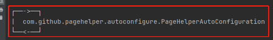
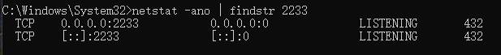
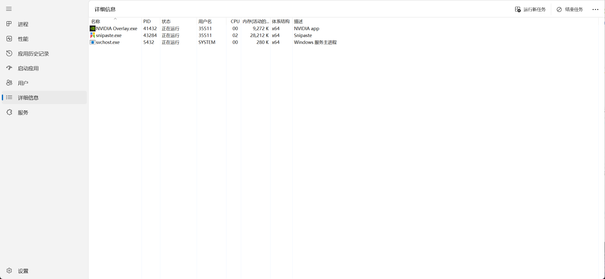
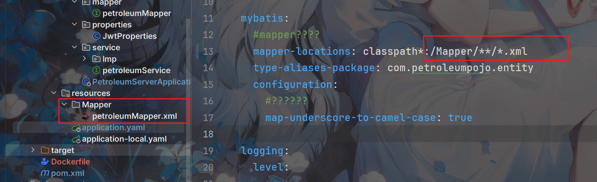
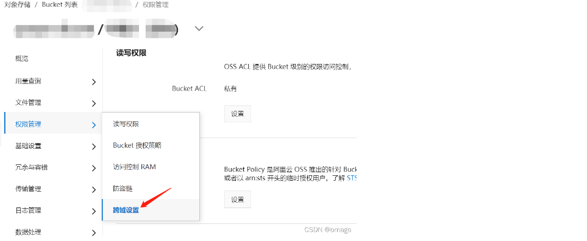
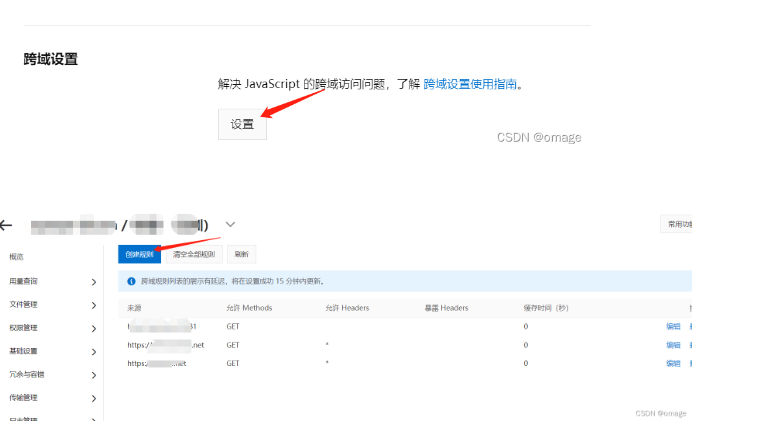

## pagehelper循环依赖报错




将依赖版本改为1.4.1


## 启动时lombok版本报错

报错:

```powershell
java: java.lang.NoSuchFieldError: Class com.sun.tools.javac.tree.JCTree$JCImport does not have
```

将Lombok依赖升级到1.18.30或更高版本即可修复这个问题。

在项目的依赖项中添加Lombok的最新版本

```xml
<dependency>
    <groupId>org.projectlombok</groupId>
    <artifactId>lombok</artifactId>
    <version>1.18.32</version>
</dependency>
```


## ThreadLocal取不出来时

一定要检查是不是创建了多个UserContext这类运用ThreadLocal的类，只需要留一个即可 


## 端口被占用

windows端口被占用：

在底部搜索栏，管理员模式启动cmd，然后

```
netstat -ano | findstr 端口号
```

	

然后进入任务管理器搜索最右边那个PID



我这里已经提前杀死了，所以看不到了


## 无法识别同级别模块

```
[ERROR] Failed to execute goal on project petroleum-server: Could not resolve dependencies for project com.example:petroleum-server:jar:0.0.1-SNAPSHOT: The following artifacts could not be resolved: com.example:petroleum-pojo:jar:0.0.1-SNAPSHOT (absent), com.example:petroleum-commom:jar:0.0.1-SNAPSHOT (absent): Could not find artifact com.example:petroleum-pojo:jar:0.0.1-SNAPSHOT -> [Help 1]
[ERROR] 
[ERROR] To see the full stack trace of the errors, re-run Maven with the -e switch.
[ERROR] Re-run Maven using the -X switch to enable full debug logging.
[ERROR] 
[ERROR] For more information about the errors and possible solutions, please read the following articles:
[ERROR] [Help 1] http://cwiki.apache.org/confluence/display/MAVEN/DependencyResolutionException
```

这种报错的话：父工程先clean再install


## yaml中配置xml路径问题



这俩一定要对齐，不然jar中无法识别


## jar包和源码运行不一致

可能会存在A模块依赖B模块，但是A中的B模块未更新。所有把B模块也clean然后install，然后把A模块clean后install即可


## 子模块找不到父模块依赖

1、首先检查父项目中是否用<dependencyManagement>将所需依赖放入其中

2、看看父模块依赖版本号引用有没有写错

3、检查子模块是否声明了父模块(parent和module)

如果都没问题，就全部clean，然后刷新maven


## nacos显示UNAVAILABLE

出现alibaba.nacos.shaded.io.grpc.StatusRuntimeException: UNAVAILABLE: io exception

因为还没有使用Nacos配置管理，但是引入了相关的两个依赖

nacos-config和bootstrap

所以SpringBoot项目启动时，会**先去你本地查看 bootstrap.properties 配置**文件里面的内容，这时你的配置文件是空的，然后**默认nacos的访问地址是 localhost:8848**，所以就找不到本地nacos。

解决方法就是：

1.bootstrap.properties 文件中，配置nacos的地址

2.先注释依赖，后续写了配置文件后再用


## 找不到公共模块的包

其他模块引用common模块时显示包不存在

这个时候需要在common中删除<build>然后clean和install父模块，再同样操作子模块


## 鉴权冲突

gateway的鉴权容易和security起冲突：security除了依赖，其他的尽量删干净

```powershell
1.apifox中出现了：
An expected CSRF token cannot be found
2.以及apifox中直接跳过网关给服务发请求依然是
401
```


## github连接出错

```powershell
ssh: connect to host github.com port 22: Connection timed out fatal: Could not read from remote repository.  

Please make sure you have the correct access rights and the repository exists.
```

出现这种错误时，我们可以将22端口改为443端口

step1:测试连接

```powershell
//输入
ssh -T git@github.com
//输出
ssh: connect to host github.com port 22: Connection timed out
```

这种情况表示22端口连接超时

step2:解决方法

在C盘——用户——你的主机名文件夹中找到.ssh文件夹；（此前配置SSH时会生成该文件夹）
在.ssh文件夹中新建文件 config,不带后缀（可以新建文本文档，去掉.txt后缀）
使用notepad++（或其他方式）打开config文件，输入以下内容，保存后即可
其中xxxxqq.com为你的邮箱

```powershell
Host github.com
User xxxxqq.com
Hostname ssh.github.com
PreferredAuthentications publickey
IdentityFile ~/.ssh/id_rsa
Port 443
```

再次执行

```
ssh -T git@github.com
```

会出现类似以下提示，输入yes回车即可

```powershell
The authenticity of host '[ssh.github.com]:443 ([192.30.255.123]:443)' can't be established.
RSA key fingerprint is SHA256:nThbg6kXUpJWGl7E1IGOCspRomTxdCARLviKw6E5SY8.
Are you sure you want to continue connecting (yes/no)? yes
Warning: Permanently added '[ssh.github.com]:443,[192.30.255.123]:443' (RSA) to the list of known hosts.
```

最终结果：

```powershell
Hi Clare! You've successfully authenticated, but GitHub does not provide shell access.
```


## Redis取不出来

有两种情况取不出来：

- 一个问题是template两个模块注入方式不一样，也是拿不到的

    - 有的通过

  ```java
  @Resource
  RedisTemplate redisTemplate;
  ```

    - 有的通过

  ```java
  @Autowired
  @Qualifier("RedisTemplate")
  RedisTemplate redisTemplate;
  ```

- 一个问题是RedisConfig也用的不一样，有的加有的不加，会导致序列化不一样，出现Redis里面的乱码


## 阿里OSS跨域问题

使用阿里云OSS下载文件时，如果是采用AJAX方式下载，会提示CORS错误，类似“Access to XMLHttpRequest ... has been blocked by CORS policy " 这样的错误。

解决办法，需要在阿里云控制台去设置OSS的跨域设置。





创建跨域规则，保存，稍等片刻再测试即可


服务器域名可以直接填写*