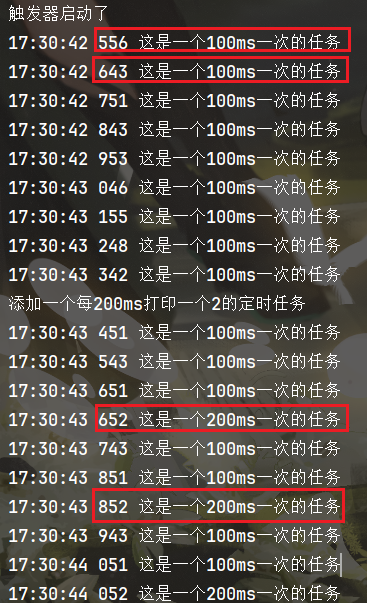

```
---
title: "⏰ 实现简单mini的定时任务"
desc: "定时任务的手写"
tags: "note"
updateTime: "2025-3-17 17:49"
outline: deep
---
```


# 手写一个min的定时任务

涉及八股：线程池，Lambda和匿名内部类，LockSupport机制

仓库链接：[SCMRCORE/mini-schedule: 手搓一个mini的schedule定时任务](https://github.com/SCMRCORE/mini-schedule)

## 基础schedule的实现

最基础的实现：我们new一个6大小的线程池，每个任务分配一个线程，每个任务通过while，每隔delay时间就run任务；

但是这样的运作方式就会**受制于线程池数量，并且作用方式是用户调用函数。**

```java
public class ScheduleService {
	ExecutorService executorService = Executors.newFixedThreadPool(6);
    
    public void schedule(Runnable task, long delay){//这里不加TimeUnit了默认毫秒
        executorService.execute(()->{
            while(true){
                Thread.sleep(delay);
                task.run();
            }
        });
    }
}

```

我们能否有一个组件，可以在对应时间把任务扔到线程池中，而不是调用函数的时候扔到线程池里；


## 核心trigger的实现

也就是说我们能不能有一个**trigger触发器**，自己阻塞某些时间，**醒的时候把任务扔到线程池里。我们的线程池只负责实现task就行。**

### 基础实现

```java
public class ScheduleService {
    ExecutorService executorService = Executors.newFixedThreadPool(6);
    Trigger trigger  = new Trigger();
    
    public void schedule(Runnable task, long delay){//这里不加TimeUnit了默认毫秒

    }
    
    //触发器，等待合适时机，把任务扔到线程池中
    class Trigger{
        List<Job> jobList = new ArrayList<>();
        //Trigger要一直拿着任务，所以肯定不能阻塞主线程，new一个Thead
        //Thread的任务就简单了：从容器中拿到一个job，判断now和startTime时间，选择阻塞/执行
        Thread thread = new Thread(()->{
            while(true){
                for(Job job : jobList){
                    long waitTime = job.getStartTime()-System.currentTimeMillis();
                    if(waitTime>0) Thread.sleep(waitTime);
                    executorService.execute(job.getTask());
                }
            }
        });
    }
}
```

我们的trigger也要知道自己执行的是什么任务，以及一个时间啊，所以我们封装一个job类

```java
/**
 * 为了让我们Trigger知道要执行的任务和执行时间，我们定义一个Job类
 */
@Data
@AllArgsConstructor
@NoArgsConstructor
public class Job {
    private Runnable task;
    private long startTime;
    //startTime-now大于0说明还没到时间要阻塞这么多时间；小于0说明已经到时间了要执行任务
}
```

### 问题优化

- 问题1：while是无限死循环，耗费CPU资源
- 问题2：**每个任务等待时间也不同，需要排序，让等待时间短的在前面**

**方案1：**

我们可以给他**自定义一个排序**

```java
@Data
@AllArgsConstructor
@NoArgsConstructor
public class Job implements Comparable<Job> {
    private Runnable task;
    private long startTime;
    //startTime-now大于0说明还没到时间要阻塞这么多时间；小于0说明已经到时间了要执行任务
    @Override
    public int compareTo(Job o) {
        return Long.compare(this.startTime, o.startTime);
    }
}
```

再在这里进行调用

```java
while(true){
    Collections.sort(jobList);
    for(Job job : jobList){
        long waitTime = job.getStartTime()-System.currentTimeMillis();
        if(waitTime>0) Thread.sleep(waitTime);
        executorService.execute(job.getTask());
    }
}
```

> **TIP：这样的话，每次while就要进行排序，并且时间复杂度最大O(N*log2N)，CPU消耗大，并且新任务加进来还可能有线程安全问题**

**方案2**：

把List替换成**PriorityBlockingQueue**

**TIP:也需要Job实现comparable**

```java
class Trigger{
    PriorityBlockingQueue<Job> jobqueue = new PriorityBlockingQueue<>();
    Thread thread = new Thread(()->{
        while(true){
            //阻塞式的优先队列
            if(!jobqueue.isEmpty()){
                Job job = jobqueue.poll();
                long waitTime = job.getStartTime()-System.currentTimeMillis();
                if(waitTime>0) Thread.sleep(waitTime);
                executorService.execute(job.getTask());
            }
        }
    });
}
```

我们还需要**针对新加进来的任务处理**，因为我们sleep了所以需要**wakeup**，可以继续用sleep；但是为了代码方便可读，这里选择LockSupport

> **回顾LockSupport：不需要持有锁，许可证机制，无锁的等待**
>
> 底层的阻塞操作通过park()和unpark()来加锁和解锁
>
> 可以由任何线程调用，并在任何时刻通过unpark解锁

**实现逻辑：新任务加进来，如果因为上一个任务而等待，则唤醒，通过重新走流程，实现优先执行最短任务。**

这里我们要调整我们的逻辑，如果沿用旧逻辑，即使唤醒了，也可能出现提前execute旧任务的情况

```java
public class ScheduleService {
	......
    class Trigger{
        PriorityBlockingQueue<Job> jobqueue = new PriorityBlockingQueue<>();
        Thread thread = new Thread(()->{
            while(true){
                while(jobqueue.isEmpty()){//不能用if，防止虚假唤醒
                    LockSupport.park();
                }
                //实现逻辑是：拿一个最新的job出来看看是否需要阻塞到开始时间
                Job latestJob = jobqueue.peek();
                if(latestJob.getStartTime()<System.currentTimeMillis()){
                    //即使多线程环境下，加进来一个更短的任务，也会先执行这个更短的。
                    //也能解决唤醒任务后继续执行这个业务，而不是新的最短业务问题
                    latestJob = jobqueue.poll();
                    executorService.execute(latestJob.getTask());
                }else{
                    //如果时间还没到最短任务开始时间，则等到最新任务的开始时间，然后重走一遍流程
                    LockSupport.parkUntil(latestJob.getStartTime());//参数是deadline
                }
            }
        });

        {//trigger实例被创建时自动执行
            thread.start();
            System.out.println("触发器启动了");
        }
        
        //我们就只需要在加任务时，再唤醒一次trigger就行
        void wakeUp(){
            LockSupport.unpark(thread);
        }
    }
}
```

那么我们的schedule函数则只需要传入job

```java
public class ScheduleService {
    ExecutorService executorService = Executors.newFixedThreadPool(6);
    Trigger trigger  = new Trigger();
    public void schedule(Runnable task, long delay){//这里不加TimeUnit了默认毫秒
        Job job = new Job(task, System.currentTimeMillis()+delay);
        trigger.jobqueue.offer(job);
        trigger.wakeUp();//下面提到的添加后就唤醒
    }

	....trigger....
}
```


### 实现无限循环

我们现在还有最后一个问题：现在的任务都是一次性的，我们需要任务执行完后，重新计算时间然后扔回容器。

为了计算下次执行时间，我们就得把delay也给job传进去

```java
@Data
@AllArgsConstructor
@NoArgsConstructor
public class Job implements Comparable<Job>{
    private Runnable task;
    private long startTime;
    private long delay;

    @Override
    public int compareTo(Job o) {
        return Long.compare(this.startTime, o.startTime);
    }
    //startTime-now大于0说明还没到时间要阻塞这么多时间；小于0说明已经到时间了要执行任务
}

```

包括我们的schedule方法里的部分也得改：

```java
Job job = new Job(task, System.currentTimeMillis()+delay, delay);
```

在我们的Thread里加入：

```java
//计算下一次执行时间，放回容器
Job nextJob = new Job(latestJob.getTask(), latestJob.getStartTime()+latestJob.getDelay(), latestJob.getDelay());
jobqueue.add(nextJob);
```
```java
Thread thread = new Thread(()->{
    while(true){
        while(jobqueue.isEmpty()){//不能用if，防止虚假唤醒
            LockSupport.park();
        }
        Job latestJob = jobqueue.peek();
        if(latestJob.getStartTime()<System.currentTimeMillis()){
            latestJob = jobqueue.poll();
            executorService.execute(latestJob.getTask());
            //计算下一次执行时间，放回容器
            Job nextJob = new Job(latestJob.getTask(), latestJob.getStartTime()+latestJob.getDelay(), latestJob.getDelay());
            jobqueue.add(nextJob);
        }else{
            LockSupport.parkUntil(latestJob.getStartTime());
        }
    }
});
```


## 样例测试

```java
@SpringBootApplication
public class MiniScheduleApplication {

    public static void main(String[] args) throws InterruptedException {

        DateTimeFormatter dateTimeFormatter = DateTimeFormatter.ofPattern("HH:mm:ss SSS");
        ScheduleService scheduleService = new ScheduleService();
        scheduleService.schedule(()->{
            System.out.println(LocalDateTime.now().format(dateTimeFormatter)+" 这是一个100ms一次的任务");
        }, 100);

        Thread.sleep(1000);

        System.out.println("添加一个每200ms打印一个2的定时任务");
        scheduleService.schedule(()->{
            System.out.println(LocalDateTime.now().format(dateTimeFormatter)+" 这是一个200ms一次的任务");
        }, 200);
    }

}
```

解释：

1. 任务一先执行，但是我们的trigger逻辑里面是new了一个新的Thread所以是异步的；
2. 这里的Thread.sleep(1000)；主线程会先等1000ms，也就会给任务一1000ms的执行时间
3. 然后才是任务二执行，此时任务一和任务二就会一起执行

结果：

	

大致时间没问题


## 完整代码

main

```java
@SpringBootApplication
public class MiniScheduleApplication {

    public static void main(String[] args) throws InterruptedException {
        DateTimeFormatter dateTimeFormatter = DateTimeFormatter.ofPattern("HH:mm:ss SSS");
        ScheduleService scheduleService = new ScheduleService();
        scheduleService.schedule(()->{
            System.out.println(LocalDateTime.now().format(dateTimeFormatter)+" 这是一个100ms一次的任务");
        }, 100);

        Thread.sleep(1000);

        System.out.println("添加一个每200ms打印一个2的定时任务");
        scheduleService.schedule(()->{
            System.out.println(LocalDateTime.now().format(dateTimeFormatter)+" 这是一个200ms一次的任务");
        }, 200);
    }

}
```

job

```java
/**
 * 为了让我们Trigger知道要执行的任务和执行时间，我们定义一个Job类
 */
@Data
@AllArgsConstructor
@NoArgsConstructor
public class Job implements Comparable<Job>{
    private Runnable task;
    private long startTime;
    private long delay;

    @Override
    public int compareTo(Job o) {
        return Long.compare(this.startTime, o.startTime);
    }
    //startTime-now大于0说明还没到时间要阻塞这么多时间；小于0说明已经到时间了要执行任务
}
```

scheduleService

```java
public class ScheduleService {
    ExecutorService executorService = Executors.newFixedThreadPool(6);
    Trigger trigger  = new Trigger();
    
    //只负责添加任务到优先队列
    public void schedule(Runnable task, long delay){//这里不加TimeUnit了默认毫秒
        Job job = new Job(task, System.currentTimeMillis()+delay, delay);
        trigger.jobqueue.offer(job);
        trigger.wakeUp();//下面提到的添加后就唤醒
    }

    //触发器，等待合适时机，把任务扔到线程池中
    class Trigger{
        //Trigger要一直拿着任务，所以肯定不能阻塞主线程，new一个Thead
        //Thread的任务就简单了：从某个容器中拿到一个job，判断now和startTime时间，选择阻塞/执行
        PriorityBlockingQueue<Job> jobqueue = new PriorityBlockingQueue<>();
        Thread thread = new Thread(()->{
            while(true){
                while(jobqueue.isEmpty()){//不能用if，防止虚假唤醒
                    LockSupport.park();
                }
                //实现逻辑是：拿一个最新的job出来看看当前是否在执行
                Job latestJob = jobqueue.peek();
                if(latestJob.getStartTime()<System.currentTimeMillis()){
                    //即使多线程环境下，加进来一个更短的任务，也会先执行这个更短的。
                    //也能解决唤醒任务后继续执行这个业务，而不是新的最短业务问题
                    latestJob = jobqueue.poll();
                    executorService.execute(latestJob.getTask());
                    //计算下一次执行时间，放回容器
                    Job nextJob = new Job(latestJob.getTask(), latestJob.getStartTime()+latestJob.getDelay(), latestJob.getDelay());
                    jobqueue.add(nextJob);
                }else{
                    //如果时间还没到最短任务开始时间，则等到最新任务的开始时间，然后重走一遍流程
                    LockSupport.parkUntil(latestJob.getStartTime());//参数是deadline
                }
            }
        });

        {
            thread.start();
            System.out.println("触发器启动了");
        }

        //我们就只需要在加任务时，再唤醒一次trigger就行
        void wakeUp(){
            LockSupport.unpark(thread);
        }
    }
}
```