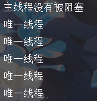
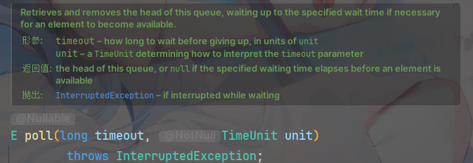

# 手写线程池

涉及八股：exception，LockSupport，阻塞队列，线程池

仓库链接：[SCMRCORE/mini-thread-pool: 手写一个mini的线程池](https://github.com/SCMRCORE/mini-thread-pool)


## 基础实现

```java
public class MyThreadPool {
    //1.线程什么时候创建？
    //2.线程的Runnbale是什么？是我们提交的Command吗？
    void execute(Runnable command){
        new Thread(command).start();
    }
}
```

这样写当然能实现，但是我们线程池就是为了**避免频繁创建和销毁线程带来的性能开销**；

并且**无法进行线程的手动管理**，即使我们把任务装进List，线程在执行完任务后仍会自动销毁；


## 实现复用和管理(阻塞队列)

```java
public class MyThreadPool {

    List<Runnable> commandList = new ArrayList<>();
    Thread thread = new Thread(()->{
        while(true) {
            if(!commandList.isEmpty()){
                Runnable command = commandList.remove(0);
                command.run();
            }
        }
    });

    void execute(Runnable command) {
        commandList.add(command);
    }
}
```

和上一期的定时任务类似：

**我们的execute将任务扔进容器，然后我们new Thread里面通过while循环，不断检查容器是否为空**

> **Q：如果容器为空，一直while非常消耗CPU资源，有办法让容器为空时一直阻塞吗？**

我们可以选择阻塞队列，同上一期类似，定时任务容器对顺序有要求，而这里只需要基础的阻塞队列即可：

```java
public class MyThreadPool {
    //阻塞队列，避免其他容器等待时疯狂消耗CPU资源
    BlockingQueue<Runnable> blockingQueue = new ArrayBlockingQueue<>(1024);//需要指定容量
    Thread thread = new Thread(()->{
        while(true) {
            try {
                Runnable command = blockingQueue.take();
                command.run();
            } catch (InterruptedException e) {
                throw new RuntimeException(e);
            }
        }
    }, "唯一线程");


    {//启动线程，创建类时会执行
        thread.start();
    }

    void execute(Runnable command) {
        //offer区别于add会有个返回值，我们会用到这个值来判断
        boolean offfer =  blockingQueue.offer(command);
    }
}

```

拓展：

**InterruptedException在这里的逻辑是运行时被中断，则需要手动进行异常的catch处理。我们的sleep也有这个异常，JUC包里几乎所有需要等待的方法都有这个异常，除了locksupport的park方法**

到这里我们就完成了一个线程的线程池了，由于我们的阻塞队列逻辑，不会自动停止需要我们手动停止：

	


## 实现池中的多个线程(corePoolSize)

只有一个线程显然不能满足我们的需求

```java
public class MyThreadPool {
    //阻塞队列，避免其他容器等待时疯狂消耗CPU资源
    BlockingQueue<Runnable> blockingQueue = new ArrayBlockingQueue<>(1024);//需要指定容量
    //将线程里的运行逻辑提取成一个共用task
    private final Runnable task = ()->{
        while(true) {
            try {
                Runnable command = blockingQueue.take();
                command.run();
            } catch (InterruptedException e) {
                throw new RuntimeException(e);
            }
        }
    };
    
    private int corePoolSize = 10;
    //用容器存储线程,我们应该有多少个线程？
    List<Thread> threadList = new ArrayList<>();
    
    void execute(Runnable command) {
        //offer区别于add会有个返回值，我们会用到这个值来判断
        boolean offfer =  blockingQueue.offer(command);
    }
}
```

因此，我们将线程**复用的逻辑提取成一个Runnable**，并用**容器存储线程** ，**用corePoolSize表示数量**


## 完善execute逻辑(maxSize)

当我们的offer返回false，便是说明我们的线程已经用完了

```java
private int corePoolSize = 10;
private int maxSize = 16;

//用容器存储线程
List<Thread> coreList = new ArrayList<>();
//核心线程已满，需要辅助线程来帮我们处理任务
List<Thread> supportList = new ArrayList<>();//maxSize-corePoolSize

void execute(Runnable command) {
    //判断ThreadList有多少元素，没到corePoolSize就创建线程
    if(coreList.size()<corePoolSize){
        Thread thread = new Thread(task);
        coreList.add(thread);
        thread.start();
    }
    //offer区别于add会有个返回值，我们会用到这个值来判断
    if(!blockingQueue.offer(command)){
        Thread thread =new Thread(task);
        supportList.add(thread);
        thread.start();
    }
}
```

这里便引入了maxSize，核心线程已满，需要辅助线程来帮我们处理任务，用supportList来存

> **Q：如果辅助线程也满了怎么办呢？同时我们这里操作不是原子的，涉及线程安全问题**

PS：演示demo就不解决线程安全问题了(CAS和锁)，但是我们要知道

再完善下execute

```java
private int corePoolSize = 10;
private int maxSize = 16;
//用容器存储线程
List<Thread> coreList = new ArrayList<>();
//核心线程已满，需要辅助线程来帮我们处理任务
List<Thread> supportList = new ArrayList<>();//maxSize-corePoolSize
void execute(Runnable command) {
    //判断ThreadList有多少元素，没到corePoolSize就创建线程
    if(coreList.size()<corePoolSize){
        Thread thread = new Thread(task);
        coreList.add(thread);
        thread.start();
    }
    //offer区别于add会有个返回值，我们会用到这个值来判断
    if(blockingQueue.offer(command)) return;

    if(coreList.size() + supportList.size() < maxSize){
        Thread thread =new Thread(task);
        supportList.add(thread);
        thread.start();
    }
    //在多线程环境下，因为不是原子即使刚创建，也可能满
    if(!blockingQueue.offer(command)){
        throw new RuntimeException("阻塞队列满了！")
    }
}
```


## 优化:辅助线程空闲释放

一个线程如何让自己在空闲的时候结束呢？

**我们设置一个超时时间，超过了超时时间仍然没拿到任务，说明此时的线程池不忙碌**，辅助线程就应该自己结束。

这里我们看一下**BlockingQueue的API**，poll函数有两个参数，超时时间和单位，也就是超过时间仍然没拿到则返回null

	

因此，修改我们的task逻辑，将核心线程和辅助线程分开，execute里记得改下参数名，这里就不演示了

```java
//将线程里的运行逻辑提取成一个共用task
private final Runnable coreTask = ()->{
    while(true) {
        try {
            Runnable command = blockingQueue.take();
            command.run();
        } catch (InterruptedException e) {
            throw new RuntimeException(e);
        }
    }
};
//核心线程任务和辅助线程任务要做一个区分
private final Runnable supportTask = ()->{
    while(true) {
        try {
            Runnable command = blockingQueue.poll(1, TimeUnit.SECONDS);
            if(command==null) {
                break;//如果没null说明空闲，break后会自动推出循环，线程结束
            }
            command.run();
        } catch (InterruptedException e) {
            throw new RuntimeException(e);
        }
    }
    System.out.println(Thread.currentThread().getName()+"线程结束了!");
};
```


## 优化：超时时间如何设置(timeout和timeUnit)

我们也得知道具体设置多少超时时间，于是将两个参数timeout和timeUnit单独列出来，放入构造函数

```java
private int corePoolSize;
private int maxSize;
private int timeout;
private TimeUnit timeUnit;

public MyThreadPool(int corePoolSize, int maxSize, int timeout, TimeUnit timeUnit){
    this.corePoolSize = corePoolSize;
    this.maxSize = maxSize;
    this.timeout = timeout;
    this.timeUnit = timeUnit;
}
```

同时，我们可以把两个task封装成两个类

```java
//将线程里的运行逻辑提取成一个共用task,并且可以将两个task封装为类方便调用
class CoreThread extends Thread{
    @Override
    public void run() {
        while(true) {
            try {
                Runnable command = blockingQueue.take();
                command.run();
            } catch (InterruptedException e) {
                throw new RuntimeException(e);
            }
        }
    }
}
class SupportThread extends Thread{
    @Override
    public void run() {
        while(true) {
            try {
                Runnable command = blockingQueue.poll(timeout, timeUnit);
                if(command==null) {
                    break;//如果没null说明空闲，break后会自动推出循环，线程结束
                }
                command.run();
            } catch (InterruptedException e) {
                throw new RuntimeException(e);
            }
        }
        System.out.println(Thread.currentThread().getName()+"线程结束了!");
    }
}
```

同时，我们也可以把阻塞队列放入构造函数，让用户自己定义

```java
private int corePoolSize;
private int maxSize;
private int timeout;
private TimeUnit timeUnit;
//阻塞队列，避免其他容器等待时疯狂消耗CPU资源
BlockingQueue<Runnable> blockingQueue;//用户传入时需要指定容量

public MyThreadPool(int corePoolSize, int maxSize, int timeout, TimeUnit timeUnit, BlockingQueue<Runnable> blockingQueue){
    this.corePoolSize = corePoolSize;
    this.maxSize = maxSize;
    this.timeout = timeout;
    this.timeUnit = timeUnit;
    this.blockingQueue = blockingQueue;//需要指定容量
}
```

测试用例：

```java
@SpringBootApplication
public class ThreadPoolApplication {

    public static void main(String[] args) {
        MyThreadPool myThreadPool = new MyThreadPool(2, 4, 1, TimeUnit.SECONDS, new ArrayBlockingQueue<>(2));
        for (int i = 0; i < 5; i++) {
            myThreadPool.execute(()->{
                try {
                    Thread.sleep(1000);
                } catch (InterruptedException e) {
                    throw new RuntimeException(e);
                }
                System.out.println(Thread.currentThread().getName());
            });
        }
        System.out.println("主线程没有被阻塞");
    }

}
//TODO 无法复现视频里的
```


## 拒绝策略(Handler)

阻塞队列满了，则会抛异常，这样的话，我们可以把抛异常单独拿出来，组合成一个拒绝策略。

生成一个reject接口，具体的异常，只需要实现这个接口即可

```java
public interface RejectHandle {
    //拒绝策略的话，我们肯定要任务信息和线程池的信息，所以传入这俩
    void reject(Runnable rejectCommand, MyThreadPool myThreadPool);
}
```

同样是装入构造函数

```java
private int corePoolSize;
private int maxSize;
private int timeout;
private TimeUnit timeUnit;
//阻塞队列，避免其他容器等待时疯狂消耗CPU资源
BlockingQueue<Runnable> blockingQueue;//用户传入时需要指定容量
private final RejectHandle rejectHandle;

public MyThreadPool(int corePoolSize, int maxSize, int timeout, TimeUnit timeUnit, BlockingQueue<Runnable> blockingQueue, RejectHandle rejectHandle) {
    this.corePoolSize = corePoolSize;
    this.maxSize = maxSize;
    this.timeout = timeout;
    this.timeUnit = timeUnit;
    this.blockingQueue = blockingQueue;//需要指定容量
    this.rejectHandle=rejectHandle;
}
```

并且在execute里把throw替换成reject

```java
void execute(Runnable command) {
    //判断ThreadList有多少元素，没到corePoolSize就创建线程
    if(coreList.size()<corePoolSize){
        Thread thread = new CoreThread();
        coreList.add(thread);
        thread.start();
    }
    //offer区别于add会有个返回值，我们会用到这个值来判断
    if(blockingQueue.offer(command)) return;

    if(coreList.size() + supportList.size() < maxSize){
        Thread thread =new SupportThread();
        supportList.add(thread);
        thread.start();
    }
    //在多线程环境下，因为不是原子即使刚创建，也可能满
    if(!blockingQueue.offer(command)){
        rejectHandle.reject(command, this);
    }
}
```

实现自定义拒绝策略

```java
public class ThrowRejectHandler implements RejectHandle{
    @Override
    public void reject(Runnable rejectCommand, MyThreadPool myThreadPool) {
        throw new RuntimeException("阻塞队列已满");
    }
}
```

测试：

```java
@SpringBootApplication
public class ThreadPoolApplication {

    public static void main(String[] args) {
        MyThreadPool myThreadPool = new MyThreadPool(2, 4, 1, TimeUnit.SECONDS, new ArrayBlockingQueue<>(2), new ThrowRejectHandler());
        for (int i = 0; i < 5; i++) {
            myThreadPool.execute(()->{
                try {
                    Thread.sleep(1000);
                } catch (InterruptedException e) {
                    throw new RuntimeException(e);
                }
                System.out.println(Thread.currentThread().getName());
            });
        }
        System.out.println("主线程没有被阻塞");
    }

}
```


## 完整代码

**MyThreadPool**

```java
public class MyThreadPool {

    private int corePoolSize;
    private int maxSize;
    private int timeout;
    private TimeUnit timeUnit;
    //阻塞队列，避免其他容器等待时疯狂消耗CPU资源
    BlockingQueue<Runnable> blockingQueue;//用户传入时需要指定容量
    private final RejectHandle rejectHandle;

    public MyThreadPool(int corePoolSize, int maxSize, int timeout, TimeUnit timeUnit, BlockingQueue<Runnable> blockingQueue, RejectHandle rejectHandle) {
        this.corePoolSize = corePoolSize;
        this.maxSize = maxSize;
        this.timeout = timeout;
        this.timeUnit = timeUnit;
        this.blockingQueue = blockingQueue;//需要指定容量
        this.rejectHandle=rejectHandle;
    }

    //省略get方法

    //用容器存储线程
    List<Thread> coreList = new ArrayList<>();
    //核心线程已满，需要辅助线程来帮我们处理任务
    List<Thread> supportList = new ArrayList<>();//maxSize-corePoolSize

    void execute(Runnable command) {
        //判断ThreadList有多少元素，没到corePoolSize就创建线程
        if(coreList.size()<corePoolSize){
            Thread thread = new CoreThread();
            coreList.add(thread);
            thread.start();
        }
        //offer区别于add会有个返回值，我们会用到这个值来判断
        if(blockingQueue.offer(command)) return;

        if(coreList.size() + supportList.size() < maxSize){
            Thread thread =new SupportThread();
            supportList.add(thread);
            thread.start();
        }
        //在多线程环境下，因为不是原子即使刚创建，也可能满
        if(!blockingQueue.offer(command)){
            rejectHandle.reject(command, this);
        }
    }

    //将线程里的运行逻辑提取成一个共用task,并且可以将两个task封装为类方便调用
    class CoreThread extends Thread{
        @Override
        public void run() {
            while(true) {
                try {
                    Runnable command = blockingQueue.take();
                    command.run();
                } catch (InterruptedException e) {
                    throw new RuntimeException(e);
                }
            }
        }
    }
    class SupportThread extends Thread{
        @Override
        public void run() {
            while(true) {
                try {
                    Runnable command = blockingQueue.poll(timeout, timeUnit);
                    if(command==null) {
                        break;//如果没null说明空闲，break后会自动推出循环，线程结束
                    }
                    command.run();
                } catch (InterruptedException e) {
                    throw new RuntimeException(e);
                }
            }
            System.out.println(Thread.currentThread().getName()+"线程结束了!");
        }
    }
}
```

**RejectHandler**

```java
public interface RejectHandle {
    //拒绝策略的话，我们肯定要任务信息和线程池的信息，所以传入这俩
    void reject(Runnable rejectCommand, MyThreadPool myThreadPool);
}
```

**ThrowRejectHandler**

```java
public class ThrowRejectHandler implements RejectHandle{
    @Override
    public void reject(Runnable rejectCommand, MyThreadPool myThreadPool) {
        throw new RuntimeException("阻塞队列已满");
    }
}
```

**test**

```java
@SpringBootApplication
public class ThreadPoolApplication {

    public static void main(String[] args) {
        MyThreadPool myThreadPool = new MyThreadPool(2, 4, 1, TimeUnit.SECONDS, new ArrayBlockingQueue<>(2), new ThrowRejectHandler());
        for (int i = 0; i < 4; i++) {
            myThreadPool.execute(()->{
                try {
                    Thread.sleep(1000);
                } catch (InterruptedException e) {
                    throw new RuntimeException(e);
                }
                System.out.println(Thread.currentThread().getName());
            });
        }
        System.out.println("主线程没有被阻塞");
    }
}
```


## 思考

- 演示demo就没有保证execute的原子性，存在线程安全问题
- 线程池缺少shutdown功能，能增加吗？
- 问：怎么理解拒绝策略？该如何回答？
- JDK线程池还有个ThreadFactory参数，干什么用的？