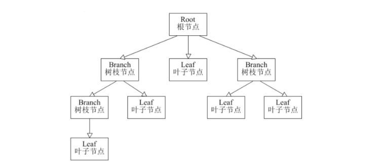
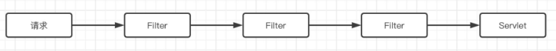
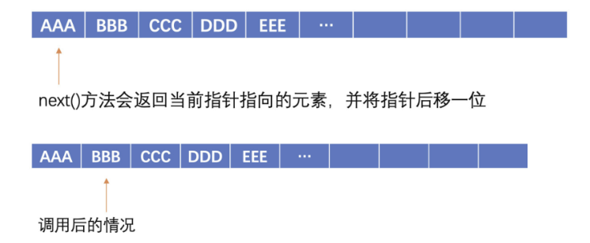

# 设计模式

## 面向对象设计原则

### 单一职责原则

一个对象应该只包含单一的职责，并且该职责被完整地封装在一个类中。


### 开放封闭

软件实体应当对扩展开放，对修改关闭。


### 里氏替换

所有引用基类的地方必须能透明地使用其子类的对象。

1. 子类可以实现父类的抽象方法，但不能覆盖父类的非抽象方法。
2. 子类可以增加自己特有的方法。
3. 当子类的方法重载父类的方法时，方法的前置条件（即方法的输入/入参）要比父类方法的输入参数更宽松。
4. 当子类的方法实现父类的方法时（重写/重载或实现抽象方法），方法的后置条件（即方法的输出/返回值）要比父类更严格或与父类一样。


### 依赖倒转原则

高层模块不应依赖于底层模块，它们都应该依赖抽象。抽象不应依赖于细节，细节应该依赖于抽象。

使用Spring框架前：会发现几个class是强关联的

```java
public class Main {

    public static void main(String[] args) {
        UserController controller = new UserController();
      	//该怎么用就这么用
    }

    static class UserMapper {
        //CRUD...
    }

    static class UserService {
        UserMapper mapper = new UserMapper();
        //业务代码....
    }

    static class UserController {
        UserService service = new UserService();
        //业务代码....
    }
}
```

使用Spring框架后：直接使用接口比如UserService，就算改实现UserServiceImpl，Controller也不需要改变。将强关联弱化

```java
public class Main {

    public static void main(String[] args) {
        UserController controller = new UserController();
    }

    interface UserMapper {
        //接口中只做CRUD方法定义
    }

    static class UserMapperImpl implements UserMapper {
        //实现类完成CRUD具体实现
    }

    interface UserService {
        //业务代码定义....
    }

    static class UserServiceImpl implements UserService {
        @Resource   //现在由Spring来为我们选择一个指定的实现类，然后注入，而不是由我们在类中硬编码进行指定
        UserMapper mapper;
        
        //业务代码具体实现
    }

    static class UserController {
        @Resource
        UserService service;   //直接使用接口，就算你改实现，我也不需要再修改代码了

        //业务代码....
    }
}
```


### 接口隔离

客户端不应依赖那些它不需要的接口。


### 合成复用原则

优先使用对象组合，而不是通过继承来达到复用的目的。

比如后面的代理模式和装饰模式


### 迪米特法则(最少知识)

每一个软件单位对其他单位都只有最少的知识，而且局限于那些与本单位密切相关的软件单位。

简单来说就是，一个类/模块对其他的类/模块有越少的交互越好。


## 创建型

### 工厂方法模式

直接new的方式创建对象的话，如果**突然这个对象的构造方法或是类名发生了改变**，岂不是**得挨着修改**。因此我们可以把需要频繁出现的对象，**创建过程封装在工厂类中，需要对象时直接调用工厂类的方法生成对象。**

> **简单工厂模式**

先定义一些类

```java
public abstract class Fruit {   //水果抽象类
    private final String name;
    
    public Fruit(String name){
        this.name = name;
    }

    @Override
    public String toString() {
        return name+"@"+hashCode();   //打印一下当前水果名称，还有对象的hashCode
    }
}
```

```java
public class Apple extends Fruit{   //苹果，继承自水果

    public Apple() {
        super("苹果");
    }
}
```

```java
public class Orange extends Fruit{  //橘子，也是继承自水果
    public Orange() {
        super("橘子");
    }
}
```

现在把对象创建封装在工厂中：

```java
public class FruitFactory {
    /**
     * 这里就直接来一个静态方法根据指定类型进行创建
     * @param type 水果类型
     * @return 对应的水果对象
     */
    public static Fruit getFruit(String type) {
        switch (type) {
            case "苹果":
                return new Apple();
           	case "橘子":
                return new Orange();
            default:
                return null;
        }
    }
}
```

简单工厂使用：

```java
public class Main {
    public static void main(String[] args) {
        Fruit fruit = FruitFactory.getFruit("橘子");   //直接问工厂要，而不是我们自己去创建
        System.out.println(fruit);
    }
}
```

**问题**：这样写的话并不满足开放封闭原则，应该对拓展开放，对修改封闭 。也就是说我们要新增水果就**要修改工厂方法的getFruit方法**，这样显然是**违背**的。

> **工厂模式**

通过抽象类和泛型，我们定义一个水果的基类，后续新增水果只需要新建新水果的工厂类即可：

```java
public abstract class FruitFactory<T extends Fruit> {   //将水果工厂抽象为抽象类，添加泛型T由子类指定水果类型
    public abstract T getFruit();  //不同的水果工厂，通过此方法生产不同的水果
}
```

```java
public class AppleFactory extends FruitFactory<Apple> {  
    //苹果工厂，直接返回Apple，一步到位
    @Override
    public Apple getFruit() {
        return new Apple();
    }
}
```

使用

```java
public class Main {
    public static void main(String[] args) {
        test(new AppleFactory()::getFruit);   
        //比如我们现在要吃一个苹果，那么就直接通过苹果工厂来获取苹果
    }

    //此方法模拟吃掉一个水果
    private static void test(Supplier<Fruit> supplier){
        System.out.println(supplier.get()+" 被吃掉了，真好吃。");
    }
}
```

- `Supplier<Fruit>` 表示一个可以提供 `Fruit` 类型对象的供给者。

- `Supplier<Fruit>` 作为一个参数类型被传递给方法 `test`，这意味着你可以传入任何能够生成 `Fruit` 实例的方法引用或Lambda表达式。


### 抽象工厂模式

如果有多个产品的话，工厂方法模式就会显得有点吃力，因为要创建多个产品的工厂和方法。

因此我们可以将多个产品都放在一个工厂里，按照产品族划分：

```java
public class Router {
}
```

```java
public class Table {
}
```

```java
public class Phone {
}
```

```java
public abstract class AbstractFactory {
    public abstract Phone getPhone();
    public abstract Table getTable();
    public abstract Router getRouter();
}
```

不过，缺点还是有的，如果**产品族新增了产品**，那么我就不得不去**为每一个产品族的工厂都去添加新产品的生产方法**，**违背了开闭原则。**


### 建造者模式

就是我们常见的xxxBuilder。

实际上我们主要通过建造者来不断配置参数或者内容，配置完所有内容，再对对象进行构建。

**常规的构建对象：**

要填非常多参数

```java
public static void main(String[] args) {
    Student student = new Student(1, 18, 3, "小明", "计算机学院", "计算机科学与技术", Arrays.asList("ICPC-ACM 区域赛 金牌", "LPL 2022春季赛 冠军"));
}
```

**建造者模式：**

创建一个Builder内部类，同时创建一个builder()方法来创建建造者。在内部类里写好给参数赋值的方法即可。

```java
public class Student {
		...

    //一律使用建造者来创建，不对外直接开放
    private Student(int id, int age, int grade, String name, String college, String profession, List<String> awards) {
        ...
    }

    public static StudentBuilder builder(){   //通过builder方法直接获取建造者
        return new StudentBuilder();
    }

    public static class StudentBuilder{   //这里就直接创建一个内部类
        //Builder也需要将所有的参数都进行暂时保存，所以Student怎么定义的这里就怎么定义
        int id;
        int age;
        int grade;
        String name;
        String college;
        String profession;
        List<String> awards;

        public StudentBuilder id(int id){    //直接调用建造者对应的方法，为对应的属性赋值
            this.id = id;
            return this;   //为了支持链式调用，这里直接返回建造者本身，下同
        }

        public StudentBuilder age(int age){
            this.age = age;
            return this;
        }
      
      	...

        public StudentBuilder awards(String... awards){
            //这个String...是可变参数，是真实存在的，等同于String[]
            this.awards = Arrays.asList(awards);
            return this;
        }
        
        public Student build(){    //最后我们只需要调用建造者提供的build方法即可根据我们的配置返回一个对象
            return new Student(id, age, grade, name, college, profession, awards);
        }
    }
}
```

现在可以使用建造者来生成对象了：

```java
public static void main(String[] args) {
    Student student = Student.builder()   //获取建造者
            .id(1)    //逐步配置各个参数
            .age(18)
            .grade(3)
            .name("小明")
            .awards("ICPC-ACM 区域赛 金牌", "LPL 2022春季赛 冠军")
            .build();   //最后直接建造我们想要的对象
}
```


### 单例模式(singleton)

就是整个程序中始终只有这一个对象。

最简单的饿汉式单例：

```java
public class Singleton {
    private static Singleton INSTANCE;   //在一开始先不进行对象创建

    private Singleton() {}   //不允许new，只能通过下方get获取

    public static Singleton getInstance(){   //将对象的创建延后到需要时再进行
        if(INSTANCE == null) {    
            //如果实例为空，那么就进行创建，不为空说明已经创建过了，那么就直接返回
            INSTANCE = new Singleton();
        }
        return INSTANCE;
    }
}
```

但是这样在多线程环境下容易出问题，在极短间隔内多个线程同时判断到Instance为null创建多个实例。因此我们需要引入我们的synchroinzed和volatile

```java
public class Singleton {
    private static volatile Singleton INSTANCE;   //在一开始先不进行对象创建

    private Singleton() {}   //不允许new，只能通过下方get获取

    public static Singleton getInstance(){
        if(INSTANCE == null) {
            synchronized (Singleton.class) {
                if(INSTANCE == null) INSTANCE = new Singleton();  
                //内层还要进行一次检查，双重检查锁定
            }
        }
        return INSTANCE;
    }
}
```

三个要点：

- **直接锁方法的话高并发下效率太低了 --> 可以锁代码块。**
- **同样是极短时间内多个线程可能同时判断为null，然后同时处于锁等待 --> 可以double check**
- **普通Instance变量的修改可能无法即使被其他线程看到 --> 使用volatile修饰保证可见性**


了解：

那么，有没有一种更好的，不用加锁的方式也能实现延迟加载的写法呢？我们可以使用静态内部类：

```java
public class Singleton {
    private Singleton() {}

    private static class Holder {   //由静态内部类持有单例对象，但是根据类加载特性，我们仅使用Singleton类时，不会对静态内部类进行初始化
        private final static Singleton INSTANCE = new Singleton();
    }

    public static Singleton getInstance(){   //只有真正使用内部类时，才会进行类初始化
        return Holder.INSTANCE;   //直接获取内部类中的
    }
}
```

这种方式显然是最完美的懒汉式解决方案，没有进行任何的加锁操作，也能保证线程安全，不过要实现这种写法，跟语言本身也有一定的关联，并不是所有的语言都支持这种写法。


### 原型模式(prototype)

其实就是以原对象为模板通过实现/重写clone()方法，来创建多个对象。

clone()方法就涉及到深拷贝和浅拷贝，这个我们不多说。直接重写clone()方法，对引用字段克隆即可

```java
class MyClass implements Cloneable {
    private String field1;
    private NestedClass nestedObject;

    @Override
    protected Object clone() throws CloneNotSupportedException {
        MyClass cloned = (MyClass) super.clone();//普通拷贝值类型对象
        cloned.nestedObject = (NestedClass) nestedObject.clone(); // 深拷贝内部的引用对象
        return cloned;
    }
}

class NestedClass implements Cloneable {
    private int nestedField;

    @Override
    protected Object clone() throws CloneNotSupportedException {
        return super.clone();
    }
}
```

测试：结果为false

```java
public class Main {

    public static void main(String[] args) throws InterruptedException, CloneNotSupportedException {
        MyClass myClass = new MyClass(new NestedClass());
        MyClass myClass1 = (MyClass) myClass.clone();
        System.out.println(myClass.getNestedObject()==myClass1.getNestedObject());
    }
}
```


**PS:不要忘了String也是引用类型，浅拷贝也只会拷贝个引用**

```java
@Override
public Object clone() throws CloneNotSupportedException {   //这里我们改进一下，针对成员变量也进行拷贝
    Student student = (Student) super.clone();
    student.name = new String(name);
    return student;   //成员拷贝完成后，再返回
}
```

因此，在这种情况下，对 `field1` 使用浅拷贝是安全的，并不会导致所谓的“拷贝马”问题（这里可能是指数据不一致或意外的数据共享问题）。实际上，由于 `String` 的不可变性，浅拷贝和深拷贝对于 `String` 类型的效果是一样的。


## 结构型

### 适配器模式

A方法需要B参数，但是我们只有C参数，于是通过D把C和B关联起来。也就是适配器。

例子：

```java
public class TestSupplier {   //手机供应商

    public String doSupply(){
        return "iPhone 14 Pro";
    }
}
```

```java
public class Main {
    public static void main(String[] args) {
        TestSupplier supplier = new TestSupplier();
      	test( ? );   //我们没有Target类型的手机供应商，只有其他的，那这里该填个啥
    }

    public static void test(Target target){   
        //现在我们需要调用test方法，但是test方法需要Target类型的手机供应商
        System.out.println("成功得到："+target.supply());
    }
}
```

因此我们可以创建一个Target接口，编写我们要使用的原类/对象TestSupplier的方法。

```java
public interface Target {    //现在的手机供应商，并不是test方法所需要的那种类型

    String supply();
}
```

我们再创建一个适配器类，继承原类，实现Target接口。

```java
public class TestAdapter extends TestSupplier implements Target {  
  //让我们的适配器继承TestSupplier并且实现Target接口
    @Override
    public String supply() {   //接着实现supply方法，直接使用TestSupplier提供的实现
        return super.doSupply();
    }
}
```

这样我们就可以使用了：直接传入适配器类

```java
public static void main(String[] args) {
    TestAdapter adapter = new TestAdapter();
    test(adapter);
}

public static void test(Target target){
    System.out.println("成功得到："+target.supply());
}
```

**问题**：这种适配器类写法会占用一个extends的坑位，我们可以换一种写法：

通过合成复用原则：

```java
public class TestAdapter implements Target{   
    //现在不再继承TestSupplier，仅实现Target

    TestSupplier supplier;
    
    public TestAdapter(TestSupplier supplier){
        this.supplier = supplier;
    }
    
    @Override
    public String supply() {
        return supplier.doSupply();
    }
}
```


### 桥接模式

情景：买奶茶的时候，中杯大杯超大杯，还要加什么配料......

如果设计Tea接口，Size接口，然后再去分别实现比如：大杯芋圆奶茶...

```java
public interface Tea {   //由具体类型的奶茶实现
    String getType();   //不同的奶茶返回的类型不同
}
public interface Size {   //分大杯小杯中杯
    String getSize();
}
```

实现：

```java
/**
 * 大杯芋圆啵啵奶茶
 */
public class LargeKissTea implements Tea, Size{

    @Override
    public String getSize() {
        return "大杯";
    }

    @Override
    public String getType() {
        return "芋圆啵啵奶茶";
    }
}
```

这样的话看着挺合理的，但是一旦数量多起来，那就得创建好多好多类，比如小杯芋圆不加糖，中杯芋圆加糖........

这时，就可以使用我们的桥接模式了，现在我们面临的问题是，**维度太多，不可能各种类型各种尺寸的奶茶都去创建一个类**，那么我们就还是**单独对这些接口进行简单的扩展，单独对不同的维度进行控制**，但是如何实现呢？我们不妨将奶茶的类型作为最基本的抽象类，然后对尺寸、配料等属性进行桥接：

```java
public abstract class AbstractTea {
    
    protected Size size;   //尺寸作为桥接属性存放在类中
    
    protected AbstractTea(Size size){   //在构造时需要知道尺寸属性
        this.size = size;
    }
    
    public abstract String getType();   //具体类型依然是由子类决定
}
```

不过这个抽象类提供的方法还不全面，仅仅只有Tea的getType方法，我们还需要添加其他维度的方法，所以继续编写一个子类：

```java
public abstract class RefinedAbstractTea extends AbstractTea{
    protected RefinedAbstractTea(Size size) {
        super(size);
    }
    
    public String getSize(){   //添加尺寸维度获取方式
        return size.getSize();
    }
}
```

单独为size创建子类：

```java
public class Large implements Size{

    @Override
    public String getSize() {
        return "大杯";
    }
}
```

现在的话就可以：

```java
public class KissTea extends RefinedAbstractTea{   //创建一个啵啵芋圆奶茶的子类
    protected KissTea(Size size) {   //在构造时需要指定具体的大小实现
        super(size);
    }

    @Override
    public String getType() {
        return "啵啵芋圆奶茶";   //返回奶茶类型
    }
}
```

现在就将尺寸和种类两个维度给拆开了：

```java
public static void main(String[] args) {
    KissTea tea = new KissTea(new Large());
    System.out.println(tea.getType());
    System.out.println(tea.getSize());
}
```

**个人理解**：实际上就是AbstractTea负责Type相关职责也就是getType，而子抽象类RefinedAbstractTea则可以拓展一个Size类职责，也就是getSize()这样的话我们最终的实现类KissTea继承子抽象类就能实现两个职责了，同时也不违背单一职责原则。（子抽象类不强制实现父类抽象方法）

> **思考：**为什么不直接在AbstractTea里写getSize()呢？
>
> 违反了单一职责原则，一个类应该只有一个引起它变化的原因。
>
> **桥接模式的本质**：桥接模式的一个关键点在于**它允许抽象部分（这里是茶的类型）和其实现部分（如尺寸、味道等）能够独立地变化**。通过让 `RefinedAbstractTea` 继承 `AbstractTea` 并添加 `getSize` 方法，可以更好地体现这一思想——你可以自由地在不修改 `AbstractTea` 的情况下，为特定的实现（如 `RefinedAbstractTea` 及其子类）添加功能或改变行为。


### 组合模式

将多个组件进行组合，让用户进行一致性处理。比如我们的组件夹，一个文件夹可以有多个子文件夹或者文件。



它就像是一个树形结构一样，有分支有叶子，而组合模式则是可以对整个树形结构上的所有节点进行递归处理，比如我们现在希望将所有文件夹中的文件的名称前面都添加一个前缀，那么就可以使用组合模式。

```java
/**
 * 首先创建一个组件抽象，组件可以包含组件，组件有自己的业务方法
 */
public abstract class Component {
    public abstract void addComponent(Component component);    //添加子组件
    public abstract void removeComponent(Component component);   //删除子组件
    public abstract Component getChild(int index);   //获取子组件
    public abstract void test();   //执行对应的业务方法，比如修改文件名称
}
```

接着我们来编写两种实现类：

```java
public class Directory extends Component{   //目录可以包含多个文件或目录

    List<Component> child = new ArrayList<>();   //这里我们使用List来存放目录中的子组件

    @Override
    public void addComponent(Component component) {
        child.add(component);
    }

    @Override
    public void removeComponent(Component component) {
        child.remove(component);
    }

    @Override
    public Component getChild(int index) {
        return child.get(index);
    }

    @Override
    public void test() {
        child.forEach(Component::test);   //将继续调用所有子组件的test方法执行业务
    }
}
```

```java
public class File extends Component{   //文件就相当于是树叶，无法再继续添加子组件了

    @Override
    public void addComponent(Component component) {
        throw new UnsupportedOperationException();   //不支持这些操作了
    }

    @Override
    public void removeComponent(Component component) {
        throw new UnsupportedOperationException();
    }

    @Override
    public Component getChild(int index) {
        throw new UnsupportedOperationException();
    }

    @Override
    public void test() {
        System.out.println("文件名称修改成功！"+this);   //具体的名称修改操作
    }
}
```

最后，我们来测试一下：

```java
public static void main(String[] args) {
    Directory outer = new Directory();   //新建一个外层目录
    Directory inner = new Directory();   //新建一个内层目录
    outer.addComponent(inner);
    outer.addComponent(new File());   //在内层目录和外层目录都添加点文件，注意别导错包了
    inner.addComponent(new File());
    inner.addComponent(new File());
    outer.test();    //开始执行文件名称修改操作
}
```


### 装饰模式

通过组合而非传统继承关系，对现有类进行装饰。

比如我们现在有一个普通的功能类：

```java
public abstract class Base {   //顶层抽象类，定义了一个test方法执行业务
    public abstract void test();
}

public class BaseImpl extends Base{
    @Override
    public void test() {
        System.out.println("我是业务方法");   //具体的业务方法
    }
}
```

不过现在的实现类太单调了，我们来添加一点装饰上去：

```java
public class Decorator extends Base{   //装饰者需要将装饰目标组合到类中

    protected Base base;

    public Decorator(Base base) {
        this.base = base;
    }

    @Override
    public void test() {
        base.test();    //这里暂时还是使用目标的原本方法实现
    }
}
```

```java
public class DecoratorImpl extends Decorator{   //装饰实现

    public DecoratorImpl(Base base) {
        super(base);
    }

    @Override
    public void test() {    //对原本的方法进行装饰，我们可以在前后都去添加额外操作
        System.out.println("装饰方法：我是操作前逻辑");
        super.test();
        System.out.println("装饰方法：我是操作后逻辑");
    }
}
```

这样，我们就通过装饰模式对类的功能进行了扩展：

```java
public static void main(String[] args) {
    Base base = new BaseImpl();
    Decorator decorator = new DecoratorImpl(base);  //将Base实现装饰一下
    Decorator outer = new DecoratorImpl(decorator);  //装饰者还可以嵌套

    decorator.test();

    outer.test();
}
```

这样我们就实现了装饰模式。


### 代理模式

代理模式和装饰模式很像，当无法直接访问某个对象或访问某个对象存在困难时，我们就可以通过一个代理对象来间接访问。

例子：需要被代理的Subject：

```java
public abstract class Subject {
    public abstract void test();
}
```

```java
public class SubjectImpl extends Subject{  //此类无法直接使用，需要我们进行代理

    @Override
    public void test() {
        System.out.println("我是测试方法！");
    }
}
```

> **最基础的代理**

将被代理对象组合到类中，然后重写方法

```java
public class Proxy extends Subject{   //为了保证和Subject操作方式一样，保证透明性，也得继承

    Subject target;   //被代理的对象（甚至可以多重代理）

    public Proxy(Subject subject){
        this.target = subject;
    }

    @Override
    public void test() {   //由代理去执行被代理对象的方法，并且我们还可以在前后添油加醋
        System.out.println("代理前绕方法");
        target.test();
        System.out.println("代理后绕方法");
    }
}
```

PS:看起来确实和基础的代理模式有点像：

- 装饰器模式强调的是增强自身，在被装饰之后你能够在被增强的类上使用增强后的功能，增强后你还是你，只不过被强化了而已；
- 代理模式强调要让别人帮你去做事情，以及添加一些本身与你业务没有太多关系的事情（记录日志、设置缓存等）重点在于让别人帮你做。

> **JDK Proxy的动态代理机制**(八股)

只能是接口形式：

```java
public interface Subject {  //JDK提供的动态代理只支持接口
    void test();
}
```

```java
public class SubjectImpl implements Subject{

    @Override
    public void test() {
        System.out.println("我是测试方法！");
    }
}
```

注意：下面传入参数的都是impl

具体：

```java
public class TestProxy implements InvocationHandler {    //代理类，需要实现InvocationHandler接口

    private final Object object;   //这里需要保存一下被代理的对象，下面需要用到

    public TestProxy(Object object) {
        this.object = object;
    }

    @Override   //此方法就是调用代理对象的对应方法时会进入，这里我们就需要编写如何进行代理了
    public Object invoke(Object proxy, Method method, Object[] args) throws Throwable {
     		//method就是调用的代理对象的哪一个方法，args是实参数组
        System.out.println("代理的对象："+proxy.getClass());   //proxy就是生成的代理对象了，我们看看是什么类型的
        Object res = method.invoke(object, args);   //在代理中调用被代理对象原本的方法，因为你是代理，还是得执行一下别人的业务，当然也可以不执行，但是这样就失去代理的意义了，注意要用上面的object
        System.out.println("方法调用完成，返回值为："+res);   //看看返回值是什么
        return res;   //返回返回值
    }
}
```

直接是实现InvocationHandler接口，同样需要我们组合被代理对象。

```java
public static void main(String[] args) {
    SubjectImpl subject = new SubjectImpl();   //被代理的大冤种
    InvocationHandler handler = new TestProxy(subject);
    Subject proxy = (Subject) Proxy.newProxyInstance(
            subject.getClass().getClassLoader(),    //需要传入被代理的类的类加载器
            subject.getClass().getInterfaces(),    //需要传入被代理的类的接口列表
            handler);    //最后传入我们实现的代理处理逻辑实现类
    proxy.test();    //比如现在我们调用代理类的test方法，那么就会进入到我们上面TestProxy中invoke方法，走我们的代理逻辑
}
```

> **CGLIB的动态代理机制**(八股)

```java
<dependency>
    <groupId>cglib</groupId>
    <artifactId>cglib</artifactId>
    <version>3.1</version>
</dependency>
```

由于CGlib底层使用ASM框架（JVM篇视频教程有介绍）进行字节码编辑，所以能够实现不仅仅局限于对接口的代理：

```java
public class TestProxy implements MethodInterceptor {  //首先还是编写我们的代理逻辑

    private final Object target;   //这些和之前JDK动态代理写法是一样的

    public TestProxy(Object target) {
        this.target = target;
    }

    @Override   //我们也是需要在这里去编写我们的代理逻辑
    public Object intercept(Object o, Method method, Object[] objects, MethodProxy methodProxy) throws Throwable {
        System.out.println("现在是由CGLib进行代理操作！"+o.getClass());
        return method.invoke(target, objects);   //也是直接调用代理对象的方法即可
    }
}
```

接着我们来创建一下代理类：

```java
public static void main(String[] args) {
    SubjectImpl subject = new SubjectImpl();

    Enhancer enhancer = new Enhancer();   //增强器，一会就需要依靠增强器来为我们生成动态代理对象
    enhancer.setSuperclass(SubjectImpl.class);    //直接选择我们需要代理的类型，直接不需要接口或是抽象类，SuperClass作为代理类的父类存在，这样我们就可以按照指定类型的方式去操作代理类了
    enhancer.setCallback(new TestProxy(subject));  //设定我们刚刚编写好的代理逻辑

    SubjectImpl proxy = (SubjectImpl) enhancer.create();   //直接创建代理类

    proxy.test();   //调用代理类的test方法
}
```


### 外观模式(待学习)


### 享元模式(带学习)


## 行为型

### 模板方法模式

在我们的程序中也是如此，**可能某些操作是固定的，我们就可以直接在类中对应方法进行编写**，但是可能**某些操作需要视情况而定，由不同的子类实现来决定**，这时，我们就**需要让这些操作由子类来延迟实现了**。现在我们就需要用到**模板方法模式**。

```java
/**
 * 抽象诊断方法，因为现在只知道挂号和看医生是固定模式，剩下的开处方和拿药都是不确定的
 */
public abstract class AbstractDiagnosis {

    public void test(){
        System.out.println("今天头好晕，不想起床，开摆，先跟公司请个假");
        System.out.println("去医院看病了~");
        System.out.println("1 >> 先挂号");
        System.out.println("2 >> 等待叫号");
        //由于现在不知道该开什么处方，所以只能先定义一下行为，然后具体由子类实现
      	//大致的流程先定义好就行
        this.prescribe();
        this.medicine();  //开药同理
    }

    public abstract void prescribe();   //开处方操作根据具体病症决定了

    public abstract void medicine();   //拿药也是根据具体的处方去拿
}
```

test就是固定看病流程，而下面两个方法则是需要视情况而定，由子类自行实现：

```java
/**
 * 感冒相关的具体实现子类
 */
public class ColdDiagnosis extends AbstractDiagnosis{
    @Override
    public void prescribe() {
        System.out.println("3 >> 一眼丁真，鉴定为假，你这不是感冒，纯粹是想摆烂");
    }

    @Override
    public void medicine() {
        System.out.println("4 >> 开点头孢回去吃吧");
    }
}
```

使用：

```java
public static void main(String[] args) {
    AbstractDiagnosis diagnosis = new ColdDiagnosis();
    diagnosis.test();
}
```

PS：JUC中的AQS里出现的代码：

```java
public final boolean release(int arg) {    //AQS的锁释放操作
    if (tryRelease(arg)) {   //可以看到这里调用了tryRelease方法，但是此方法并不是在AQS实现的，而是不同的锁自行实现，因为AQS也不知道你这种类型的锁到底该怎么去解锁
        Node h = head;
        if (h != null && h.waitStatus != 0)
            unparkSuccessor(h);
        return true;
    }
    return false;
}

protected boolean tryRelease(int arg) {
    throw new UnsupportedOperationException();   //AQS中不支持，需要延迟到具体的子类去实现
}
```

模板方法模式，实际上这部分功能的实现是在子类完成的：

```java
protected final boolean tryRelease(int releases) {   
  //ReentrantLock中的AQS Sync实现类，对tryRelease方法进行了具体实现
    int c = getState() - releases;
    if (Thread.currentThread() != getExclusiveOwnerThread())
        throw new IllegalMonitorStateException();
    boolean free = false;
    if (c == 0) {
        free = true;
        setExclusiveOwnerThread(null);
    }
    setState(c);
    return free;
}
```


### 责任链模式

责任链模式也非常好理解，比如我们的钉钉审批，实际上就是一条流水线一样的操作，由你发起申请，然后经过多个部门主管审批，最后才能通过，所以你的申请表相当于是在一条责任链上传递。当然**除了这样的直线型责任链之外，还有环形、树形等**。



实际上我们之前也遇到过很多种责任链，比如JavaWeb中学习的Filter过滤器，正是采用的责任链模式，通过将请求一级一级不断向下传递，来对我们所需要的请求进行过滤和处理。

这里我们就使用责任链模式来模拟一个简单的面试过程，我们面试也是一面二面三面这样走的流程，这里我们先设计一下责任链上的各个处理器：

```java
public abstract class Handler {

    protected Handler successor;    //这里我们就设计责任链以单链表形式存在，这里存放后继节点

    public Handler connect(Handler successor){     //拼接后续节点
        this.successor = successor;
        return successor;  //这里返回后继节点，方便我们一会链式调用
    }

    public void handle(){
        this.doHandle();   //由不同的子类实现具体处理过程
        Optional
                .ofNullable(successor)
                .ifPresent(Handler::handle);    //责任链上如果还有后继节点，就继续向下传递
    }

    public abstract void doHandle();   //结合上节课学习的模板方法，交给子类实现
}
```

因为面试有很多轮，所以我们这里创建几个处理器的实现：

```java
public class FirstHandler extends Handler{   //用于一面的处理器
    @Override
    public void doHandle() {
        System.out.println("============= 白马程序员一面 ==========");
        System.out.println("1. 谈谈你对static关键字的理解？");
        System.out.println("2. 内部类可以调用外部的数据吗？如果是静态的呢？");
        System.out.println("3. hashCode()方法是所有的类都有吗？默认返回的是什么呢？");
        System.out.println("以上问题会的，可以依次打在评论区");
    }
}
```

```java
public class SecondHandler extends Handler{  //二面
    @Override
    public void doHandle() {
        System.out.println("============= 白马程序员二面 ==========");
        System.out.println("1. 如果我们自己创建一个java.lang包并且编写一个String类，能否实现覆盖JDK默认的？");
        System.out.println("2. HashMap的负载因子有什么作用？变化规律是什么？");
        System.out.println("3. 线程池的运作机制是什么？");
        System.out.println("4. ReentrantLock公平锁和非公平锁的区别是什么？");
        System.out.println("以上问题会的，可以依次打在评论区");
    }
}
```

```java
public class ThirdHandler extends Handler{
    @Override
    public void doHandle() {
        System.out.println("============= 白马程序员三面 ==========");
        System.out.println("1. synchronized关键字了解吗？如何使用？底层是如何实现的？");
        System.out.println("2. IO和NIO的区别在哪里？NIO三大核心组件？");
        System.out.println("3. TCP握手和挥手流程？少一次握手可以吗？为什么？");
        System.out.println("4. 操作系统中PCB是做什么的？运行机制是什么？");
        System.out.println("以上问题会的，可以依次打在评论区");
    }
}
```

这样我们就编写好了每一轮的面试流程，现在我们就可以构建一个责任链了：

```java
public static void main(String[] args) {
    Handler handler = new FirstHandler();  //一面首当其冲
    handler
            .connect(new SecondHandler())   //继续连接二面和三面
            .connect(new ThirdHandler());
    handler.handle();   //开始面试
} 
```


### 迭代器模式

迭代器我们在JavaSE篇就已经讲解过了，迭代器可以说是我们学习Java语言的基础，**没有迭代器，集合类的遍历就成了问题**，正是因为有迭代器的存在，我们才能更加优雅的使用foreach语法。

回顾我们之前使用迭代器的场景：

```java
public static void main(String[] args) {
    List<String> list = Arrays.asList("AAA", "BBB", "CCC");
    for (String s : list) {   //使用foreach语法糖进行迭代，依次获取每一个元素
        System.out.println(s);   //打印一下
    }
}
```

编译之后的代码如下：

```java
public static void main(String[] args) {
    List<String> list = Arrays.asList("AAA", "BBB", "CCC");
    Iterator var2 = list.iterator();   //实际上这里本质是通过List生成的迭代器来遍历我们每个元素的

    while(var2.hasNext()) {   //判断是否还有元素可以迭代，没有就false
        String s = (String)var2.next();   //通过next方法得到下一个元素，每调用一次，迭代器会向后移动一位
        System.out.println(s);    //打印一下
    }
}
```

可以看到，当我们使用迭代器对List进行遍历时，实际上就像一个指向列表头部的指针，我们通过不断向后移动指针来依次获取所指向的元素：



我们自己的模拟一个迭代器接口：

```java
public class ArrayCollection<T> {    //首先设计一个简单的数组集合，一会我们就迭代此集合内的元素

    private final T[] array;   //底层使用一个数组来存放数据

    private ArrayCollection(T[] array){   //private掉，自己用
        this.array = array;
    }

    public static <T> ArrayCollection<T> of(T[] array){   //开个静态方法直接吧数组转换成ArrayCollection，其实和直接new一样，但是这样写好看一点
        return new ArrayCollection<>(array);
    }
}
```

现在我们就可以将数据存放在此集合中了：

```java
public static void main(String[] args) {
    String[] arr = new String[]{"AAA", "BBB", "CCC", "DDD"};
    ArrayCollection<String> collection = ArrayCollection.of(arr);
}
```

然后我们实现迭代器接口：

```java
public class ArrayCollection<T> implements Iterable<T>{   //实现Iterable接口表示此类是支持迭代的

    ...

    @Override
    public Iterator<T> iterator() {    //需要实现iterator方法，此方法会返回一个迭代器，用于迭代我们集合中的元素
        return new ArrayIterator();
    }

    public class ArrayIterator implements Iterator<T> {   //这里实现一个，注意别用静态，需要使用对象中存放的数组
        private int cur = 0;   //这里我们通过一个指针表示当前的迭代位置

        @Override
        public boolean hasNext() {     //判断是否还有下一个元素
            return cur < array.length;   //如果指针大于或等于数组最大长度，就不能再继续了
        }

        @Override
        public T next() {   //返回当前指针位置的元素并向后移动一位
            return array[cur++];   //正常返回对应位置的元素，并将指针自增
        }
    }
}
```

接着，我们就可以对我们自己编写的一个简单集合类进行迭代了：

```java
public static void main(String[] args) {
    String[] arr = new String[]{"AAA", "BBB", "CCC", "DDD"};
    ArrayCollection<String> collection = ArrayCollection.of(arr);
    for (String s : collection) {    //可以直接使用foreach语法糖，当然最后还是会变成迭代器调用
        System.out.println(s);
    }
}
```

最后编译出来的样子：

```java
public static void main(String[] args) {
    String[] arr = new String[]{"AAA", "BBB", "CCC", "DDD"};
    ArrayCollection<String> collection = ArrayCollection.of(arr);
    Iterator var3 = collection.iterator();   //首先获取迭代器，实际上就是调用我们实现的iterator方法

    while(var3.hasNext()) {
        String s = (String)var3.next();   //直接使用next()方法不断向下获取
        System.out.println(s);
    }
}
```

这样我们就实现了一个迭代器来遍历我们的元素。


### 观察者模式

在Java中，一个对象的状态发生改变，可能就会影响到其他的对象，与之相关的对象可能也会联动的进行改变。还有我们之前遇到过的监听器机制，当具体的事件触发时，我们在一开始创建的监听器就可以执行相关的逻辑。我们可以使用观察者模式来实现这样的功能，**当对象发生改变时，观察者能够立即观察到并进行一些联动操作**，我们先定义一个观察者接口：

```java
public interface Observer {   //观察者接口
    void update();   //当对象有更新时，会回调此方法
}
```

接着我们来写一个支持观察者的实体类：

````java
public class Subject {
    private final Set<Observer> observerSet = new HashSet<>();

    public void observe(Observer observer) {   //添加观察者
        observerSet.add(observer);
    }

    public void modify() {   //模拟对象进行修改
        observerSet.forEach(Observer::update);   //当对象发生修改时，会通知所有的观察者，并进行方法回调
    }
}
````

接着我们就可以测试一下了：

```java
public static void main(String[] args) {
    Subject subject = new Subject();
    subject.observe(() -> System.out.println("我是一号观察者！"));
    subject.observe(() -> System.out.println("我是二号观察者！"));
    subject.modify();
}
```

这样，我们就简单实现了一下观察者模式，当然JDK也为我们提供了实现观察者模式相关的接口：

```java
import java.util.Observable;    //java.util包下提供的观察者抽象类

public class Subject extends Observable {   //继承此抽象类表示支持观察者

    public void modify(){
        System.out.println("对对象进行修改！");
        this.setChanged();    //当对对象修改后，需要setChanged来设定为已修改状态
        this.notifyObservers(new Date());   //使用notifyObservers方法来通知所有的观察者
      	//注意只有已修改状态下通知观察者才会有效，并且可以给观察者传递参数，这里传递了一个时间对象
    }
}
```

我们来测试一下吧：

```java
public static void main(String[] args) {
    Subject subject = new Subject();
    subject.addObserver((o, arg) -> System.out.println("监听到变化，并得到参数："+arg));  
  	//注意这里的Observer是java.util包下提供的
    subject.modify();   //进行修改操作
}
```


### 策略模式

我们可以为对象设定一种策略，这样对象之后的行为就会按照我们在一开始指定的策略而决定了，看起来和前面的状态模式很像，但是，它**与状态模式的区别在于，这种转换是“主动”的，是由我们去指定，而状态模式，可能是在运行过程中自动切换的**。

再比如我们现在有一个排序类，但是根据不同的策略，会使用不同的排序方案：

```java
public interface Strategy {   //策略接口，不同的策略实现也不同

    Strategy SINGLE = Arrays::sort;   //单线程排序方案
    Strategy PARALLEL = Arrays::parallelSort;   //并行排序方案
    
    void sort(int[] array);
}
```

现在我们编写一个排序类：

```java
public class Sorter {

    private Strategy strategy;   //策略

    public void setStrategy(Strategy strategy) {
        this.strategy = strategy;
    }

    public void sort(int[] array){
        strategy.sort(array);
    }
}
```

现在我们就可以指定不同的策略进行排序了：

```java
public static void main(String[] args) {
    Sorter sorter = new Sorter();
    sorter.setStrategy(Strategy.PARALLEL);    //指定为并行排序方案
    
    sorter.sort(new int[]{9, 2, 4, 5, 1, 0, 3, 7});
}
```


### 访问者模式(待学习)


### 解释器模式(了解)


### 命令模式(待学习)


### 中介者模式(待学习)


### 备忘录模式(待学习)

